<h1 align="center">JOBSHEET 1 - SISTEM OPERASI</h1>


**Nama**       : M. Javier Thufail  
**NIM**        : 254107020019  
**Kelas**      : TI 1-G  
**No. Absen**  : 18  

---

## 1.10. Latihan

### 1.10.1. Latihan Konseptual

### 1️⃣ Jelaskan 5 fungsi utama sistem operasi dengan contoh konkret dari minimal 2
OS berbeda (Windows, macOS, atau Linux).


#### 💻 FUNGSI UTAMA SISTEM OPERASI


- Manajemen Proses

Manajemen proses bertugas mengatur **pembuatan, penjadwalan, dan terminasi proses** agar beberapa aplikasi dapat berjalan bersamaan tanpa konflik.

#### 🔎 Implementasi pada Berbagai OS

| Sistem Operasi | Implementasi |
|---------------|-------------|
| Windows | Task Manager menampilkan dan menghentikan proses (contoh: `chrome.exe`) menggunakan perintah `kill`. |
| Linux | Perintah `ps` untuk melihat proses dan `kill` untuk menghentikan proses. |
| macOS | Menggunakan Activity Monitor untuk memantau dan mengakhiri proses. |


- Manajemen Memori

Manajemen memori bertugas **mengalokasikan dan membebaskan RAM** untuk setiap proses agar sistem tetap stabil dan efisien.

Teknik yang digunakan:
Paging, Swapping, Memory Compression

#### 🔎 Implementasi pada Berbagai OS

| Sistem Operasi | Implementasi |
|---------------|-------------|
| Windows | Menggunakan `pagefile.sys` di SSD untuk swapping saat RAM penuh. |
| macOS | Menggunakan *memory compression* sebelum melakukan swap. |
| Linux | Menggunakan `Zram` atau `Zswap` untuk kompresi memori. |


- Manajemen File

Manajemen file bertugas **mengatur penyimpanan dan akses data** melalui sistem file berbentuk hierarki (folder & file).

#### 🔎 Sistem File yang Digunakan

| Sistem Operasi | Sistem File |
|---------------|------------|
| Windows | NTFS (mendukung enkripsi & quota per user) |
| macOS | APFS (optimasi SSD & enkripsi cepat) |
| Linux | ext4 (stabil & mendukung journaling) |


- Manajemen Perangkat

Fungsi ini mengatur komunikasi antara **hardware dan sistem operasi** melalui driver.

#### 🔎 Implementasi pada Berbagai OS

| Sistem Operasi | Implementasi |
|---------------|-------------|
| Windows | Device Manager untuk mengelola driver printer, GPU, dll. |
| Linux | Modul kernel seperti `udev` untuk deteksi otomatis USB. |
| macOS | System Information untuk integrasi hardware Apple. |


- Keamanan

Keamanan bertujuan melindungi sistem dari akses tidak sah melalui:
- Autentikasi
- Enkripsi
- Firewall
- Proteksi malware

#### 🔎 Fitur Keamanan

| Sistem Operasi | Fitur Keamanan |
|---------------|---------------|
| Windows | Windows Defender, BitLocker, UAC |
| macOS | FileVault, Gatekeeper, XProtect |
| Linux | iptables firewall & permission ketat |


#### ✨ Kesimpulan

Sistem operasi memiliki lima fungsi utama:
1. Manajemen Proses  
2. Manajemen Memori  
3. Manajemen File  
4. Manajemen Perangkat  
5. Keamanan  

Setiap OS (Windows, Linux, macOS) memiliki pendekatan berbeda, namun tujuan utamanya sama:  
👉 **Menjaga sistem tetap stabil, aman, dan efisien.**

---
### 2️⃣ Kapan sebaiknya menggunakan Windows vs Linux vs macOS? Analisis
berdasarkan use case: gaming, development, server, creative work, dan enterprise.

Pilihan OS bergantung pada use case spesifik, dengan analisis berdasarkan kompatibilitas, performa, dan biaya.
| Use Case      | Terbaik | Alasan                                                                                                                                       |
| ------------- | ------- | -------------------------------------------------------------------------------------------------------------------------------------------- |
| Gaming        | Windows | Dukungan DirectX luas, library game AAA terbesar, kompatibel hardware.randallblack​ Linux runner-up via Proton, macOS terbatas.randallblack​ |
| Development   | Linux   | Stabil untuk server-side, open-source tools, Unix-like untuk coding.refurbo+1 macOS bagus iOS dev, Windows untuk .NET.linkedin+1             |
| Server        | Linux   | Gratis, stabil jangka panjang, aman, resource ringan untuk cloud.refurbo+1 Windows enterprise, macOS tidak direkomendasikan.refurbo​         |
| Creative Work | macOS   | Optimal Final Cut Pro/Logic, color accuracy hardware Apple.linkedin+1 Windows alternatif Adobe, Linux kurang GUI.randallblack​               |
| Enterprise    | Windows | Integrasi Active Directory, Office suite, MDM mudah untuk bisnis besar.linkedin+1 Linux untuk backend, macOS terbatas skala.randallblack​    |

---

### 1.10.2. Latihan Praktikal 

### 1️⃣ Install Ubuntu Server 22.04 LTS di VirtualBox dengan langkah berikut:
### 1️. Download Ubuntu Server ISO

Unduh file ISO Ubuntu Server 22.04 LTS dari website resmi Ubuntu.


📌 *Hasil download file ISO Ubuntu Server*

## 2. Install dengan automatic partitioning (guided)

Buka VirtualBox lalu buat VM baru dengan spesifikasi berikut:

- RAM : **2 GB**
- Storage : **25 GB**
- Type : Linux
- Version : Ubuntu (64-bit)

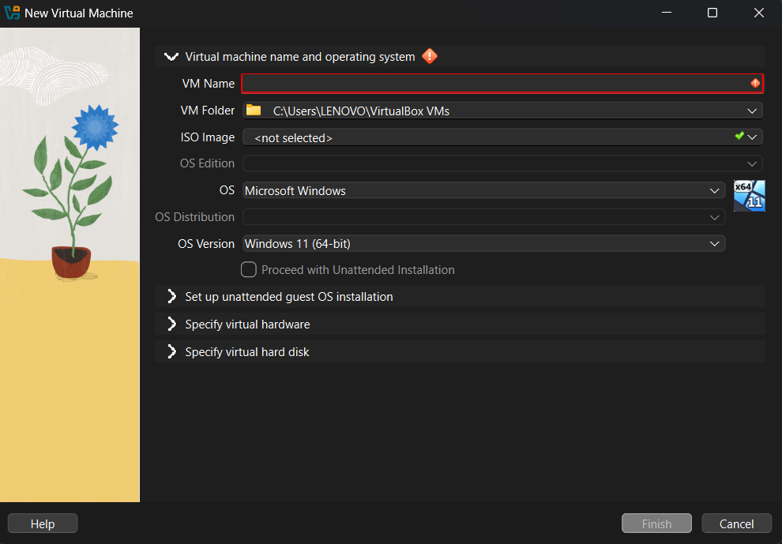

📌 *Proses pembuatan Virtual Machine*

## 3. Buat user account dengan password yang kuat
  
  Pilih metode partisi:

- Gunakan **Automatic Partitioning (Guided)**

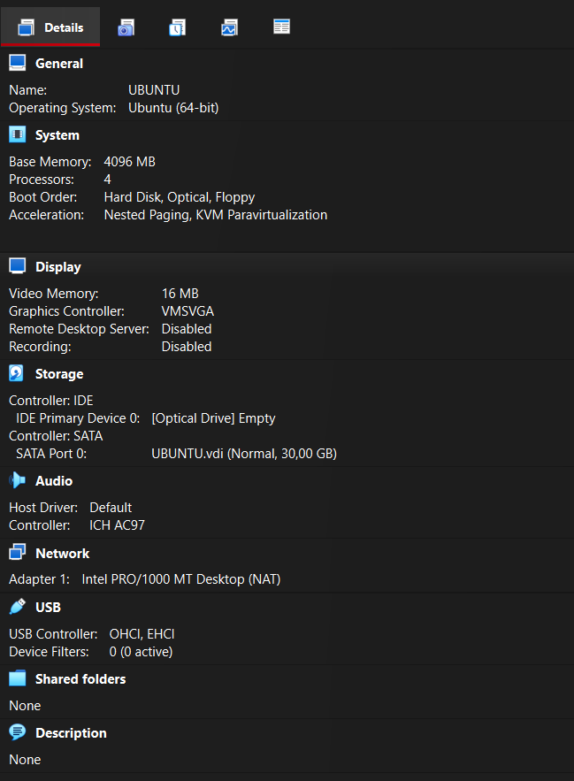

📌 *Proses instalasi dan partisi otomatis*

## 4. Reboot dan login ke sistem
  
  Buat username dan password yang kuat untuk keamanan sistem.

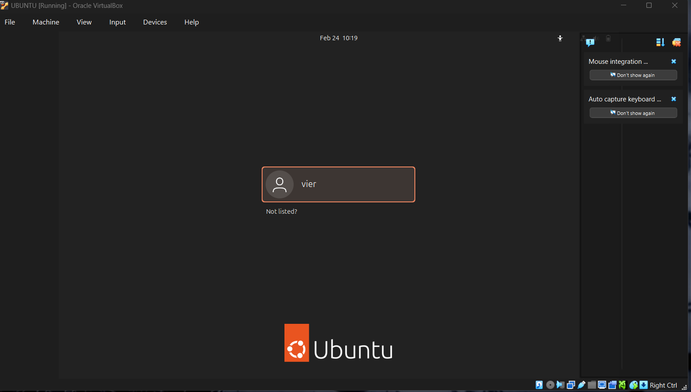

📌 *Pembuatan akun pengguna*


## 5. Dokumentasikan proses instalasi dengan screenshot key steps
Semua proses instalasi telah didokumentasikan melalui screenshot pada setiap tahap utama, mulai dari:
- Download ISO
- Pembuatan VM
- Proses instalasi
- Pembuatan user
- Login sistem


### 2️⃣ Setelah instalasi Ubuntu Server, lakukan tasks berikut:
## 1. Update package list: sudo apt update
Perintah untuk memperbarui daftar repository:

```bash
sudo apt update
```

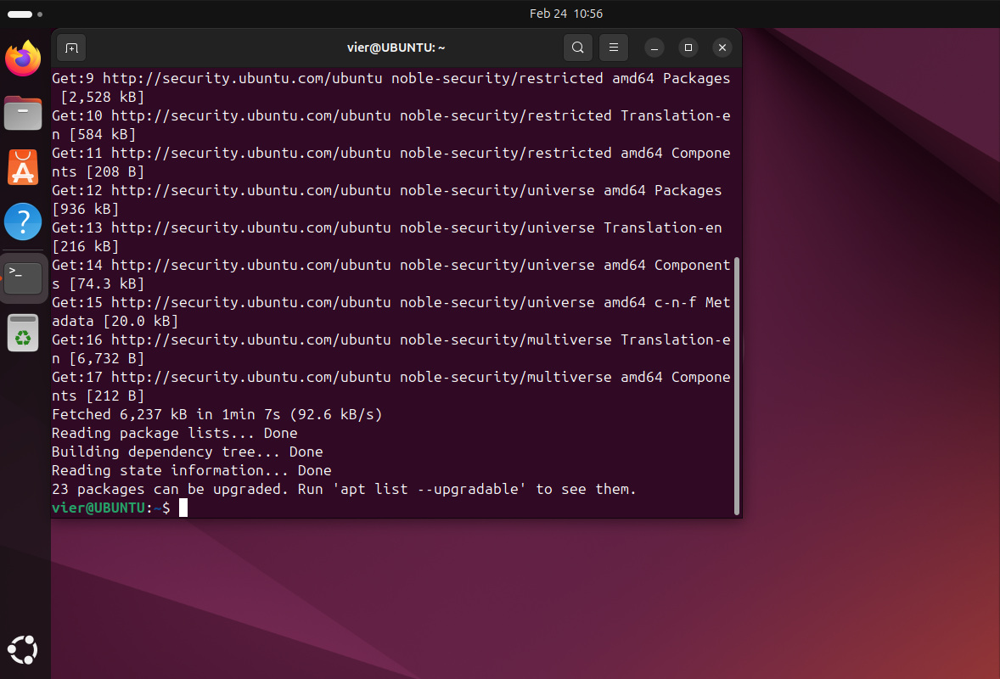

📌 *Output proses update package list*

## 2. Upgrade packages: sudo apt upgrade
Perintah untuk memperbarui semua package ke versi terbaru:

```bash
sudo apt upgrade
```

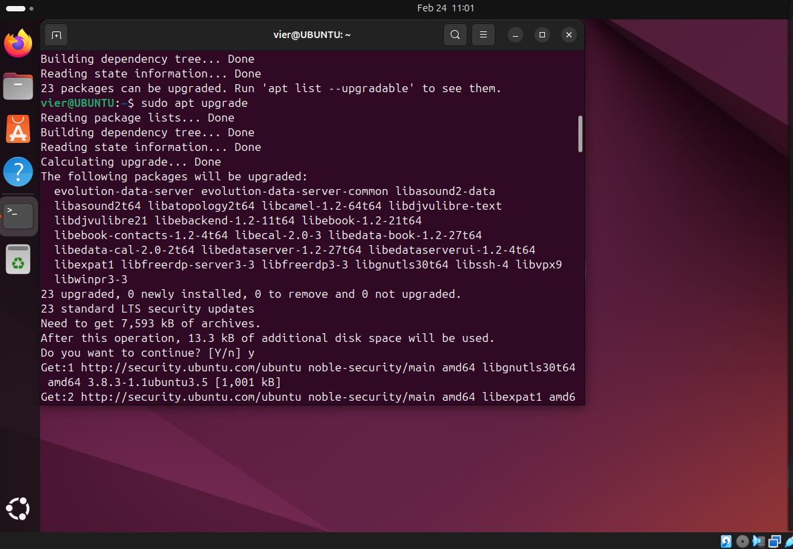

📌 *Output proses upgrade package*

## 3. Install neofetch: sudo apt install neofetch
Menginstall aplikasi **neofetch** untuk menampilkan informasi sistem:

```bash
sudo apt install neofetch
```

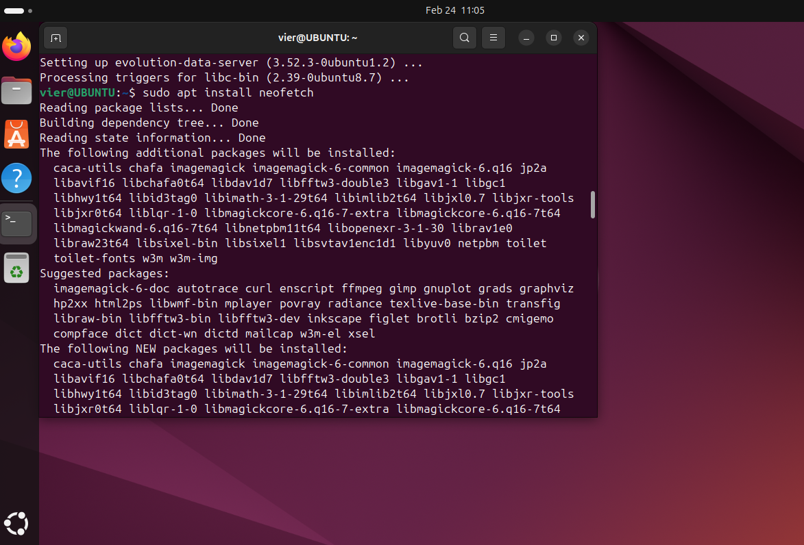

📌 *Proses instalasi neofetch*

## 4. Jalankan neofetch dan screenshot hasilnya
Menampilkan informasi sistem:

```bash
neofetch
```

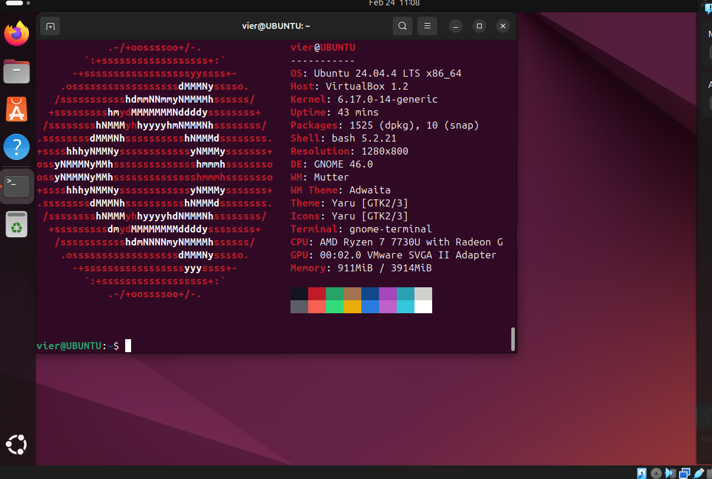


📌 *Output informasi sistem menggunakan neofetch*

## 5. Check disk usage dengan df -h
Melihat penggunaan storage/disk:

```bash
df -h
```

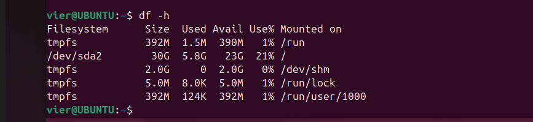
📌 *Output penggunaan disk*

### 6️. Mengecek memory dengan free -h
Melihat penggunaan RAM:

```bash
free -h
```

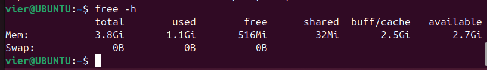

📌 *Output penggunaan memori*

## 7. Dokumentasikan output dari setiap command
Setiap perintah telah dijalankan dan didokumentasikan melalui screenshot yang menunjukkan hasil output dari sistem.
- Update dan upgrade sistem
- Instalasi aplikasi monitoring (neofetch)
- Pengecekan penggunaan disk
- Pengecekan penggunaan memori

### 3️⃣ Eksplorasi sistem yang baru diinstall:
Setelah instalasi selesai, dilakukan eksplorasi sistem untuk mengetahui konfigurasi dan kondisi server.
## 1. Tampilkan informasi OS: cat /etc/os-release
Perintah:

```bash
cat /etc/os-release
```

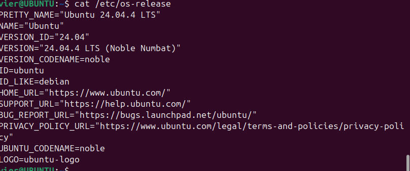

📌 *Menampilkan detail versi Ubuntu yang digunakan.*

## 2. Tampilkan versi kernel: uname -r
Perintah:

```bash
uname -r
```
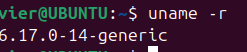

📌 *Menampilkan versi kernel Linux yang sedang berjalan.*
## 3. List partisi: lsblk
Perintah:

```bash
lsblk
```

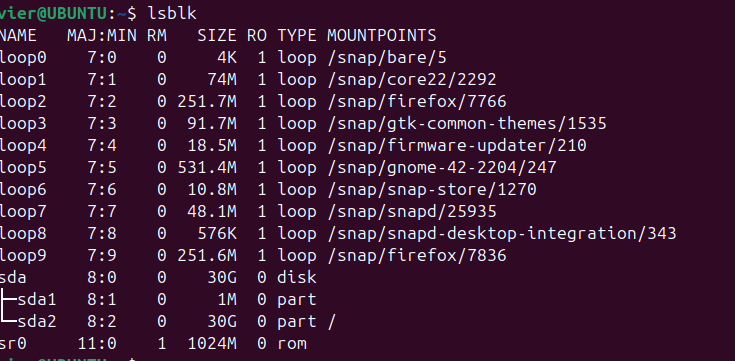

📌 *Menampilkan informasi partisi dan storage yang tersedia.*
## 4. Check network connectivity: ping -c 4 google.com
Perintah:

```bash
ping -c 4 google.com
```

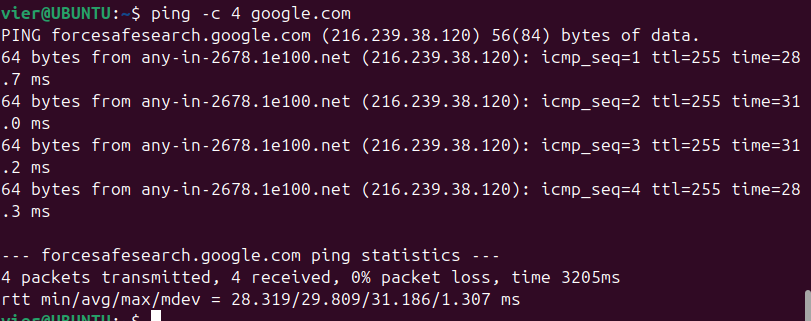

📌 *Mengirim 4 paket ping untuk memastikan koneksi internet aktif.*
## 5. Install dan jalankan htop untuk melihat resource usage
### Install htop

```bash
sudo apt install htop
```

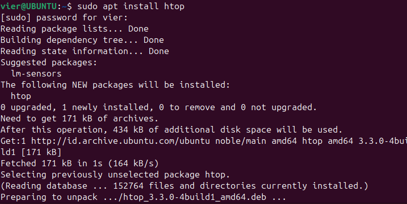

### Jalankan htop

```bash
htop
```

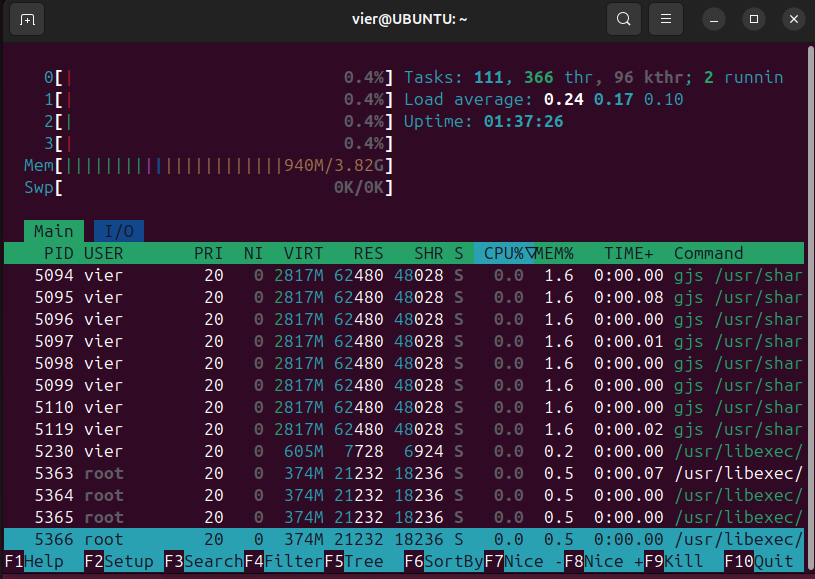

📌 *htop digunakan untuk memantau penggunaan CPU, RAM, dan proses secara real-time.*

## 6. Buat laporan singkat tentang konfigurasi sistem Anda
Berdasarkan hasil eksplorasi:

- Sistem Operasi : Ubuntu Server 22.04 LTS  
- Kernel Linux : (sesuai output `uname -r`)  
- Storage : 25GB dengan partisi otomatis  
- RAM : 2GB  
- Network : Berhasil terhubung ke internet  
- Monitoring Tool : htop terinstall dan berjalan normal 

---

### 1.10.3. Latihan Refleksi
### 1️⃣ Ceritakan pengalaman Anda dengan sistem operasi:
## 1. Sistem operasi apa yang Anda gunakan sehari-hari? (Windows, macOS, Linux, atau lainnya)
Saat ini saya sehari-hari menggunakan **Windows 10/11** sebagai sistem operasi utama pada laptop pribadi saya. Windows menjadi pilihan utama karena kompatibilitasnya yang luas dengan berbagai aplikasi perkuliahan, software development, dan kebutuhan multimedia.

## 2. Berapa lama Anda menggunakan sistem operasi tersebut?
Saya telah menggunakan Windows kurang lebih selama 6–8 tahun, mulai dari jenjang sekolah hingga perkuliahan. Selama waktu tersebut, saya sudah terbiasa dengan tampilan, pengaturan sistem, serta cara troubleshooting dasar pada Windows.

## 3. Apa yang Anda sukai dari sistem operasi tersebut?
Beberapa hal yang saya sukai dari Windows:

- Antarmuka yang user-friendly dan mudah dipahami.
- Dukungan software yang sangat luas.
- Banyak tutorial dan komunitas yang membantu jika terjadi masalah.
- Kompatibel dengan berbagai perangkat keras (printer, GPU, dll).

Windows juga mendukung berbagai aplikasi seperti Microsoft Office, browser, software coding (VS Code, IntelliJ), dan game.

## 4. Apa tantangan atau masalah yang pernah Anda hadapi?
Beberapa tantangan yang pernah saya alami:

- Update otomatis yang terkadang memakan waktu lama.
- Sistem terasa lambat jika RAM kecil.
- Risiko virus atau malware jika tidak berhati-hati.
- Kadang terjadi error driver setelah update.

Masalah-masalah tersebut biasanya dapat diatasi dengan update driver, scan antivirus, atau reinstall aplikasi tertentu.

## 5. Apakah Anda pernah menggunakan sistem operasi lain? Bandingkan pengalaman Anda.
Saya juga pernah menggunakan **Linux (Ubuntu Server 22.04 LTS)** saat praktikum. Perbedaannya cukup terasa:

| Windows | Linux (Ubuntu Server) |
|----------|------------------------|
| GUI lengkap | Lebih banyak menggunakan terminal |
| Mudah untuk pemula | Perlu memahami command line |
| Banyak software komersial | Lebih fokus open-source |

Linux terasa lebih ringan dan stabil, terutama untuk kebutuhan server. Namun, membutuhkan adaptasi karena banyak konfigurasi dilakukan melalui terminal.

## 6. Setelah mempelajari bab ini, apakah ada sistem operasi lain yang ingin Anda coba? Mengapa?
Setelah mempelajari bab ini, saya tertarik untuk mencoba **Ubuntu Desktop** atau distribusi Linux lainnya seperti Fedora. Saya ingin lebih memahami sistem berbasis open-source dan meningkatkan kemampuan dalam penggunaan command line serta administrasi sistem.

## 📌 Dokumentasi

Berikut dokumentasi penggunaan sistem:


## ✅ Kesimpulan

Dari pengalaman saya, setiap sistem operasi memiliki kelebihan dan kekurangan masing-masing. Windows cocok untuk kebutuhan umum dan produktivitas, sedangkan Linux sangat baik untuk pengembangan dan server. Pembelajaran pada bab ini membuat saya lebih memahami bagaimana sistem operasi bekerja dan membuka ketertarikan untuk mengeksplorasi sistem lain di masa depan.

---
