<h1 align="center">JOBSHEET 2 - SISTEM OPERASI</h1>


**Nama**       : M. Javier Thufail  
**NIM**        : 254107020019  
**Kelas**      : TI 1-G  
**No. Absen**  : 18  

---
## Praktikum 2.1 — 🖥️ Identifikasi CPU dan Memori
## 1. Tampilkan informasi CPU:
Perintah:

```bash
lscpu
```

📌 *Kode 1.1 – Melihat informasi CPU*

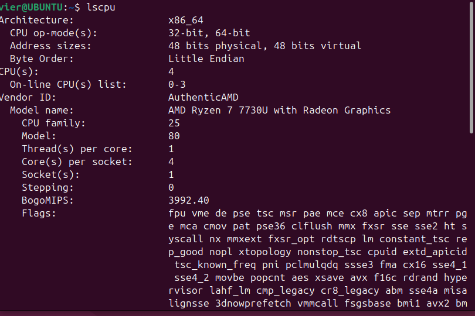

Keterangan:
Perintah `lscpu` digunakan untuk menampilkan detail arsitektur CPU seperti jumlah core, thread, dan model prosesor.

## 2. Tampilkan ringkasan memori:
Perintah:

```bash
free -h
```

📌 *Kode 1.2 – Melihat penggunaan memori*

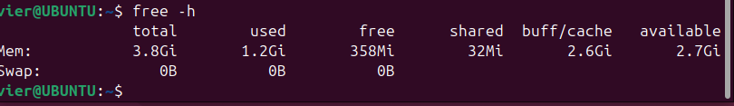

Keterangan:
Perintah `free -h` digunakan untuk melihat total RAM, memori yang terpakai, serta swap dalam format yang mudah dibaca (human-readable).

## 3. (Opsional) cek informasi hardware dari DMI/BIOS (butuh sudo):
Perintah:

```bash
sudo dmidecode -t system
```

📌 *Kode 1.3 – Informasi DMI (opsional)*

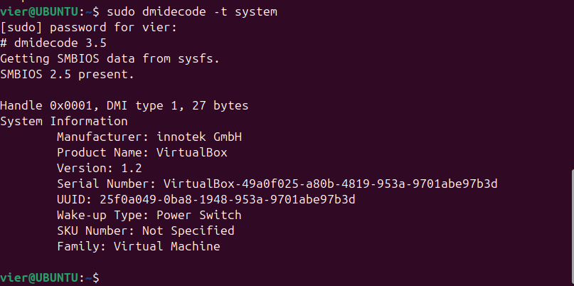

Keterangan:
Perintah ini menampilkan informasi sistem dari BIOS/DMI seperti manufacturer, product name, dan versi sistem.

## 🔎 Latihan 2.1
Catat: (1) jumlah CPU(s), core/thread, (2) total RAM, (3) total swap. Jelaskan perbedaan RAM vs swap dalam 2–3 kalimat.
#### ✅ Data yang Diperoleh:

1. Jumlah CPU(s)        : (4 `lscpu`)
2. Core / Thread        : (1 `lscpu`)
3. Total RAM            : (3.8 `free -h`)
4. Total Swap           : (0B `free -h`)

#### ✍️ Penjelasan RAM vs Swap

RAM adalah memori utama yang digunakan sistem untuk menjalankan aplikasi secara aktif dan memiliki kecepatan sangat tinggi.  
Swap adalah ruang pada storage (HDD/SSD) yang digunakan sebagai memori cadangan ketika RAM hampir penuh, tetapi kecepatannya lebih lambat dibandingkan RAM.

---

## Praktikum 2.2 — 🔌 Identifikasi Perangkat PCI/USB dan Driver
## 1. Lihat daftar perangkat PCI:
Perintah:

```bash
lspci
```

📌 *Kode 1.4: Daftar perangkat PCI (ringkas)*

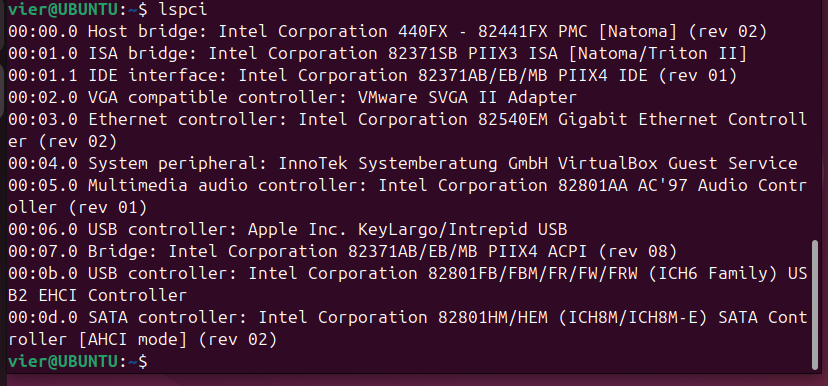

## 2. Lihat perangkat PCI beserta driver kernel yang digunakan:
Perintah:

```bash
lspci -nnk
```

📌 *Kode 1.5: Melihat driver perangkat PCI*

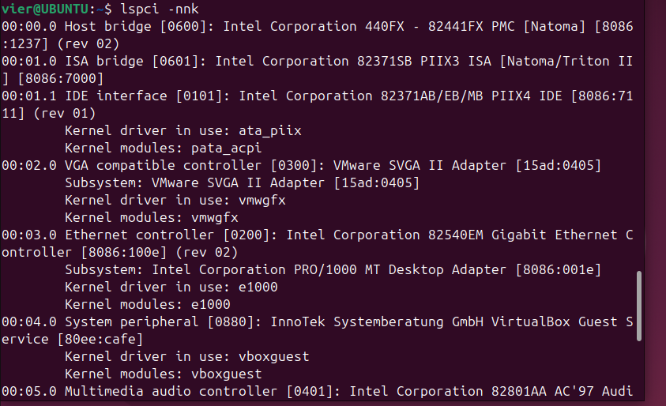

## 3. Fokus pada NIC (Ethernet) untuk mencari modul driver:
Perintah:

```bash
lspci -nnk | grep -A3 -i ethernet
```

📌 *Kode 1.6: Mencari informasi NIC dan driver yang digunakan*

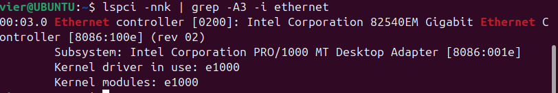

## 4. Lihat perangkat USB:
Perintah:

```bash
lsusb
```

📌 *Kode 1.7: Daftar perangkat USB*

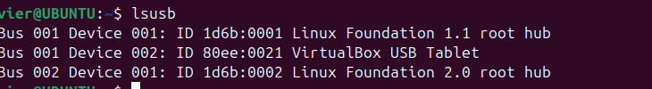

## 5. Lihat topologi USB (tree):
Perintah:

```bash
lsusb -t
```

📌 *Kode 1.8: Topologi perangkat USB*

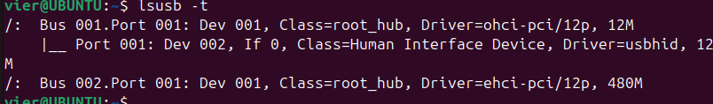


## 🔎 Latihan 2.2
Temukan 1 perangkat PCI (misal NIC) dan tuliskan: Vendor:Device ID (angka heksadesimal), nama driver/modul kernel, dan deskripsi singkat fungsinya
### ✅ Contoh Hasil Identifikasi Perangkat PCI (NIC)

Berikut contoh identifikasi salah satu perangkat PCI (Network Interface Card):

- **Vendor:Device ID** : 8086:100e  
- **Driver/Modul Kernel** : e1000  
- **Deskripsi Fungsi** :  
  Perangkat ini merupakan Network Interface Card (Ethernet) yang digunakan untuk menghubungkan sistem ke jaringan lokal (LAN) atau internet. Driver `e1000` memungkinkan kernel Linux berkomunikasi dengan perangkat jaringan tersebut.

  ---

## Praktikum 2.3 — 💾 Identifikasi Storage dan Filesystem
## 1. Lihat daftar disk/partisi:
Perintah:

```bash
lsblk -f
```

📌 *Kode 1.9: Melihat block device dan filesystem*

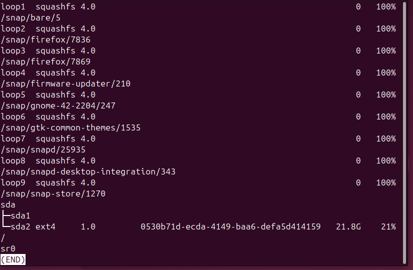

## 2. Tampilkan UUID dan tipe filesystem:
Perintah:

```bash
sudo blkid
```

📌 *Kode 1.10: Melihat UUID filesystem*

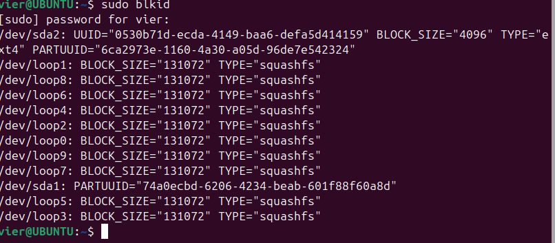

## 3. Lihat mount point untuk root filesystem:
Perintah:

```bash
findmnt /
```

📌 *Kode 1.11: Melihat device untuk root filesystem*

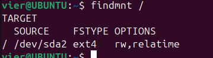

---

## Praktikum 2.4 — 🧩 Melihat Modul Aktif dan Informasinya
## 1. Cek versi kernel:
Perintah:

```bash
uname -r
```

📌 *Kode 1.13: Cek versi kernel*


## 2. Tampilkan daftar modul aktif:
Perintah:

```bash
lsmod | head
```

📌 *Kode 1.14: Daftar modul aktif*

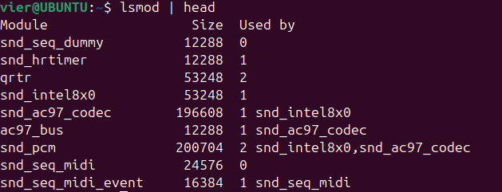

## 3. Pilih salah satu modul (contoh aman: loop) dan lihat detailnya:
Perintah:

```bash
modinfo loop
```

📌 *Kode 1.15: Detail modul dengan modinfo*

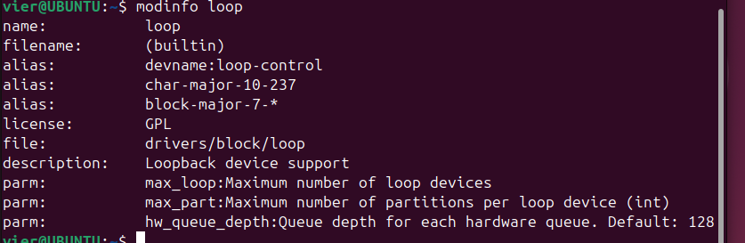

## 4. Muat modul (jika belum aktif), lalu verifikasi:
Perintah untuk memuat modul (jika belum aktif):

```bash
sudo modprobe loop
```

Verifikasi apakah modul berhasil dimuat:

```bash
lsmod | grep -i loop
```

📌 *Kode 1.16: Load modul dan verifikasi*

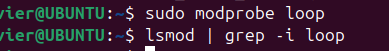

## 5. (Opsional) lihat pesan kernel terbaru:
Perintah:

```bash
dmesg -T | tail -n 20
```

📌 *Kode 1.17: Cek log kernel terbaru*

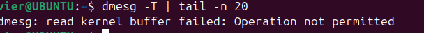

---

## Praktikum 2.5 — ⚙️ Konfigurasi Auto-load dan Blacklist
## 1. Buat file auto-load:
Perintah:

```bash
echo "loop" | sudo tee /etc/modules-load.d/loop.conf
```

📌 *Kode 1.18: Menambahkan modul untuk auto-load (demo)*

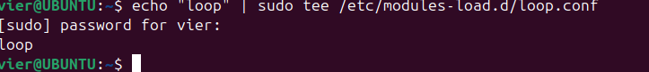

## 2. Simulasikan verifikasi (tanpa reboot) dengan memastikan modul sudah aktif:
1Perintah:

```bash
lsmod | grep -i loop
```

📌 *Kode 1.19: Verifikasi modul aktif*

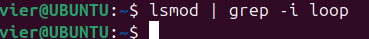

## 3. (Opsional, konsep) blacklist modul:
Contoh perintah blacklist modul:

```bash
echo "blacklist loop" | sudo tee /etc/modprobe.d/blacklist-loop.conf
```

📌 *Kode 1.20: Contoh blacklist modul (JANGAN diterapkan sembarangan)*

---

## Praktikum 2.6 — 🗂️ Mengenali Block vs Character Device
## 1. Lihat detail salah satu disk (sesuaikan dengan perangkat Anda, misal sda):
Perintah (sesuaikan dengan perangkat Anda, misalnya `sda`):

```bash
ls -l /dev/sda
```

📌 *Kode 1.21: Melihat detail device node disk*

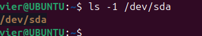

## 2. Lihat detail device terminal:
Perintah:

```bash
ls -l /dev/tty
```

📌 *Kode 1.22: Melihat detail device node terminal*

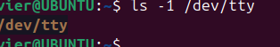

## 3. Lihat disk dan partisi untuk mengaitkan dengan /dev:
Perintah:

```bash
lsblk
```

📌 *Kode 1.23: Mapping disk/partisi*

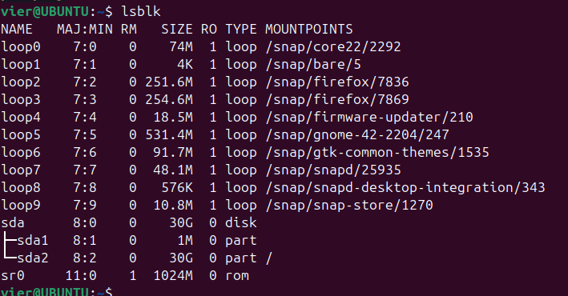

## 🔎 Latihan 2.3
Dari output ls -l, jelaskan perbedaan penanda file untuk block device dan character device. (Hint: karakter pertama pada permission string)
### ✅ Perbedaan Block Device dan Character Device

Perbedaan dapat dilihat dari **karakter pertama pada permission string** hasil perintah `ls -l`:

- Jika diawali huruf **`b`** → menunjukkan **block device**  
  Contoh:  
  ```
  brw-rw---- 1 root disk ...
  ```
  Artinya perangkat tersebut membaca/menulis data dalam bentuk blok (contoh: hard disk, SSD).

- Jika diawali huruf **`c`** → menunjukkan **character device**  
  Contoh:  
  ```
  crw-rw-rw- 1 root tty ...
  ```
  Artinya perangkat tersebut membaca/menulis data dalam bentuk karakter (contoh: terminal, keyboard, mouse).
  
  ---

## Praktikum 2.7 — 🔎 Melihat Informasi udev
## 1. Cek atribut udev untuk disk:
Perintah (sesuaikan dengan perangkat Anda, misalnya `sda`):

```bash
udevadm info --query=all --name=/dev/sda | head -n 30
```

📌 *Kode 1.24: Melihat atribut udev untuk disk*


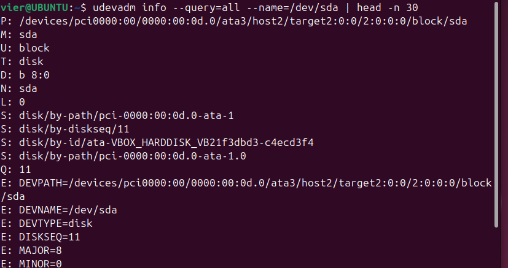

## 2. (Opsional) monitor event udev (jalankan, lalu colok/lepas USB pada mesin fisik):
Perintah:

```bash
sudo udevadm monitor
```

📌 *Kode 1.25: Monitor event udev (opsional)*

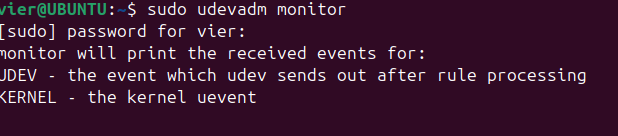

---

## Praktikum 2.8 — 📁 Membuat Workspace Praktikum
## 1. Buat direktori praktikum dan masuk ke dalamnya:
Perintah:

```bash
mkdir -p ~/praktikum-os/week02
cd ~/praktikum-os/week02
pwd
```
📌 *Kode 1.26: Membuat workspace praktikum*


## 2. Buat beberapa file contoh:
Perintah:

```bash
touch notes.txt data.log config.txt
ls -lah
```

📌 *Kode 1.27: Membuat file contoh*

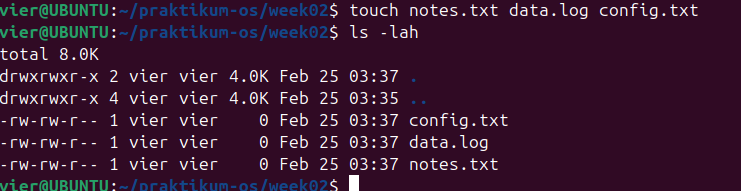

## 3. Isi file log contoh (simulasi):
Perintah:

```bash
echo "INFO: service started" >> data.log
echo "WARN: disk usage high" >> data.log
echo "ERROR: failed to connect" >> data.log
cat data.log
```

📌 *Kode 1.28: Mengisi file log contoh*

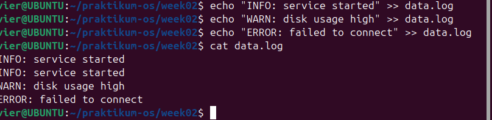

## 4. Baca file dengan less:
Perintah:

```bash
less data.log
```

📌 *Kode 1.29: Membaca file dengan less*


---


## Praktikum 2.9 — 🔎 Pencarian Pola dengan grep
1. Cari baris yang mengandung ERROR pada data.log:
Perintah:

```bash
grep "ERROR" data.log
```

📌 *Kode 1.30: grep sederhana*

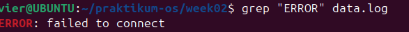

2. Cari tanpa memperhatikan huruf besar/kecil:
Perintah:

```bash
grep -i "error" data.log
```

📌 *Kode 1.31: grep case-insensitive*

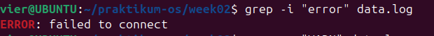

3. Tampilkan nomor baris:
Perintah:

```bash
grep -n "WARN" data.log
```

📌 *Kode 1.32: grep dengan nomor baris*


4. Tampilkan baris yang tidak cocok (invert match):
Perintah:

```bash
grep -v "INFO" data.log
```

📌 *Kode 1.33: grep invert match*

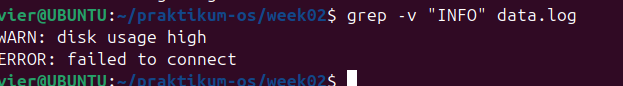

## 🔎 Latihan 2.4
Gunakan grep untuk menampilkan hanya baris yang mengandung INFO atau WARN dari data.log. (Hint: gunakan grep -E dengan pola alternatif)
### 📌 Menampilkan Baris yang Mengandung INFO atau WARN

Perintah:

```bash
grep -E "INFO|WARN" data.log
```

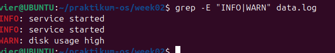

Keterangan:
- Opsi `-E` memungkinkan penggunaan **regular expression extended**.
- Tanda `|` berarti **atau (OR)**.
- Perintah ini akan menampilkan baris yang mengandung **INFO** atau **WARN** saja.

---

## Praktikum 2.10 — 🔄 Substitusi dengan sed (Aman di File Latihan)
## 1. Siapkan file konfigurasi latihan:
Perintah:

```bash
cat > config.txt << 'EOF'
PORT=8080
MODE=dev
SERVICE_NAME=myserver
EOF

cat config.txt
```

📌 *Kode 1.34: Membuat file config latihan*

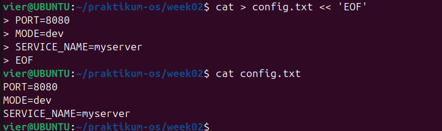

## 2. Ganti dev menjadi prod (tanpa mengubah file asli):
Perintah:

```bash
sed 's/MODE=dev/MODE=prod/' config.txt
```

📌 *Kode 1.35: sed substitusi tanpa in-place*

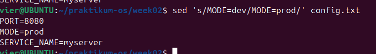

## 3. Terapkan perubahan langsung ke file (-i):
Perintah:

```bash
sed -i 's/MODE=dev/MODE=prod/' config.txt
cat config.txt
```

📌 *Kode 1.36: sed in-place*

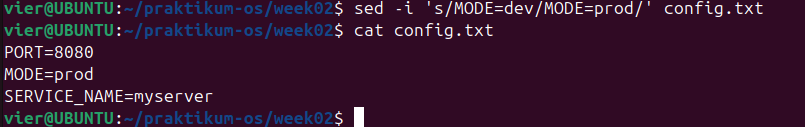

## 4. Ganti semua kemunculan kata (g untuk global), contoh ubah myserver menjadi node:
Perintah:

```bash
sed -i 's/myserver/node/g' config.txt
cat config.txt
```

📌 *Kode 1.37: sed global replacement*

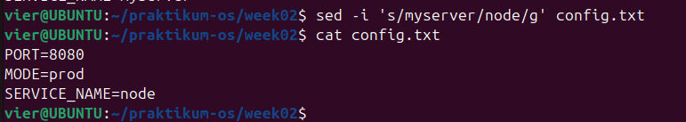

---

## Praktikum 2.11 — 📊 Ekstraksi Kolom dengan awk
## 1. Lihat output df -h:
Perintah:

```bash
df -h
```

📌 *Kode 1.38: Output df -h*

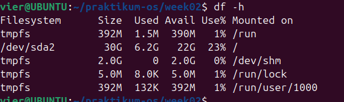

## 2. Ambil kolom filesystem dan persentase pemakaian:
Perintah:

```bash
df -h | awk 'NR==1 {print $1, $5, $6} NR>1 {print $1, $5, $6}'
```

📌 *Kode 1.39: awk print kolom tertentu*

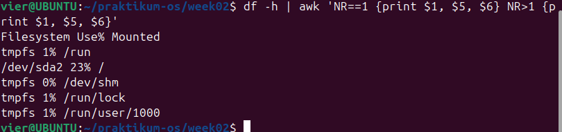

## 3. Filter hanya yang pemakaian disk di atas 80%:
Perintah:

```bash
df -h | awk 'NR==1 || ($5+0) > 80 {print $1, $5, $6}'
```

📌 *Kode 1.40: awk filter berdasarkan kondisi*

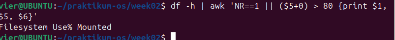


---

## Praktikum 2.12 — 🖥️ Melihat Proses dengan ps
## 1. Tampilkan semua proses (format BSD):
Perintah:

```bash
ps aux | head
```

📌 *Kode 1.41: ps aux*

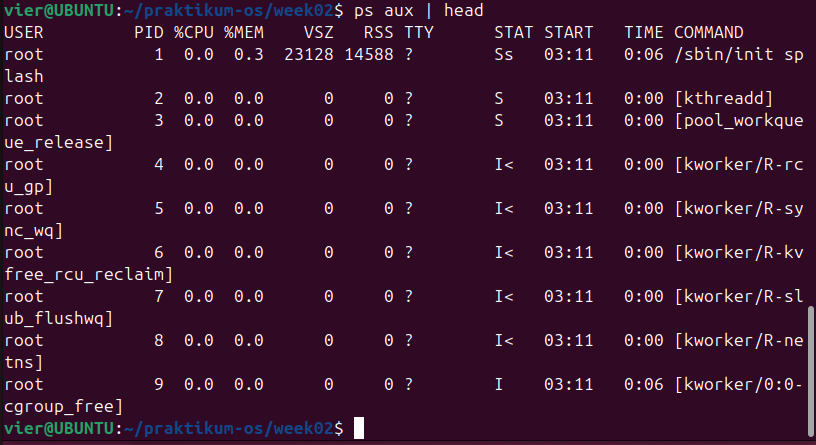

## 2. Cari proses tertentu (misal sshd):
Perintah:

```bash
ps aux | grep -i sshd
```

📌 *Kode 1.42: Filter proses dengan grep*

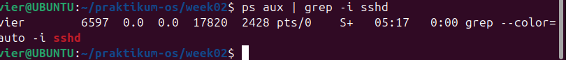


---

## Praktikum 2.13 — 📊 Monitoring Real-time dengan top
## 1. Jalankan top:
Perintah:

```bash
top
```

📌 *Kode 1.43: Menjalankan top*

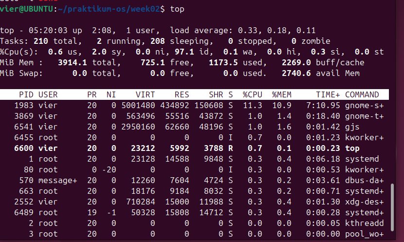

## 2. Amati nilai load average, pemakaian CPU, dan proses teratas. Tekan q untuk keluar.
Saat `top` berjalan, perhatikan nilai berikut:

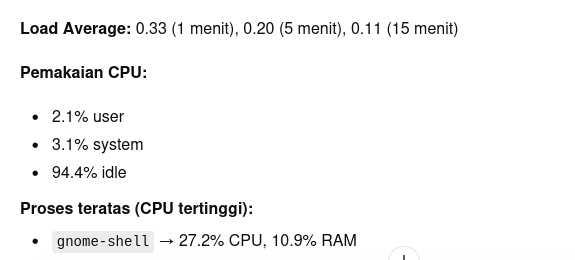


---

## Praktikum 2.14 — 🛑 Menghentikan Proses dengan kill
## 1. Jalankan proses dummy di background:
Perintah:

```bash
sleep 300 &
```

📌 *Kode 1.44: Membuat proses dummy*

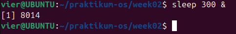

## 2. Cari PID proses sleep:
Perintah:

```bash
ps aux | grep -E "sleep 300" | grep -v grep
```

📌 *Kode 1.45: Mencari PID sleep*

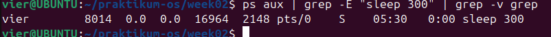

## 3. Hentikan dengan SIGTERM:
Perintah:

```bash
kill <PID_ANDA>
```

📌 *Kode 1.46: Mengirim SIGTERM*


## 4. Verifikasi proses berhenti:
Perintah:

```bash
ps aux | grep -E "sleep 300" | grep -v grep
```

📌 *Kode 1.47: Verifikasi proses sudah berhenti*


## 5. (Opsional) Jika proses sulit untuk dihentikan dan Anda membutukan untuk menghentikan proses tersebut, gunakan SIGKILL:
Perintah:

```bash
kill -9 <PID_ANDA>
```

📌 *Kode 1.48: Mengirim SIGKILL (opsional)*


---

## Praktikum 2.15 — 🖥️ Cek Disk, Load, dan Service
## 1. Cek penggunaan disk:
Perintah:

```bash
df -h
```

📌 *Kode 1.49: Cek kapasitas disk*

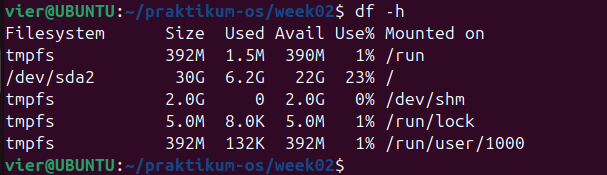

## 2. Cari direktori yang besar (contoh pada /var):
Perintah:

```bash
sudo du -sh /var/* 2>/dev/null | sort -h | tail -n 10
```

📌 *Kode 1.50: Cek ukuran direktori (contoh /var)*

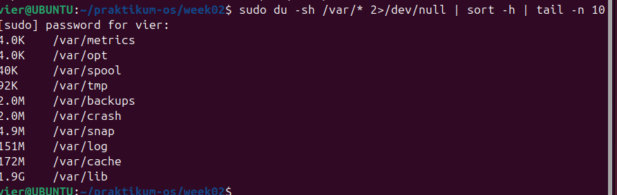

## 3. Cek load dan uptime:
Perintah:

```bash
uptime
```

📌 *Kode 1.51: Cek load average*


## 4. Cek service yang gagal:
Perintah:

```bash
systemctl --failed
```

📌 *Kode 1.52: Service yang gagal*

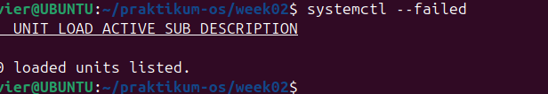

## 5. Ambil log error terbaru (jika ada indikasi masalah):
Perintah:

```bash
journalctl -xe | tail -n 50
```

📌 *Kode 1.53: Log error terbaru*

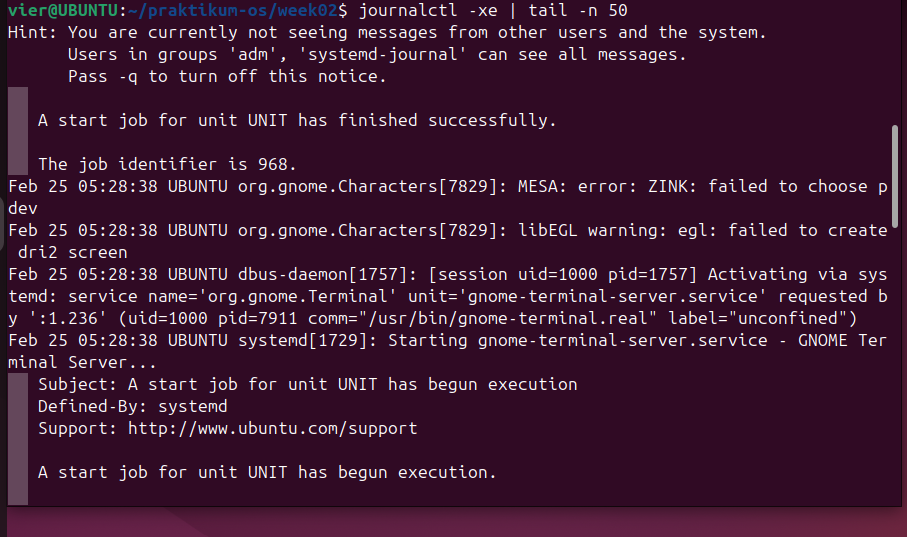

---

## Praktikum 2.16 — 🌐 Monitoring Port dan Koneksi (Network Basics)
## 1. Lihat interface dan IP:
Perintah:

```bash
ip a
```

📌 *Kode 1.54: Cek IP address*

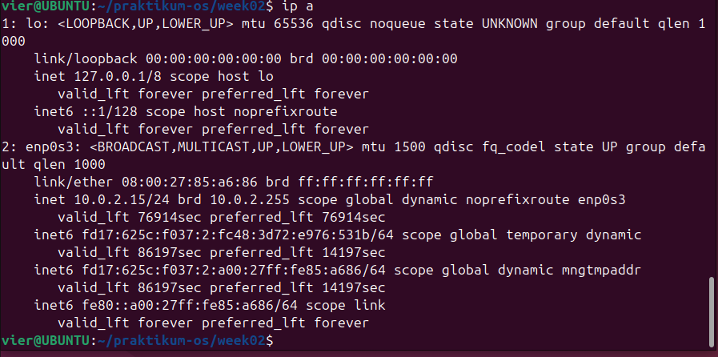

## 2. Lihat routing table:
Perintah:

```bash
ip r
```

📌 *Kode 1.55: Cek routing*

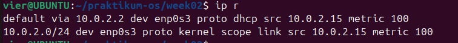

## 3. Lihat port yang sedang listening:
Perintah:

```bash
sudo ss -tulpn
```

📌 *Kode 1.56: Cek port listening*

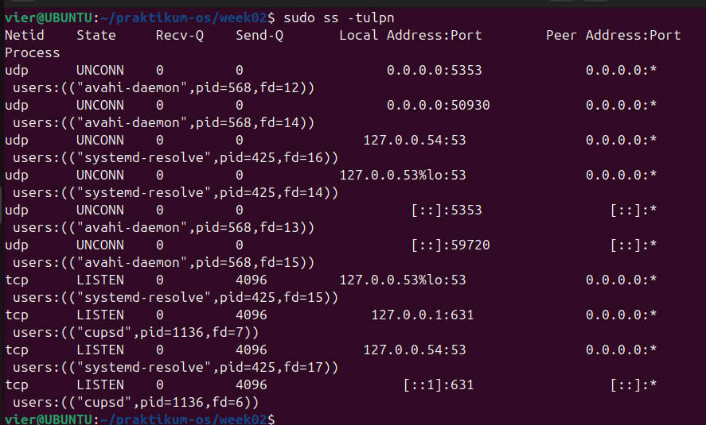

## 🔎 Latihan 2.5
* Pilih satu port yang listening dari output ss -tulpn(misal port 22), lalu tuliskan service/proses yang membukanya. Jelaskan kegunaan port tersebut secara singkat.

```
Port yang dipilih    : 631
Service/Proses       : CUPS (Common Unix Printing System)
Status               : LISTEN

Kegunaan:
Port 631 digunakan oleh layanan CUPS untuk manajemen dan konfigurasi printer 
melalui jaringan atau web interface (http://localhost:631).
```

---
---

# 📝 Latihan

## 🔹 Latihan 2.A

Jalankan `lspci -nnk`. Pilih 1 perangkat PCI dan tuliskan detailnya.

```
Nama Perangkat       : Ethernet controller - Intel Corporation 82540EM
ID vendor:device     : 8086:100e
Kernel driver in use : e1000
```

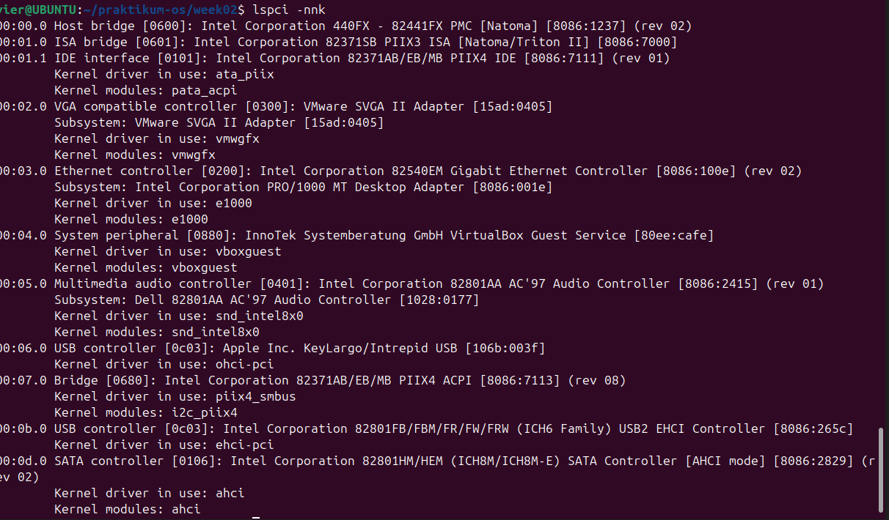

---

## 🔹 Latihan 2.B

Menentukan root filesystem dengan `findmnt /` dan mencocokkan dengan `lsblk -f`.

```
Root filesystem : /dev/sda2
Filesystem      : ext4
UUID            : 0530b71d-ecda-4149-baa6-defa5d414159
```

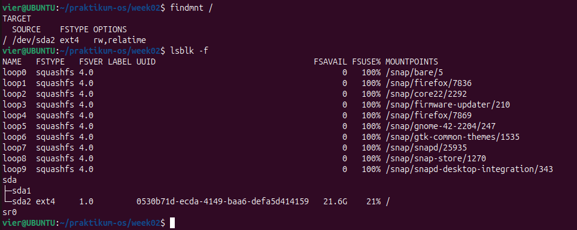

---

## 🔹 Latihan 2.C

Membuat file `server.log` minimal 10 baris (INFO, WARN, ERROR), lalu menampilkan hanya baris ERROR menggunakan `grep`.

Contoh perintah:
```bash
grep "ERROR" server.log
```


---

## 🔹 Latihan 2.D

Mengganti semua kata `server` menjadi `node` menggunakan `sed`.

Perintah:
```bash
sed -i 's/server/node/g' nama_file.txt
```


---

## 🔹 Latihan 2.E

Menampilkan filesystem dengan penggunaan disk di atas 70%.

Perintah:
```bash
df -h | awk 'NR==1 || ($5+0) > 70'
```

Hasil:
```
Tidak ada disk yang mencapai 70%.
```


---

## 🔹 Latihan 2.F

Menjalankan proses di background dan menghentikannya.

```bash
sleep 600 &
ps aux | grep sleep
kill <PID>
```

### Perbedaan SIGTERM dan SIGKILL

| SIGTERM (15) | SIGKILL (9) |
|--------------|-------------|
| Menghentikan proses secara normal | Menghentikan proses secara paksa |
| Bisa cleanup data | Langsung berhenti |
| Bisa ditangkap program | Tidak bisa ditangkap |


---

## 🔹 Latihan 2.G

Menjalankan:
```bash
systemctl --failed
```

Hasil:
```
0 loaded units listed.
```

Artinya tidak ada service yang gagal.

Jika memilih service aktif (misal ssh):

```bash
systemctl status ssh
journalctl -u ssh | tail -n 30
```

  


---
*Jobsheet 2 - Sistem Operasi*


