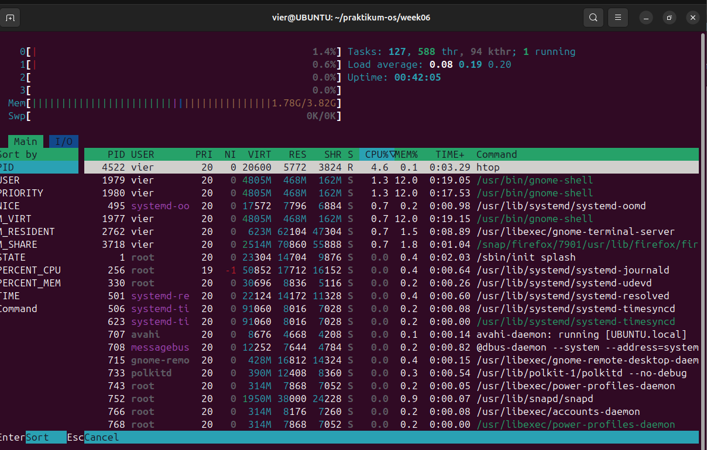
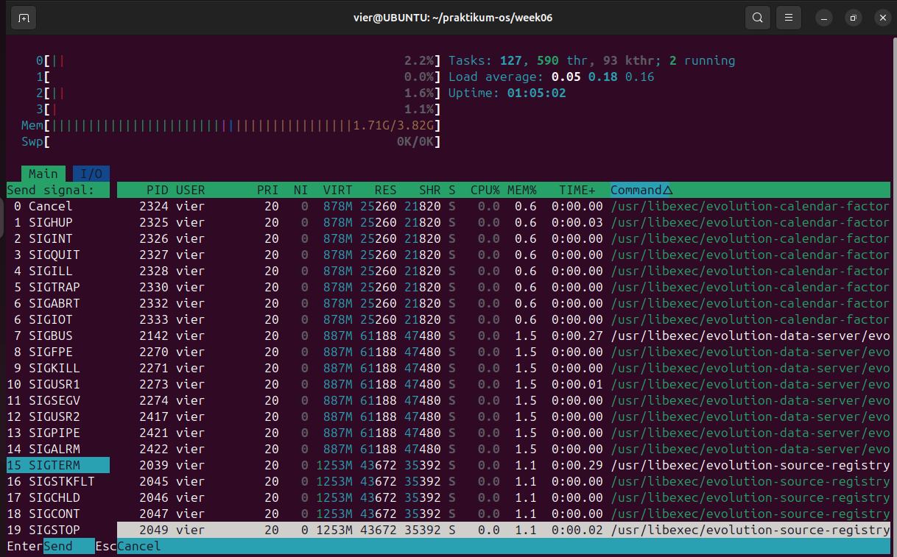

<h1 align="center">JOBSHEET 6 - SISTEM OPERASI</h1>


**Nama**       : M. Javier Thufail  
**NIM**        : 254107020019  
**Kelas**      : TI 1-G  
**No. Absen**  : 18  

---
<h1 align="center">Manajemen Proses</h2>

## Praktikum 6.1 — Melihat Proses dan Thread
### 1. Tampilkan semua proses yang berjalan
Perintah:
```bash
ps aux
```

Output:
```bash
vier@UBUNTU:~$ ps aux
USER         PID %CPU %MEM    VSZ   RSS TTY      STAT START   TIME COMMAND
root           1  6.4  0.3  23168 14624 ?        Ss   18:13   0:01 /sbin/init sp
root           2  0.0  0.0      0     0 ?        S    18:13   0:00 [kthreadd]
root           3  0.0  0.0      0     0 ?        S    18:13   0:00 [pool_workque
root           4  0.0  0.0      0     0 ?        I<   18:13   0:00 [kworker/R-rc
root           5  0.0  0.0      0     0 ?        I<   18:13   0:00 [kworker/R-sy
root           6  0.0  0.0      0     0 ?        I<   18:13   0:00 [kworker/R-kv
root           7  0.0  0.0      0     0 ?        I<   18:13   0:00 [kworker/R-sl
root           8  0.0  0.0      0     0 ?        I<   18:13   0:00 [kworker/R-ne
root           9  0.0  0.0      0     0 ?        I    18:13   0:00 [kworker/0:0-
``` 
<details>
<summary><b>Baca Selengkapnya...</b></summary>
<br>

```bash
root          10  0.1  0.0      0     0 ?        I    18:13   0:00 [kworker/0:1-
root          11  0.0  0.0      0     0 ?        I<   18:13   0:00 [kworker/0:0H
root          12  1.4  0.0      0     0 ?        I    18:13   0:00 [kworker/u16:
root          13  0.0  0.0      0     0 ?        I<   18:13   0:00 [kworker/R-mm
root          14  0.1  0.0      0     0 ?        S    18:13   0:00 [ksoftirqd/0]
root          15  0.7  0.0      0     0 ?        I    18:13   0:00 [rcu_preempt]
root          16  0.0  0.0      0     0 ?        S    18:13   0:00 [rcu_exp_par_
root          17  0.2  0.0      0     0 ?        S    18:13   0:00 [rcu_exp_gp_k
root          18  0.0  0.0      0     0 ?        S    18:13   0:00 [migration/0]
root          19  0.0  0.0      0     0 ?        S    18:13   0:00 [idle_inject/
root          20  0.0  0.0      0     0 ?        S    18:13   0:00 [cpuhp/0]
root          21  0.0  0.0      0     0 ?        S    18:13   0:00 [cpuhp/1]
root          22  0.0  0.0      0     0 ?        S    18:13   0:00 [idle_inject/
root          23  1.4  0.0      0     0 ?        S    18:13   0:00 [migration/1]
root          24  0.4  0.0      0     0 ?        S    18:13   0:00 [ksoftirqd/1]
root          25  0.1  0.0      0     0 ?        I    18:13   0:00 [kworker/1:0-
root          26  0.0  0.0      0     0 ?        I<   18:13   0:00 [kworker/1:0H
root          27  0.0  0.0      0     0 ?        S    18:13   0:00 [cpuhp/2]
root          28  0.0  0.0      0     0 ?        S    18:13   0:00 [idle_inject/
root          29  1.4  0.0      0     0 ?        S    18:13   0:00 [migration/2]
root          30  0.1  0.0      0     0 ?        S    18:13   0:00 [ksoftirqd/2]
root          31  0.0  0.0      0     0 ?        I    18:13   0:00 [kworker/2:0-
root          32  0.0  0.0      0     0 ?        I<   18:13   0:00 [kworker/2:0H
root          33  0.0  0.0      0     0 ?        S    18:13   0:00 [cpuhp/3]
root          34  0.0  0.0      0     0 ?        S    18:13   0:00 [idle_inject/
root          35  0.0  0.0      0     0 ?        S    18:13   0:00 [migration/3]
root          36  0.1  0.0      0     0 ?        S    18:13   0:00 [ksoftirqd/3]
root          37  0.0  0.0      0     0 ?        I    18:13   0:00 [kworker/3:0-
root          38  0.0  0.0      0     0 ?        I<   18:13   0:00 [kworker/3:0H
root          39  0.0  0.0      0     0 ?        S    18:13   0:00 [kdevtmpfs]
root          40  0.0  0.0      0     0 ?        I<   18:13   0:00 [kworker/R-in
root          41  0.0  0.0      0     0 ?        I    18:13   0:00 [rcu_tasks_kt
root          42  0.0  0.0      0     0 ?        I    18:13   0:00 [rcu_tasks_ru
root          43  0.0  0.0      0     0 ?        I    18:13   0:00 [rcu_tasks_tr
root          44  0.0  0.0      0     0 ?        S    18:13   0:00 [kauditd]
root          45  0.0  0.0      0     0 ?        S    18:13   0:00 [khungtaskd]
root          46  0.0  0.0      0     0 ?        S    18:13   0:00 [oom_reaper]
root          47  1.1  0.0      0     0 ?        I    18:13   0:00 [kworker/u16:
root          48  0.0  0.0      0     0 ?        I<   18:13   0:00 [kworker/R-wr
root          49  0.0  0.0      0     0 ?        I    18:13   0:00 [kworker/u16:
root          50  0.0  0.0      0     0 ?        S    18:13   0:00 [kcompactd0]
root          51  0.0  0.0      0     0 ?        SN   18:13   0:00 [ksmd]
root          52  0.0  0.0      0     0 ?        SN   18:13   0:00 [khugepaged]
root          53  0.0  0.0      0     0 ?        I<   18:13   0:00 [kworker/R-kb
root          54  0.0  0.0      0     0 ?        I<   18:13   0:00 [kworker/R-bl
root          55  0.0  0.0      0     0 ?        I<   18:13   0:00 [kworker/R-ki
root          56  0.0  0.0      0     0 ?        S    18:13   0:00 [irq/9-acpi]
root          57  0.1  0.0      0     0 ?        I    18:13   0:00 [kworker/2:1-
root          58  0.1  0.0      0     0 ?        I    18:13   0:00 [kworker/3:1-
root          59  0.1  0.0      0     0 ?        I    18:13   0:00 [kworker/1:1-
root          60  0.0  0.0      0     0 ?        I<   18:13   0:00 [kworker/R-tp
root          61  0.0  0.0      0     0 ?        I<   18:13   0:00 [kworker/R-at
root          62  0.0  0.0      0     0 ?        I<   18:13   0:00 [kworker/R-md
root          63  0.0  0.0      0     0 ?        I<   18:13   0:00 [kworker/R-md
root          64  0.0  0.0      0     0 ?        I<   18:13   0:00 [kworker/R-ed
root          65  0.0  0.0      0     0 ?        I<   18:13   0:00 [kworker/R-de
root          66  0.0  0.0      0     0 ?        S    18:13   0:00 [watchdogd]
root          67  0.0  0.0      0     0 ?        I<   18:13   0:00 [kworker/R-qu
root          68  0.0  0.0      0     0 ?        I<   18:13   0:00 [kworker/3:1H
root          69  0.0  0.0      0     0 ?        S    18:13   0:00 [kswapd0]
root          70  0.0  0.0      0     0 ?        S    18:13   0:00 [ecryptfs-kth
root          71  0.0  0.0      0     0 ?        I<   18:13   0:00 [kworker/R-kt
root          72  0.0  0.0      0     0 ?        I<   18:13   0:00 [kworker/R-ac
root          73  0.0  0.0      0     0 ?        S    18:13   0:00 [scsi_eh_0]
root          74  0.0  0.0      0     0 ?        I<   18:13   0:00 [kworker/R-sc
root          75  0.0  0.0      0     0 ?        S    18:13   0:00 [scsi_eh_1]
root          76  0.0  0.0      0     0 ?        I<   18:13   0:00 [kworker/R-sc
root          77  0.3  0.0      0     0 ?        I    18:13   0:00 [kworker/u16:
root          78  1.1  0.0      0     0 ?        I    18:13   0:00 [kworker/u16:
root          79  0.0  0.0      0     0 ?        I<   18:13   0:00 [kworker/2:1H
root          80  0.0  0.0      0     0 ?        I<   18:13   0:00 [kworker/R-ml
root          81  0.0  0.0      0     0 ?        I<   18:13   0:00 [kworker/R-ip
root          82  0.0  0.0      0     0 ?        I<   18:13   0:00 [kworker/R-ks
root          84  0.0  0.0      0     0 ?        I<   18:13   0:00 [kworker/u17:
root          95  0.0  0.0      0     0 ?        I<   18:13   0:00 [kworker/R-ch
root          96  0.2  0.0      0     0 ?        I<   18:13   0:00 [kworker/1:1H
root          97  0.0  0.0      0     0 ?        I    18:13   0:00 [kworker/2:2-
root         146  0.0  0.0      0     0 ?        I<   18:13   0:00 [kworker/0:1H
root         150  0.0  0.0      0     0 ?        I    18:13   0:00 [kworker/3:2]
root         151  0.0  0.0      0     0 ?        S    18:13   0:00 [scsi_eh_2]
root         152  0.0  0.0      0     0 ?        I<   18:13   0:00 [kworker/R-sc
root         164  0.0  0.0      0     0 ?        I    18:13   0:00 [kworker/0:2-
root         208  0.0  0.0      0     0 ?        S    18:14   0:00 [jbd2/sda2-8]
root         209  0.0  0.0      0     0 ?        I<   18:14   0:00 [kworker/R-ex
root         257  1.8  0.4  42588 17572 ?        S<s  18:14   0:00 /usr/lib/syst
root         299  0.0  0.0      0     0 ?        I    18:14   0:00 [kworker/2:3-
root         310  0.0  0.0      0     0 ?        I    18:14   0:00 [kworker/1:2]
root         314  0.0  0.0      0     0 ?        I    18:14   0:00 [kworker/3:3-
root         331  0.9  0.2  30696  8820 ?        Ss   18:14   0:00 /usr/lib/syst
root         443  0.0  0.0      0     0 ?        S    18:14   0:00 [psimon]
systemd+     486  0.3  0.1  17704  7776 ?        Ss   18:14   0:00 /usr/lib/syst
systemd+     489  0.4  0.3  21600 13660 ?        Ss   18:14   0:00 /usr/lib/syst
systemd+     493  0.2  0.1  91060  8004 ?        Ssl  18:14   0:00 /usr/lib/syst
root         524  0.0  0.0      0     0 ?        I<   18:14   0:00 [kworker/2:2H
root         569  0.0  0.0      0     0 ?        I    18:14   0:00 [kworker/u16:
root         570  0.0  0.0      0     0 ?        I    18:14   0:00 [kworker/u16:
root         571  0.1  0.0      0     0 ?        I    18:14   0:00 [kworker/u16:
root         572  0.1  0.0      0     0 ?        I    18:14   0:00 [kworker/u16:
root         573  0.0  0.0      0     0 ?        I    18:14   0:00 [kworker/u16:
root         575  0.0  0.0      0     0 ?        S    18:14   0:00 [irq/18-vmwgf
root         577  0.0  0.0      0     0 ?        I<   18:14   0:00 [kworker/R-tt
root         578  0.6  0.0      0     0 ?        I    18:14   0:00 [kworker/u16:
avahi        718  0.3  0.1   8676  4692 ?        Ss   18:14   0:00 avahi-daemon:
message+     721  2.2  0.1  12184  7376 ?        Ss   18:14   0:00 @dbus-daemon 
gnome-r+     725  0.7  0.4 512820 16856 ?        Ssl  18:14   0:00 /usr/libexec/
polkitd      744  2.5  0.2 384652 11348 ?        Ssl  18:14   0:00 /usr/lib/polk
root         751  0.2  0.1 322204  7708 ?        Ssl  18:14   0:00 /usr/libexec/
root         762  2.3  1.0 1923476 41256 ?       Ssl  18:14   0:00 /usr/lib/snap
root         764  0.5  0.2 321968  8132 ?        Ssl  18:14   0:00 /usr/libexec/
root         770  0.0  0.0  18100  2956 ?        Ss   18:14   0:00 /usr/sbin/cro
root         772  0.2  0.1 318488  7104 ?        Ssl  18:14   0:00 /usr/libexec/
root         785  0.6  0.2  18152  9208 ?        Ss   18:14   0:00 /usr/lib/syst
root         786  0.6  0.3 469496 14404 ?        Ssl  18:14   0:00 /usr/libexec/
syslog       817  0.5  0.1 222596  6308 ?        Ssl  18:14   0:00 /usr/sbin/rsy
avahi        837  0.0  0.0   8488  1548 ?        S    18:14   0:00 avahi-daemon:
root         852  0.8  0.4 345008 19856 ?        Ssl  18:14   0:00 /usr/sbin/Net
root         857  0.0  0.1  17392  6652 ?        Ss   18:14   0:00 /usr/sbin/wpa
root         935  0.3  0.1  17292  7860 ?        Ss   18:14   0:00 /usr/lib/syst
root         943  0.6  0.3 392104 13024 ?        Ssl  18:14   0:00 /usr/sbin/Mod
root        1042  0.1  0.1  17292  7556 ?        Ss   18:14   0:00 /usr/lib/syst
root        1112  0.2  0.3  47076 12544 ?        Ss   18:14   0:00 /usr/sbin/cup
root        1118  0.3  0.5 120916 23484 ?        Ssl  18:14   0:00 /usr/bin/pyth
lp          1127  0.0  0.1  16844  7068 ?        S    18:14   0:00 /usr/lib/cups
root        1130  0.2  0.2 323500  9608 ?        Ssl  18:14   0:00 /usr/sbin/gdm
cups-br+    1143  0.2  0.5 268500 20456 ?        Ssl  18:14   0:00 /usr/sbin/cup
kernoops    1145  0.0  0.0  12752  2432 ?        Ss   18:14   0:00 /usr/sbin/ker
root        1147  0.0  0.0      0     0 ?        S    18:14   0:00 [psimon]
kernoops    1150  0.0  0.0  12752  2420 ?        Ss   18:14   0:00 /usr/sbin/ker
gdm         1153  0.8  0.2  20744 11936 ?        Ss   18:14   0:00 /usr/lib/syst
root        1154  0.0  0.0      0     0 ?        I    18:14   0:00 [kworker/0:3-
gdm         1155  0.0  0.0  21476  3672 ?        S    18:14   0:00 (sd-pam)
gdm         1169  0.2  0.3 121984 12796 ?        S<sl 18:14   0:00 /usr/bin/pipe
gdm         1170  0.0  0.1 106412  6260 ?        Ssl  18:14   0:00 /usr/bin/pipe
gdm         1172  0.8  0.4 414652 18768 ?        S<sl 18:14   0:00 /usr/bin/wire
gdm         1174  0.1  0.2 118616 11564 ?        S<sl 18:14   0:00 /usr/bin/pipe
gdm         1177  0.0  0.1   9500  5316 ?        Ss   18:14   0:00 /usr/bin/dbus
rtkit       1192  0.1  0.0  22948  3612 ?        SNsl 18:14   0:00 /usr/libexec/
gdm         1205  0.0  0.1 545236  7500 ?        Ssl  18:14   0:00 /usr/libexec/
gdm         1211  0.0  0.1 317984  6364 ?        Ssl  18:14   0:00 /usr/libexec/
root        1221  0.0  0.0   2712  2096 ?        Ss   18:14   0:00 fusermount3 -
colord      1296  0.7  0.3 328736 14844 ?        Ssl  18:14   0:00 /usr/libexec/
root        1315  0.3  0.1  17300  7660 ?        Ss   18:14   0:00 /usr/lib/syst
root        1340  0.3  0.5 383884 21336 ?        Ssl  18:14   0:00 /usr/libexec/
root        1343  0.5  0.2 325392  9392 ?        Ssl  18:14   0:00 /usr/libexec/
geoclue     1573  0.5  0.4 637548 16280 ?        Ssl  18:14   0:00 /usr/libexec/
root        1606  0.0  0.0      0     0 ?        I<   18:14   0:00 [kworker/u17:
root        1610  0.3  0.2 381896  9520 ?        Ssl  18:14   0:00 /usr/libexec/
root        1670  0.1  0.2 251256 10744 ?        Sl   18:14   0:00 gdm-session-w
vier        1684  3.9  0.3  21176 12700 ?        Ss   18:14   0:00 /usr/lib/syst
vier        1685  0.0  0.0  21472  3668 ?        S    18:14   0:00 (sd-pam)
vier        1694  0.4  0.3 122072 12912 ?        S<sl 18:14   0:00 /usr/bin/pipe
vier        1695  0.0  0.1 106412  6212 ?        Ssl  18:14   0:00 /usr/bin/pipe
vier        1699  0.7  0.4 415592 19128 ?        S<sl 18:14   0:00 /usr/bin/wire
vier        1700  0.1  0.2 118648 11596 ?        S<sl 18:14   0:00 /usr/bin/pipe
vier        1706  0.4  0.2 325184 10556 ?        SLsl 18:14   0:00 /usr/bin/gnom
vier        1717  4.1  0.1  10864  6860 ?        Ss   18:14   0:00 /usr/bin/dbus
vier        1750  0.0  0.1 244344  6420 tty2     Ssl+ 18:14   0:00 /usr/libexec/
vier        1761  0.3  0.4 306912 17052 tty2     Sl+  18:14   0:00 /usr/libexec/
vier        1766  0.3  0.1 545236  7632 ?        Ssl  18:14   0:00 /usr/libexec/
vier        1775  0.0  0.1 317984  6336 ?        Ssl  18:14   0:00 /usr/libexec/
root        1808  0.0  0.0   2712  2100 ?        Ss   18:14   0:00 fusermount3 -
vier        1855  0.0  0.1 162660  7076 ?        Ssl  18:14   0:00 /usr/libexec/
vier        1856  0.0  0.1 100224  5840 ?        Ssl  18:14   0:00 /usr/libexec/
vier        1870  0.3  0.2 322968  8148 ?        Ssl  18:14   0:00 /usr/libexec/
vier        1879  0.0  0.1 468384  7472 ?        Sl   18:14   0:00 /usr/libexec/
vier        1883  1.2  0.4 676628 18780 ?        Ssl  18:14   0:00 /usr/libexec/
vier        1927 38.3  9.9 4906900 397316 ?      Ssl  18:14   0:04 /usr/bin/gnom
vier        1931  0.0  0.1 382948  7948 ?        Sl   18:14   0:00 /usr/libexec/
vier        1946  0.0  0.1   9488  5344 ?        S    18:14   0:00 /usr/bin/dbus
vier        1999  0.1  0.1 236076  7852 ?        Sl   18:14   0:00 /usr/libexec/
vier        2012  0.7  0.4 654776 18068 ?        Sl   18:14   0:00 /usr/libexec/
vier        2026  2.1  1.0 604056 43224 ?        Ssl  18:14   0:00 /usr/libexec/
vier        2030  0.6  0.6 2597652 27580 ?       Sl   18:14   0:00 /usr/bin/gjs 
vier        2036  1.3  0.3 397512 12596 ?        Ssl  18:14   0:00 /usr/bin/ibus
vier        2037  0.0  0.1 392196  6876 ?        Ssl  18:14   0:00 /usr/libexec/
vier        2042  0.6  0.5 421612 20916 ?        Ssl  18:14   0:00 /usr/libexec/
vier        2044  0.1  0.3 440352 12464 ?        Ssl  18:14   0:00 /usr/libexec/
vier        2045  0.0  0.2 467416  8100 ?        Ssl  18:14   0:00 /usr/libexec/
vier        2049  0.8  0.5 494200 20596 ?        Ssl  18:14   0:00 /usr/libexec/
vier        2050  1.0  0.6 529116 26140 ?        Ssl  18:14   0:00 /usr/libexec/
vier        2051  0.9  0.6 532240 24972 ?        Ssl  18:14   0:00 /usr/libexec/
vier        2052  0.1  0.2 332432 11836 ?        Ssl  18:14   0:00 /usr/libexec/
vier        2054  0.0  0.1 539760  7108 ?        Ssl  18:14   0:00 /usr/libexec/
vier        2062  0.0  0.1 318236  6476 ?        Ssl  18:14   0:00 /usr/libexec/
vier        2072  0.0  0.1 305500  7488 ?        Sl   18:14   0:00 /usr/libexec/
vier        2089  2.8  1.5 835008 61232 ?        Sl   18:14   0:00 /usr/libexec/
vier        2097  0.2  0.2 551868 11912 ?        Ssl  18:14   0:00 /usr/libexec/
vier        2138  0.0  0.2 468228  8596 ?        Ssl  18:14   0:00 /usr/libexec/
vier        2140  0.1  0.2 402312 10028 ?        Ssl  18:14   0:00 /usr/libexec/
vier        2150  0.7  0.5 495172 21432 ?        Ssl  18:14   0:00 /usr/libexec/
vier        2201  0.1  0.2 397860 10716 ?        Ssl  18:14   0:00 /usr/libexec/
vier        2205  0.0  0.1 319140  7548 ?        Sl   18:14   0:00 /usr/libexec/
vier        2212 14.0  0.7 430192 30156 ?        Sl   18:14   0:01 /usr/libexec/
vier        2230  0.1  0.1 319100  7392 ?        Sl   18:14   0:00 /usr/libexec/
vier        2259  0.0  0.3 424916 15556 ?        Sl   18:14   0:00 /usr/libexec/
vier        2270  0.2  0.1 319436  7176 ?        Ssl  18:14   0:00 /usr/libexec/
vier        2275  0.3  0.6 555356 24756 ?        Sl   18:14   0:00 /usr/libexec/
vier        2283  0.0  0.2 397800  9660 ?        Sl   18:14   0:00 /usr/libexec/
vier        2292  0.0  0.1 318468  6620 ?        Ssl  18:14   0:00 /usr/libexec/
vier        2296  0.9  0.6 899408 25212 ?        Ssl  18:14   0:00 /usr/libexec/
vier        2301  0.1  0.2 398056  8216 ?        Ssl  18:14   0:00 /usr/libexec/
vier        2310  0.0  0.1 318448  6644 ?        Ssl  18:14   0:00 /usr/libexec/
vier        2326  1.0  0.7 834000 30952 ?        Ssl  18:14   0:00 /usr/libexec/
vier        2351  0.2  0.1 245444  7624 ?        Sl   18:14   0:00 /usr/libexec/
vier        2371  0.1  0.1 230116  5920 ?        Ssl  18:14   0:00 /usr/libexec/
vier        2382  2.2  1.3 1078412 52640 ?       Sl   18:14   0:00 /usr/bin/naut
vier        2383  0.4  0.2 618116  9516 ?        Sl   18:14   0:00 /usr/libexec/
vier        2413  1.2  0.6 743048 26640 ?        SNsl 18:14   0:00 /usr/libexec/
vier        2441  0.8  0.3 710284 14732 ?        Ssl  18:14   0:00 /usr/libexec/
vier        2444  0.6  0.7 2542136 28516 ?       Sl   18:14   0:00 /usr/bin/gjs 
vier        2466  1.7  1.0 925448 41296 ?        Ssl  18:14   0:00 /usr/libexec/
vier        2479  3.6  1.5 2952096 63652 ?       Sl   18:14   0:00 gjs /usr/shar
vier        2519  1.1  0.6 426428 26572 ?        Ssl  18:14   0:00 /usr/libexec/
vier        2520  0.0  0.1 244944  6620 ?        Ssl  18:14   0:00 /usr/libexec/
vier        2540  1.3  0.3  39140 12208 ?        Ss   18:14   0:00 /snap/snapd-d
vier        2591  2.2  0.7 429412 31148 ?        Sl   18:14   0:00 /snap/snapd-d
vier        2614 18.8  6.5 3887508 264424 ?      Sl   18:14   0:01 /usr/bin/gjs-
vier        2616  0.4  0.4 535696 17580 ?        Sl   18:14   0:00 /usr/libexec/
vier        2617  2.5  1.1 572220 47476 ?        Sl   18:14   0:00 /usr/bin/gnom
vier        2621  1.3  0.7 507660 31392 ?        Sl   18:14   0:00 /usr/libexec/
vier        2687  1.5  1.7 245008 68856 ?        S    18:14   0:00 /usr/bin/Xway
vier        2691  2.9  2.1 650948 84848 ?        Ssl  18:14   0:00 /usr/libexec/
vier        2712  1.8  0.6 275820 25304 ?        Sl   18:14   0:00 /usr/libexec/
vier        2714  2.7  2.5 1422976 104016 ?      Sl   18:14   0:00 /usr/libexec/
vier        2753  8.2  1.3 562352 53916 ?        Ssl  18:14   0:00 /usr/libexec/
vier        2760  0.2  0.1  19700  5376 pts/0    Ss   18:14   0:00 bash
vier        2770  100  0.1  22292  4796 pts/0    R+   18:14   0:00 ps aux

```

</details>

### 2. Tampilkan proses beserta thread-nya, dapat dilihat pada kolom LWP (Light-Weight Process ID)
Perintah:

```bash
ps aux -L
```
Output:
```bash
vier@UBUNTU:~$ ps aux -L
USER         PID     LWP %CPU NLWP %MEM    VSZ   RSS TTY      STAT START   TIME COMMAND
root           1       1  1.0    1  0.3  23168 14624 ?        Ss   18:14   0:02 /sbin/init splash
root           2       2  0.0    1  0.0      0     0 ?        S    18:14   0:00 [kthreadd]
root           3       3  0.0    1  0.0      0     0 ?        S    18:14   0:00 [pool_workqueue_release]
root           4       4  0.0    1  0.0      0     0 ?        I<   18:14   0:00 [kworker/R-rcu_gp]
root           5       5  0.0    1  0.0      0     0 ?        I<   18:14   0:00 [kworker/R-sync_wq]
root           6       6  0.0    1  0.0      0     0 ?        I<   18:14   0:00 [kworker/R-kvfree_rcu_reclaim]
root           7       7  0.0    1  0.0      0     0 ?        I<   18:14   0:00 [kworker/R-slub_flushwq]
root           8       8  0.0    1  0.0      0     0 ?        I<   18:14   0:00 [kworker/R-netns]
```
<details>
<summary><b>Baca Selengkapnya...</b></summary>
<br>

```bash
root           9       9  0.0    1  0.0      0     0 ?        I    18:14   0:00 [kworker/0:0-events]
root          10      10  0.0    1  0.0      0     0 ?        I    18:14   0:00 [kworker/0:1-events]
root          11      11  0.0    1  0.0      0     0 ?        I<   18:14   0:00 [kworker/0:0H-events_highpri]
root          12      12  0.2    1  0.0      0     0 ?        I    18:14   0:00 [kworker/u16:0-loop12]
root          13      13  0.0    1  0.0      0     0 ?        I<   18:14   0:00 [kworker/R-mm_percpu_wq]
root          14      14  0.0    1  0.0      0     0 ?        S    18:14   0:00 [ksoftirqd/0]
root          15      15  0.2    1  0.0      0     0 ?        I    18:14   0:00 [rcu_preempt]
root          16      16  0.0    1  0.0      0     0 ?        S    18:14   0:00 [rcu_exp_par_gp_kthread_worker/0]
root          17      17  0.0    1  0.0      0     0 ?        S    18:14   0:00 [rcu_exp_gp_kthread_worker]
root          18      18  0.0    1  0.0      0     0 ?        S    18:14   0:00 [migration/0]
root          19      19  0.0    1  0.0      0     0 ?        S    18:14   0:00 [idle_inject/0]
root          20      20  0.0    1  0.0      0     0 ?        S    18:14   0:00 [cpuhp/0]
root          21      21  0.0    1  0.0      0     0 ?        S    18:14   0:00 [cpuhp/1]
root          22      22  0.0    1  0.0      0     0 ?        S    18:14   0:00 [idle_inject/1]
root          23      23  0.2    1  0.0      0     0 ?        S    18:14   0:00 [migration/1]
root          24      24  0.2    1  0.0      0     0 ?        S    18:14   0:00 [ksoftirqd/1]
root          25      25  0.1    1  0.0      0     0 ?        I    18:14   0:00 [kworker/1:0-mm_percpu_wq]
root          26      26  0.0    1  0.0      0     0 ?        I<   18:14   0:00 [kworker/1:0H-events_highpri]
root          27      27  0.0    1  0.0      0     0 ?        S    18:14   0:00 [cpuhp/2]
root          28      28  0.0    1  0.0      0     0 ?        S    18:14   0:00 [idle_inject/2]
root          29      29  0.2    1  0.0      0     0 ?        S    18:14   0:00 [migration/2]
root          30      30  0.0    1  0.0      0     0 ?        S    18:14   0:00 [ksoftirqd/2]
root          31      31  0.0    1  0.0      0     0 ?        I    18:14   0:00 [kworker/2:0-events]
root          32      32  0.0    1  0.0      0     0 ?        I<   18:14   0:00 [kworker/2:0H-kblockd]
root          33      33  0.0    1  0.0      0     0 ?        S    18:14   0:00 [cpuhp/3]
root          34      34  0.0    1  0.0      0     0 ?        S    18:14   0:00 [idle_inject/3]
root          35      35  0.0    1  0.0      0     0 ?        S    18:14   0:00 [migration/3]
root          36      36  0.0    1  0.0      0     0 ?        S    18:14   0:00 [ksoftirqd/3]
root          37      37  0.0    1  0.0      0     0 ?        I    18:14   0:00 [kworker/3:0-cgroup_offline]
root          38      38  0.0    1  0.0      0     0 ?        I<   18:14   0:00 [kworker/3:0H-events_highpri]
root          39      39  0.0    1  0.0      0     0 ?        S    18:14   0:00 [kdevtmpfs]
root          40      40  0.0    1  0.0      0     0 ?        I<   18:14   0:00 [kworker/R-inet_frag_wq]
root          41      41  0.0    1  0.0      0     0 ?        I    18:14   0:00 [rcu_tasks_kthread]
root          42      42  0.0    1  0.0      0     0 ?        I    18:14   0:00 [rcu_tasks_rude_kthread]
root          43      43  0.0    1  0.0      0     0 ?        I    18:14   0:00 [rcu_tasks_trace_kthread]
root          44      44  0.0    1  0.0      0     0 ?        S    18:14   0:00 [kauditd]
root          45      45  0.0    1  0.0      0     0 ?        S    18:14   0:00 [khungtaskd]
root          46      46  0.0    1  0.0      0     0 ?        S    18:14   0:00 [oom_reaper]
root          47      47  0.3    1  0.0      0     0 ?        I    18:14   0:00 [kworker/u16:1-flush-8:0]
root          48      48  0.0    1  0.0      0     0 ?        I<   18:14   0:00 [kworker/R-writeback]
root          49      49  0.0    1  0.0      0     0 ?        I    18:14   0:00 [kworker/u16:2-loop8]
root          50      50  0.0    1  0.0      0     0 ?        S    18:14   0:00 [kcompactd0]
root          51      51  0.0    1  0.0      0     0 ?        SN   18:14   0:00 [ksmd]
root          52      52  0.0    1  0.0      0     0 ?        SN   18:14   0:00 [khugepaged]
root          53      53  0.0    1  0.0      0     0 ?        I<   18:14   0:00 [kworker/R-kblockd]
root          54      54  0.0    1  0.0      0     0 ?        I<   18:14   0:00 [kworker/R-blkcg_punt_bio]
root          55      55  0.0    1  0.0      0     0 ?        I<   18:14   0:00 [kworker/R-kintegrityd]
root          56      56  0.0    1  0.0      0     0 ?        S    18:14   0:00 [irq/9-acpi]
root          57      57  0.0    1  0.0      0     0 ?        I    18:14   0:00 [kworker/2:1-mm_percpu_wq]
root          58      58  0.0    1  0.0      0     0 ?        I    18:14   0:00 [kworker/3:1-events]
root          59      59  0.0    1  0.0      0     0 ?        I    18:14   0:00 [kworker/1:1-cgroup_free]
root          60      60  0.0    1  0.0      0     0 ?        I<   18:14   0:00 [kworker/R-tpm_dev_wq]
root          61      61  0.0    1  0.0      0     0 ?        I<   18:14   0:00 [kworker/R-ata_sff]
root          62      62  0.0    1  0.0      0     0 ?        I<   18:14   0:00 [kworker/R-md]
root          63      63  0.0    1  0.0      0     0 ?        I<   18:14   0:00 [kworker/R-md_bitmap]
root          64      64  0.0    1  0.0      0     0 ?        I<   18:14   0:00 [kworker/R-edac-poller]
root          65      65  0.0    1  0.0      0     0 ?        I<   18:14   0:00 [kworker/R-devfreq_wq]
root          66      66  0.0    1  0.0      0     0 ?        S    18:14   0:00 [watchdogd]
root          67      67  0.0    1  0.0      0     0 ?        I<   18:14   0:00 [kworker/R-quota_events_unbound]
root          68      68  0.0    1  0.0      0     0 ?        I<   18:14   0:00 [kworker/3:1H-kblockd]
root          69      69  0.1    1  0.0      0     0 ?        S    18:14   0:00 [kswapd0]
root          70      70  0.0    1  0.0      0     0 ?        S    18:14   0:00 [ecryptfs-kthread]
root          71      71  0.0    1  0.0      0     0 ?        I<   18:14   0:00 [kworker/R-kthrotld]
root          72      72  0.0    1  0.0      0     0 ?        I<   18:14   0:00 [kworker/R-acpi_thermal_pm]
root          73      73  0.0    1  0.0      0     0 ?        S    18:14   0:00 [scsi_eh_0]
root          74      74  0.0    1  0.0      0     0 ?        I<   18:14   0:00 [kworker/R-scsi_tmf_0]
root          75      75  0.0    1  0.0      0     0 ?        S    18:14   0:00 [scsi_eh_1]
root          76      76  0.0    1  0.0      0     0 ?        I<   18:14   0:00 [kworker/R-scsi_tmf_1]
root          77      77  0.0    1  0.0      0     0 ?        I    18:14   0:00 [kworker/u16:3-events_unbound]
root          78      78  0.4    1  0.0      0     0 ?        I    18:14   0:00 [kworker/u16:4-kvfree_rcu_reclaim]
root          79      79  0.0    1  0.0      0     0 ?        I<   18:14   0:00 [kworker/2:1H-kblockd]
root          80      80  0.0    1  0.0      0     0 ?        I<   18:14   0:00 [kworker/R-mld]
root          81      81  0.0    1  0.0      0     0 ?        I<   18:14   0:00 [kworker/R-ipv6_addrconf]
root          82      82  0.0    1  0.0      0     0 ?        I<   18:14   0:00 [kworker/R-kstrp]
root          84      84  0.0    1  0.0      0     0 ?        I<   18:14   0:00 [kworker/u17:0-ttm]
root          95      95  0.0    1  0.0      0     0 ?        I<   18:14   0:00 [kworker/R-charger_manager]
root          96      96  0.0    1  0.0      0     0 ?        I<   18:14   0:00 [kworker/1:1H-kblockd]
root          97      97  0.0    1  0.0      0     0 ?        I    18:14   0:00 [kworker/2:2-events]
root         146     146  0.0    1  0.0      0     0 ?        I<   18:14   0:00 [kworker/0:1H-kblockd]
root         150     150  0.0    1  0.0      0     0 ?        I    18:14   0:00 [kworker/3:2-cgroup_release]
root         151     151  0.0    1  0.0      0     0 ?        S    18:14   0:00 [scsi_eh_2]
root         152     152  0.0    1  0.0      0     0 ?        I<   18:14   0:00 [kworker/R-scsi_tmf_2]
root         164     164  0.0    1  0.0      0     0 ?        I    18:14   0:00 [kworker/0:2-cgroup_free]
root         208     208  0.0    1  0.0      0     0 ?        S    18:14   0:00 [jbd2/sda2-8]
root         209     209  0.0    1  0.0      0     0 ?        I<   18:14   0:00 [kworker/R-ext4-rsv-conversion]
root         257     257  0.2    1  0.4  42724 17680 ?        S<s  18:14   0:00 /usr/lib/systemd/systemd-journald
root         299     299  0.0    1  0.0      0     0 ?        I    18:14   0:00 [kworker/2:3-cgroup_free]
root         310     310  0.0    1  0.0      0     0 ?        I    18:14   0:00 [kworker/1:2]
root         314     314  0.0    1  0.0      0     0 ?        I    18:14   0:00 [kworker/3:3-cgroup_free]
root         331     331  0.1    1  0.2  30696  8820 ?        Ss   18:14   0:00 /usr/lib/systemd/systemd-udevd
root         443     443  0.0    1  0.0      0     0 ?        S    18:14   0:00 [psimon]
systemd+     486     486  0.1    1  0.1  17572  7772 ?        Ss   18:14   0:00 /usr/lib/systemd/systemd-oomd
systemd+     489     489  0.1    1  0.3  21996 14048 ?        Ss   18:14   0:00 /usr/lib/systemd/systemd-resolved
systemd+     493     493  0.0    2  0.2  91060  8020 ?        Ssl  18:14   0:00 /usr/lib/systemd/systemd-timesyncd
systemd+     493     614  0.0    2  0.2  91060  8020 ?        Ssl  18:14   0:00 /usr/lib/systemd/systemd-timesyncd
root         524     524  0.0    1  0.0      0     0 ?        I<   18:14   0:00 [kworker/2:2H-kblockd]
root         569     569  0.0    1  0.0      0     0 ?        I    18:14   0:00 [kworker/u16:5-events_unbound]
root         570     570  0.0    1  0.0      0     0 ?        I    18:14   0:00 [kworker/u16:6-loop10]
root         571     571  0.3    1  0.0      0     0 ?        I    18:14   0:00 [kworker/u16:7-events_unbound]
root         572     572  0.0    1  0.0      0     0 ?        I    18:14   0:00 [kworker/u16:8-loop5]
root         573     573  0.0    1  0.0      0     0 ?        I    18:14   0:00 [kworker/u16:9-loop12]
root         575     575  0.0    1  0.0      0     0 ?        S    18:14   0:00 [irq/18-vmwgfx]
root         577     577  0.0    1  0.0      0     0 ?        I<   18:14   0:00 [kworker/R-ttm]
root         578     578  0.8    1  0.0      0     0 ?        I    18:14   0:01 [kworker/u16:10-events_power_efficient]
avahi        718     718  0.0    1  0.1   8676  4676 ?        Ss   18:14   0:00 avahi-daemon: running [UBUNTU.local]
message+     721     721  0.3    1  0.1  12188  7448 ?        Ss   18:14   0:00 @dbus-daemon --system --address=systemd:
gnome-r+     725     725  0.0    4  0.4 512820 16856 ?        Ssl  18:14   0:00 /usr/libexec/gnome-remote-desktop-daemon
gnome-r+     725     970  0.0    4  0.4 512820 16856 ?        Ssl  18:14   0:00 /usr/libexec/gnome-remote-desktop-daemon
gnome-r+     725     974  0.0    4  0.4 512820 16856 ?        Ssl  18:14   0:00 /usr/libexec/gnome-remote-desktop-daemon
gnome-r+     725     975  0.0    4  0.4 512820 16856 ?        Ssl  18:14   0:00 /usr/libexec/gnome-remote-desktop-daemon
polkitd      744     744  0.2    4  0.3 399656 12496 ?        Ssl  18:14   0:00 /usr/lib/polkit-1/polkitd --no-debug
polkitd      744     893  0.0    4  0.3 399656 12496 ?        Ssl  18:14   0:00 /usr/lib/polkit-1/polkitd --no-debug
polkitd      744     894  0.0    4  0.3 399656 12496 ?        Ssl  18:14   0:00 /usr/lib/polkit-1/polkitd --no-debug
polkitd      744     895  0.0    4  0.3 399656 12496 ?        Ssl  18:14   0:00 /usr/lib/polkit-1/polkitd --no-debug
root         751     751  0.0    4  0.1 322204  7708 ?        Ssl  18:14   0:00 /usr/libexec/power-profiles-daemon
root         751     779  0.0    4  0.1 322204  7708 ?        Ssl  18:14   0:00 /usr/libexec/power-profiles-daemon
root         751     780  0.0    4  0.1 322204  7708 ?        Ssl  18:14   0:00 /usr/libexec/power-profiles-daemon
root         751     782  0.0    4  0.1 322204  7708 ?        Ssl  18:14   0:00 /usr/libexec/power-profiles-daemon
root         762     762  0.0   10  0.9 1923476 39388 ?       Ssl  18:14   0:00 /usr/lib/snapd/snapd
root         762     789  0.0   10  0.9 1923476 39388 ?       Ssl  18:14   0:00 /usr/lib/snapd/snapd
root         762     791  0.0   10  0.9 1923476 39388 ?       Ssl  18:14   0:00 /usr/lib/snapd/snapd
root         762     799  0.0   10  0.9 1923476 39388 ?       Ssl  18:14   0:00 /usr/lib/snapd/snapd
root         762     800  0.0   10  0.9 1923476 39388 ?       Ssl  18:14   0:00 /usr/lib/snapd/snapd
root         762     801  0.0   10  0.9 1923476 39388 ?       Ssl  18:14   0:00 /usr/lib/snapd/snapd
root         762     848  0.0   10  0.9 1923476 39388 ?       Ssl  18:14   0:00 /usr/lib/snapd/snapd
root         762     849  0.0   10  0.9 1923476 39388 ?       Ssl  18:14   0:00 /usr/lib/snapd/snapd
root         762    1033  0.0   10  0.9 1923476 39388 ?       Ssl  18:14   0:00 /usr/lib/snapd/snapd
root         762    1108  0.0   10  0.9 1923476 39388 ?       Ssl  18:14   0:00 /usr/lib/snapd/snapd
root         764     764  0.0    4  0.2 321968  8124 ?        Ssl  18:14   0:00 /usr/libexec/accounts-daemon
root         764     818  0.0    4  0.2 321968  8124 ?        Ssl  18:14   0:00 /usr/libexec/accounts-daemon
root         764     823  0.0    4  0.2 321968  8124 ?        Ssl  18:14   0:00 /usr/libexec/accounts-daemon
root         764     827  0.0    4  0.2 321968  8124 ?        Ssl  18:14   0:00 /usr/libexec/accounts-daemon
root         770     770  0.0    1  0.0  18100  2956 ?        Ss   18:14   0:00 /usr/sbin/cron -f -P
root         772     772  0.0    4  0.1 318488  7104 ?        Ssl  18:14   0:00 /usr/libexec/switcheroo-control
root         772     798  0.0    4  0.1 318488  7104 ?        Ssl  18:14   0:00 /usr/libexec/switcheroo-control
root         772     805  0.0    4  0.1 318488  7104 ?        Ssl  18:14   0:00 /usr/libexec/switcheroo-control
root         772     812  0.0    4  0.1 318488  7104 ?        Ssl  18:14   0:00 /usr/libexec/switcheroo-control
root         785     785  0.0    1  0.2  18152  9196 ?        Ss   18:14   0:00 /usr/lib/systemd/systemd-logind
root         786     786  0.0    6  0.3 469496 14400 ?        Ssl  18:14   0:00 /usr/libexec/udisks2/udisksd
root         786     815  0.0    6  0.3 469496 14400 ?        Ssl  18:14   0:00 /usr/libexec/udisks2/udisksd
root         786     820  0.0    6  0.3 469496 14400 ?        Ssl  18:14   0:00 /usr/libexec/udisks2/udisksd
root         786     829  0.0    6  0.3 469496 14400 ?        Ssl  18:14   0:00 /usr/libexec/udisks2/udisksd
root         786     941  0.0    6  0.3 469496 14400 ?        Ssl  18:14   0:00 /usr/libexec/udisks2/udisksd
root         786     985  0.0    6  0.3 469496 14400 ?        Ssl  18:14   0:00 /usr/libexec/udisks2/udisksd
syslog       817     817  0.0    4  0.1 222596  6292 ?        Ssl  18:14   0:00 /usr/sbin/rsyslogd -n -iNONE
syslog       817     867  0.0    4  0.1 222596  6292 ?        Ssl  18:14   0:00 /usr/sbin/rsyslogd -n -iNONE
syslog       817     868  0.0    4  0.1 222596  6292 ?        Ssl  18:14   0:00 /usr/sbin/rsyslogd -n -iNONE
syslog       817     869  0.0    4  0.1 222596  6292 ?        Ssl  18:14   0:00 /usr/sbin/rsyslogd -n -iNONE
avahi        837     837  0.0    1  0.0   8488  1548 ?        S    18:14   0:00 avahi-daemon: chroot helper
root         852     852  0.0    4  0.4 345008 19856 ?        Ssl  18:14   0:00 /usr/sbin/NetworkManager --no-daemon
root         852     917  0.0    4  0.4 345008 19856 ?        Ssl  18:14   0:00 /usr/sbin/NetworkManager --no-daemon
root         852     921  0.0    4  0.4 345008 19856 ?        Ssl  18:14   0:00 /usr/sbin/NetworkManager --no-daemon
root         852     923  0.0    4  0.4 345008 19856 ?        Ssl  18:14   0:00 /usr/sbin/NetworkManager --no-daemon
root         857     857  0.0    1  0.1  17392  6648 ?        Ss   18:14   0:00 /usr/sbin/wpa_supplicant -u -s -O DIR=/r
root         943     943  0.0    4  0.3 392104 12996 ?        Ssl  18:14   0:00 /usr/sbin/ModemManager
root         943     973  0.0    4  0.3 392104 12996 ?        Ssl  18:14   0:00 /usr/sbin/ModemManager
root         943     977  0.0    4  0.3 392104 12996 ?        Ssl  18:14   0:00 /usr/sbin/ModemManager
root         943     984  0.0    4  0.3 392104 12996 ?        Ssl  18:14   0:00 /usr/sbin/ModemManager
root        1112    1112  0.0    1  0.3  47076 12544 ?        Ss   18:14   0:00 /usr/sbin/cupsd -l
root        1118    1118  0.0    2  0.5 120916 23476 ?        Ssl  18:14   0:00 /usr/bin/python3 /usr/share/unattended-u
root        1118    1135  0.0    2  0.5 120916 23476 ?        Ssl  18:14   0:00 /usr/bin/python3 /usr/share/unattended-u
lp          1127    1127  0.0    1  0.1  16844  7068 ?        S    18:14   0:00 /usr/lib/cups/notifier/dbus dbus://
root        1130    1130  0.0    4  0.2 323500  9608 ?        Ssl  18:14   0:00 /usr/sbin/gdm3
root        1130    1131  0.0    4  0.2 323500  9608 ?        Ssl  18:14   0:00 /usr/sbin/gdm3
root        1130    1132  0.0    4  0.2 323500  9608 ?        Ssl  18:14   0:00 /usr/sbin/gdm3
root        1130    1133  0.0    4  0.2 323500  9608 ?        Ssl  18:14   0:00 /usr/sbin/gdm3
cups-br+    1143    1143  0.0    4  0.5 268500 20456 ?        Ssl  18:14   0:00 /usr/sbin/cups-browsed
cups-br+    1143    1162  0.0    4  0.5 268500 20456 ?        Ssl  18:14   0:00 /usr/sbin/cups-browsed
cups-br+    1143    1163  0.0    4  0.5 268500 20456 ?        Ssl  18:14   0:00 /usr/sbin/cups-browsed
cups-br+    1143    1164  0.0    4  0.5 268500 20456 ?        Ssl  18:14   0:00 /usr/sbin/cups-browsed
kernoops    1145    1145  0.0    1  0.0  12752  2432 ?        Ss   18:14   0:00 /usr/sbin/kerneloops --test
root        1147    1147  0.0    1  0.0      0     0 ?        S    18:14   0:00 [psimon]
kernoops    1150    1150  0.0    1  0.0  12752  2420 ?        Ss   18:14   0:00 /usr/sbin/kerneloops
root        1154    1154  0.0    1  0.0      0     0 ?        I    18:14   0:00 [kworker/0:3-events]
rtkit       1192    1192  0.0    3  0.0  22948  3612 ?        SNsl 18:14   0:00 /usr/libexec/rtkit-daemon
rtkit       1192    1206  0.0    3  0.0  22948  3612 ?        Ssl  18:14   0:00 /usr/libexec/rtkit-daemon
rtkit       1192    1207  0.0    3  0.0  22948  3612 ?        SNsl 18:14   0:00 /usr/libexec/rtkit-daemon
colord      1296    1296  0.0    4  0.3 328736 14908 ?        Ssl  18:14   0:00 /usr/libexec/colord
colord      1296    1303  0.0    4  0.3 328736 14908 ?        Ssl  18:14   0:00 /usr/libexec/colord
colord      1296    1304  0.0    4  0.3 328736 14908 ?        Ssl  18:14   0:00 /usr/libexec/colord
colord      1296    1306  0.0    4  0.3 328736 14908 ?        Ssl  18:14   0:00 /usr/libexec/colord
root        1340    1340  0.0    4  0.5 383884 21336 ?        Ssl  18:14   0:00 /usr/libexec/packagekitd
root        1340    1351  0.0    4  0.5 383884 21336 ?        Ssl  18:14   0:00 /usr/libexec/packagekitd
root        1340    1352  0.0    4  0.5 383884 21336 ?        Ssl  18:14   0:00 /usr/libexec/packagekitd
root        1340    1353  0.0    4  0.5 383884 21336 ?        Ssl  18:14   0:00 /usr/libexec/packagekitd
root        1343    1343  0.0    4  0.2 325392  9380 ?        Ssl  18:14   0:00 /usr/libexec/upowerd
root        1343    1386  0.0    4  0.2 325392  9380 ?        Ssl  18:14   0:00 /usr/libexec/upowerd
root        1343    1387  0.0    4  0.2 325392  9380 ?        Ssl  18:14   0:00 /usr/libexec/upowerd
root        1343    1389  0.0    4  0.2 325392  9380 ?        Ssl  18:14   0:00 /usr/libexec/upowerd
root        1606    1606  0.0    1  0.0      0     0 ?        I<   18:14   0:00 [kworker/u17:1]
root        1670    1670  0.0    4  0.2 251256 10744 ?        Sl   18:14   0:00 gdm-session-worker [pam/gdm-password]
root        1670    1671  0.0    4  0.2 251256 10744 ?        Sl   18:14   0:00 gdm-session-worker [pam/gdm-password]
root        1670    1672  0.0    4  0.2 251256 10744 ?        Sl   18:14   0:00 gdm-session-worker [pam/gdm-password]
root        1670    1673  0.0    4  0.2 251256 10744 ?        Sl   18:14   0:00 gdm-session-worker [pam/gdm-password]
vier        1684    1684  0.2    1  0.3  21176 12700 ?        Ss   18:14   0:00 /usr/lib/systemd/systemd --user
vier        1685    1685  0.0    1  0.0  21472  3668 ?        S    18:14   0:00 (sd-pam)
vier        1694    1694  0.0    3  0.3 122232 12972 ?        S<sl 18:14   0:00 /usr/bin/pipewire
vier        1694    1725  0.0    3  0.3 122232 12972 ?        Ssl  18:14   0:00 /usr/bin/pipewire
vier        1694    1730  0.0    3  0.3 122232 12972 ?        Ssl  18:14   0:00 /usr/bin/pipewire
vier        1695    1695  0.0    3  0.1 106412  6212 ?        Ssl  18:14   0:00 /usr/bin/pipewire -c filter-chain.conf
vier        1695    1726  0.0    3  0.1 106412  6212 ?        Ssl  18:14   0:00 /usr/bin/pipewire -c filter-chain.conf
vier        1695    1728  0.0    3  0.1 106412  6212 ?        Ssl  18:14   0:00 /usr/bin/pipewire -c filter-chain.conf
vier        1699    1699  0.0    6  0.4 415592 19192 ?        S<sl 18:14   0:00 /usr/bin/wireplumber
vier        1699    1722  0.0    6  0.4 415592 19192 ?        Ssl  18:14   0:00 /usr/bin/wireplumber
vier        1699    1723  0.0    6  0.4 415592 19192 ?        Ssl  18:14   0:00 /usr/bin/wireplumber
vier        1699    1724  0.0    6  0.4 415592 19192 ?        Ssl  18:14   0:00 /usr/bin/wireplumber
vier        1699    1732  0.0    6  0.4 415592 19192 ?        Ssl  18:14   0:00 /usr/bin/wireplumber
vier        1699    1734  0.0    6  0.4 415592 19192 ?        Ssl  18:14   0:00 /usr/bin/wireplumber
vier        1700    1700  0.0    3  0.2 118936 11852 ?        S<sl 18:14   0:00 /usr/bin/pipewire-pulse
vier        1700    1727  0.0    3  0.2 118936 11852 ?        Ssl  18:14   0:00 /usr/bin/pipewire-pulse
vier        1700    1736  0.0    3  0.2 118936 11852 ?        Ssl  18:14   0:00 /usr/bin/pipewire-pulse
vier        1706    1706  0.0    5  0.2 325184 10556 ?        SLsl 18:14   0:00 /usr/bin/gnome-keyring-daemon --foregrou
vier        1706    1718  0.0    5  0.2 325184 10556 ?        SLsl 18:14   0:00 /usr/bin/gnome-keyring-daemon --foregrou
vier        1706    1719  0.0    5  0.2 325184 10556 ?        SLsl 18:14   0:00 /usr/bin/gnome-keyring-daemon --foregrou
vier        1706    1720  0.0    5  0.2 325184 10556 ?        SLsl 18:14   0:00 /usr/bin/gnome-keyring-daemon --foregrou
vier        1706    1721  0.0    5  0.2 325184 10556 ?        SLsl 18:14   0:00 /usr/bin/gnome-keyring-daemon --foregrou
vier        1717    1717  0.3    1  0.1  10860  6856 ?        Ss   18:14   0:00 /usr/bin/dbus-daemon --session --address
vier        1750    1750  0.0    4  0.1 244344  6420 tty2     Ssl+ 18:14   0:00 /usr/libexec/gdm-wayland-session env GNO
vier        1750    1752  0.0    4  0.1 244344  6420 tty2     Ssl+ 18:14   0:00 /usr/libexec/gdm-wayland-session env GNO
vier        1750    1753  0.0    4  0.1 244344  6420 tty2     Ssl+ 18:14   0:00 /usr/libexec/gdm-wayland-session env GNO
vier        1750    1759  0.0    4  0.1 244344  6420 tty2     Ssl+ 18:14   0:00 /usr/libexec/gdm-wayland-session env GNO
vier        1761    1761  0.0    4  0.4 306912 17052 tty2     Sl+  18:14   0:00 /usr/libexec/gnome-session-binary --sess
vier        1761    1852  0.0    4  0.4 306912 17052 tty2     Sl+  18:14   0:00 /usr/libexec/gnome-session-binary --sess
vier        1761    1853  0.0    4  0.4 306912 17052 tty2     Sl+  18:14   0:00 /usr/libexec/gnome-session-binary --sess
vier        1761    1854  0.0    4  0.4 306912 17052 tty2     Sl+  18:14   0:00 /usr/libexec/gnome-session-binary --sess
vier        1766    1766  0.0    8  0.1 693732  7788 ?        Ssl  18:14   0:00 /usr/libexec/xdg-document-portal
vier        1766    1771  0.0    8  0.1 693732  7788 ?        Ssl  18:14   0:00 /usr/libexec/xdg-document-portal
vier        1766    1772  0.0    8  0.1 693732  7788 ?        Ssl  18:14   0:00 /usr/libexec/xdg-document-portal
vier        1766    1773  0.0    8  0.1 693732  7788 ?        Ssl  18:14   0:00 /usr/libexec/xdg-document-portal
vier        1766    1807  0.0    8  0.1 693732  7788 ?        Ssl  18:14   0:00 /usr/libexec/xdg-document-portal
vier        1766    1812  0.0    8  0.1 693732  7788 ?        Ssl  18:14   0:00 /usr/libexec/xdg-document-portal
vier        1766    1813  0.0    8  0.1 693732  7788 ?        Ssl  18:14   0:00 /usr/libexec/xdg-document-portal
vier        1766    2832  0.0    8  0.1 693732  7788 ?        Ssl  18:14   0:00 /usr/libexec/xdg-document-portal
vier        1775    1775  0.0    4  0.1 317984  6464 ?        Ssl  18:14   0:00 /usr/libexec/xdg-permission-store
vier        1775    1792  0.0    4  0.1 317984  6464 ?        Ssl  18:14   0:00 /usr/libexec/xdg-permission-store
vier        1775    1793  0.0    4  0.1 317984  6464 ?        Ssl  18:14   0:00 /usr/libexec/xdg-permission-store
vier        1775    1799  0.0    4  0.1 317984  6464 ?        Ssl  18:14   0:00 /usr/libexec/xdg-permission-store
root        1808    1808  0.0    1  0.0   2712  2100 ?        Ss   18:14   0:00 fusermount3 -o rw,nosuid,nodev,fsname=po
vier        1855    1855  0.0    3  0.1 162660  7076 ?        Ssl  18:14   0:00 /usr/libexec/gcr-ssh-agent --base-dir /r
vier        1855    1860  0.0    3  0.1 162660  7076 ?        Ssl  18:14   0:00 /usr/libexec/gcr-ssh-agent --base-dir /r
vier        1855    1861  0.0    3  0.1 162660  7076 ?        Ssl  18:14   0:00 /usr/libexec/gcr-ssh-agent --base-dir /r
vier        1856    1856  0.0    2  0.1 100224  5840 ?        Ssl  18:14   0:00 /usr/libexec/gnome-session-ctl --monitor
vier        1856    1862  0.0    2  0.1 100224  5840 ?        Ssl  18:14   0:00 /usr/libexec/gnome-session-ctl --monitor
vier        1870    1870  0.0    4  0.2 322968  8276 ?        Ssl  18:14   0:00 /usr/libexec/gvfsd
vier        1870    1873  0.0    4  0.2 322968  8276 ?        Ssl  18:14   0:00 /usr/libexec/gvfsd
vier        1870    1874  0.0    4  0.2 322968  8276 ?        Ssl  18:14   0:00 /usr/libexec/gvfsd
vier        1870    1875  0.0    4  0.2 322968  8276 ?        Ssl  18:14   0:00 /usr/libexec/gvfsd
vier        1879    1879  0.0    7  0.1 468384  7472 ?        Sl   18:14   0:00 /usr/libexec/gvfsd-fuse /run/user/1000/g
vier        1879    1884  0.0    7  0.1 468384  7472 ?        Sl   18:14   0:00 /usr/libexec/gvfsd-fuse /run/user/1000/g
vier        1879    1885  0.0    7  0.1 468384  7472 ?        Sl   18:14   0:00 /usr/libexec/gvfsd-fuse /run/user/1000/g
vier        1879    1886  0.0    7  0.1 468384  7472 ?        Sl   18:14   0:00 /usr/libexec/gvfsd-fuse /run/user/1000/g
vier        1879    1887  0.0    7  0.1 468384  7472 ?        Sl   18:14   0:00 /usr/libexec/gvfsd-fuse /run/user/1000/g
vier        1879    1888  0.0    7  0.1 468384  7472 ?        Sl   18:14   0:00 /usr/libexec/gvfsd-fuse /run/user/1000/g
vier        1879    1889  0.0    7  0.1 468384  7472 ?        Sl   18:14   0:00 /usr/libexec/gvfsd-fuse /run/user/1000/g
vier        1883    1883  0.0    5  0.4 676628 18784 ?        Ssl  18:14   0:00 /usr/libexec/gnome-session-binary --syst
vier        1883    1890  0.0    5  0.4 676628 18784 ?        Ssl  18:14   0:00 /usr/libexec/gnome-session-binary --syst
vier        1883    1891  0.0    5  0.4 676628 18784 ?        Ssl  18:14   0:00 /usr/libexec/gnome-session-binary --syst
vier        1883    1893  0.0    5  0.4 676628 18784 ?        Ssl  18:14   0:00 /usr/libexec/gnome-session-binary --syst
vier        1883    1902  0.0    5  0.4 676628 18784 ?        Ssl  18:14   0:00 /usr/libexec/gnome-session-binary --syst
vier        1927    1927  7.5   22 10.4 4928612 420548 ?      Ssl  18:14   0:13 /usr/bin/gnome-shell
vier        1927    1948  0.0   22 10.4 4928612 420548 ?      Ssl  18:14   0:00 /usr/bin/gnome-shell
vier        1927    1949  0.0   22 10.4 4928612 420548 ?      Ssl  18:14   0:00 /usr/bin/gnome-shell
vier        1927    1951  0.2   22 10.4 4928612 420548 ?      Ssl  18:14   0:00 /usr/bin/gnome-shell
vier        1927    1952  0.0   22 10.4 4928612 420548 ?      Ssl  18:14   0:00 /usr/bin/gnome-shell
vier        1927    1953  0.0   22 10.4 4928612 420548 ?      Ssl  18:14   0:00 /usr/bin/gnome-shell
vier        1927    1954  0.0   22 10.4 4928612 420548 ?      Ssl  18:14   0:00 /usr/bin/gnome-shell
vier        1927    1955  0.0   22 10.4 4928612 420548 ?      Ssl  18:14   0:00 /usr/bin/gnome-shell
vier        1927    1956  0.0   22 10.4 4928612 420548 ?      Ssl  18:14   0:00 /usr/bin/gnome-shell
vier        1927    1962  1.0   22 10.4 4928612 420548 ?      Ssl  18:14   0:01 /usr/bin/gnome-shell
vier        1927    1970  1.8   22 10.4 4928612 420548 ?      Ssl  18:14   0:03 /usr/bin/gnome-shell
vier        1927    1971  1.8   22 10.4 4928612 420548 ?      Ssl  18:14   0:03 /usr/bin/gnome-shell
vier        1927    1972  1.8   22 10.4 4928612 420548 ?      Ssl  18:14   0:03 /usr/bin/gnome-shell
vier        1927    1973  1.8   22 10.4 4928612 420548 ?      Ssl  18:14   0:03 /usr/bin/gnome-shell
vier        1927    1974  0.0   22 10.4 4928612 420548 ?      Ssl  18:14   0:00 /usr/bin/gnome-shell
vier        1927    1975  0.0   22 10.4 4928612 420548 ?      Ssl  18:14   0:00 /usr/bin/gnome-shell
vier        1927    1976  0.0   22 10.4 4928612 420548 ?      Ssl  18:14   0:00 /usr/bin/gnome-shell
vier        1927    1977  0.0   22 10.4 4928612 420548 ?      Ssl  18:14   0:00 /usr/bin/gnome-shell
vier        1927    1978  0.0   22 10.4 4928612 420548 ?      SNsl 18:14   0:00 /usr/bin/gnome-shell
vier        1927    1982  0.4   22 10.4 4928612 420548 ?      Ssl  18:14   0:00 /usr/bin/gnome-shell
vier        1927    2375  0.0   22 10.4 4928612 420548 ?      Ssl  18:14   0:00 /usr/bin/gnome-shell
vier        1927    2409  0.0   22 10.4 4928612 420548 ?      Ssl  18:14   0:00 /usr/bin/gnome-shell
vier        1931    1931  0.0    5  0.2 382948  8076 ?        Sl   18:14   0:00 /usr/libexec/at-spi-bus-launcher --launc
vier        1931    1936  0.0    5  0.2 382948  8076 ?        Sl   18:14   0:00 /usr/libexec/at-spi-bus-launcher --launc
vier        1931    1938  0.0    5  0.2 382948  8076 ?        Sl   18:14   0:00 /usr/libexec/at-spi-bus-launcher --launc
vier        1931    1940  0.0    5  0.2 382948  8076 ?        Sl   18:14   0:00 /usr/libexec/at-spi-bus-launcher --launc
vier        1931    1944  0.0    5  0.2 382948  8076 ?        Sl   18:14   0:00 /usr/libexec/at-spi-bus-launcher --launc
vier        1946    1946  0.0    1  0.1   9488  5360 ?        S    18:14   0:00 /usr/bin/dbus-daemon --config-file=/usr/
vier        1999    1999  0.0    4  0.1 236076  7852 ?        Sl   18:14   0:00 /usr/libexec/at-spi2-registryd --use-gno
vier        1999    2000  0.0    4  0.1 236076  7852 ?        Sl   18:14   0:00 /usr/libexec/at-spi2-registryd --use-gno
vier        1999    2001  0.0    4  0.1 236076  7852 ?        Sl   18:14   0:00 /usr/libexec/at-spi2-registryd --use-gno
vier        1999    2002  0.0    4  0.1 236076  7852 ?        Sl   18:14   0:00 /usr/libexec/at-spi2-registryd --use-gno
vier        2012    2012  0.0    7  0.4 654776 18068 ?        Sl   18:14   0:00 /usr/libexec/gnome-shell-calendar-server
vier        2012    2018  0.0    7  0.4 654776 18068 ?        Sl   18:14   0:00 /usr/libexec/gnome-shell-calendar-server
vier        2012    2019  0.0    7  0.4 654776 18068 ?        Sl   18:14   0:00 /usr/libexec/gnome-shell-calendar-server
vier        2012    2022  0.0    7  0.4 654776 18068 ?        Sl   18:14   0:00 /usr/libexec/gnome-shell-calendar-server
vier        2012    2023  0.0    7  0.4 654776 18068 ?        Sl   18:14   0:00 /usr/libexec/gnome-shell-calendar-server
vier        2012    2024  0.0    7  0.4 654776 18068 ?        Sl   18:14   0:00 /usr/libexec/gnome-shell-calendar-server
vier        2012    2294  0.0    7  0.4 654776 18068 ?        Sl   18:14   0:00 /usr/libexec/gnome-shell-calendar-server
vier        2026    2026  0.1    5  1.0 604056 43280 ?        Ssl  18:14   0:00 /usr/libexec/evolution-source-registry
vier        2026    2033  0.0    5  1.0 604056 43280 ?        Ssl  18:14   0:00 /usr/libexec/evolution-source-registry
vier        2026    2034  0.0    5  1.0 604056 43280 ?        Ssl  18:14   0:00 /usr/libexec/evolution-source-registry
vier        2026    2035  0.0    5  1.0 604056 43280 ?        Ssl  18:14   0:00 /usr/libexec/evolution-source-registry
vier        2026    2038  0.0    5  1.0 604056 43280 ?        Ssl  18:14   0:00 /usr/libexec/evolution-source-registry
vier        2030    2030  0.0    8  0.6 2597652 27404 ?       Sl   18:14   0:00 /usr/bin/gjs -m /usr/share/gnome-shell/o
vier        2030    2067  0.0    8  0.6 2597652 27404 ?       Sl   18:14   0:00 /usr/bin/gjs -m /usr/share/gnome-shell/o
vier        2030    2070  0.0    8  0.6 2597652 27404 ?       Sl   18:14   0:00 /usr/bin/gjs -m /usr/share/gnome-shell/o
vier        2030    2082  0.0    8  0.6 2597652 27404 ?       Sl   18:14   0:00 /usr/bin/gjs -m /usr/share/gnome-shell/o
vier        2030    2112  0.0    8  0.6 2597652 27404 ?       Sl   18:14   0:00 /usr/bin/gjs -m /usr/share/gnome-shell/o
vier        2030    2113  0.0    8  0.6 2597652 27404 ?       Sl   18:14   0:00 /usr/bin/gjs -m /usr/share/gnome-shell/o
vier        2030    2114  0.0    8  0.6 2597652 27404 ?       Sl   18:14   0:00 /usr/bin/gjs -m /usr/share/gnome-shell/o
vier        2030    2115  0.0    8  0.6 2597652 27404 ?       Sl   18:14   0:00 /usr/bin/gjs -m /usr/share/gnome-shell/o
vier        2036    2036  0.1    4  0.3 397512 12640 ?        Ssl  18:14   0:00 /usr/bin/ibus-daemon --panel disable
vier        2036    2168  0.0    4  0.3 397512 12640 ?        Ssl  18:14   0:00 /usr/bin/ibus-daemon --panel disable
vier        2036    2169  0.0    4  0.3 397512 12640 ?        Ssl  18:14   0:00 /usr/bin/ibus-daemon --panel disable
vier        2036    2187  0.1    4  0.3 397512 12640 ?        Ssl  18:14   0:00 /usr/bin/ibus-daemon --panel disable
vier        2037    2037  0.0    5  0.1 392196  7004 ?        Ssl  18:14   0:00 /usr/libexec/gsd-a11y-settings
vier        2037    2055  0.0    5  0.1 392196  7004 ?        Ssl  18:14   0:00 /usr/libexec/gsd-a11y-settings
vier        2037    2058  0.0    5  0.1 392196  7004 ?        Ssl  18:14   0:00 /usr/libexec/gsd-a11y-settings
vier        2037    2065  0.0    5  0.1 392196  7004 ?        Ssl  18:14   0:00 /usr/libexec/gsd-a11y-settings
vier        2037    2142  0.0    5  0.1 392196  7004 ?        Ssl  18:14   0:00 /usr/libexec/gsd-a11y-settings
vier        2042    2042  0.0    5  0.5 421612 21044 ?        Ssl  18:14   0:00 /usr/libexec/gsd-color
vier        2042    2104  0.0    5  0.5 421612 21044 ?        Ssl  18:14   0:00 /usr/libexec/gsd-color
vier        2042    2105  0.0    5  0.5 421612 21044 ?        Ssl  18:14   0:00 /usr/libexec/gsd-color
vier        2042    2107  0.0    5  0.5 421612 21044 ?        Ssl  18:14   0:00 /usr/libexec/gsd-color
vier        2042    2129  0.0    5  0.5 421612 21044 ?        Ssl  18:14   0:00 /usr/libexec/gsd-color
vier        2044    2044  0.0    5  0.3 440352 12592 ?        Ssl  18:14   0:00 /usr/libexec/gsd-datetime
vier        2044    2124  0.0    5  0.3 440352 12592 ?        Ssl  18:14   0:00 /usr/libexec/gsd-datetime
vier        2044    2125  0.0    5  0.3 440352 12592 ?        Ssl  18:14   0:00 /usr/libexec/gsd-datetime
vier        2044    2131  0.0    5  0.3 440352 12592 ?        Ssl  18:14   0:00 /usr/libexec/gsd-datetime
vier        2044    2143  0.0    5  0.3 440352 12592 ?        Ssl  18:14   0:00 /usr/libexec/gsd-datetime
vier        2045    2045  0.0    5  0.2 467544  8192 ?        Ssl  18:14   0:00 /usr/libexec/gsd-housekeeping
vier        2045    2128  0.0    5  0.2 467544  8192 ?        Ssl  18:14   0:00 /usr/libexec/gsd-housekeeping
vier        2045    2136  0.0    5  0.2 467544  8192 ?        Ssl  18:14   0:00 /usr/libexec/gsd-housekeeping
vier        2045    2178  0.0    5  0.2 467544  8192 ?        Ssl  18:14   0:00 /usr/libexec/gsd-housekeeping
vier        2045    2194  0.0    5  0.2 467544  8192 ?        Ssl  18:14   0:00 /usr/libexec/gsd-housekeeping
vier        2049    2049  0.0    5  0.5 494200 20596 ?        Ssl  18:14   0:00 /usr/libexec/gsd-keyboard
vier        2049    2099  0.0    5  0.5 494200 20596 ?        Ssl  18:14   0:00 /usr/libexec/gsd-keyboard
vier        2049    2100  0.0    5  0.5 494200 20596 ?        Ssl  18:14   0:00 /usr/libexec/gsd-keyboard
vier        2049    2102  0.0    5  0.5 494200 20596 ?        Ssl  18:14   0:00 /usr/libexec/gsd-keyboard
vier        2049    2130  0.0    5  0.5 494200 20596 ?        Ssl  18:14   0:00 /usr/libexec/gsd-keyboard
vier        2050    2050  0.0    5  0.6 529116 26140 ?        Ssl  18:14   0:00 /usr/libexec/gsd-media-keys
vier        2050    2173  0.0    5  0.6 529116 26140 ?        Ssl  18:14   0:00 /usr/libexec/gsd-media-keys
vier        2050    2175  0.0    5  0.6 529116 26140 ?        Ssl  18:14   0:00 /usr/libexec/gsd-media-keys
vier        2050    2177  0.0    5  0.6 529116 26140 ?        Ssl  18:14   0:00 /usr/libexec/gsd-media-keys
vier        2050    2189  0.0    5  0.6 529116 26140 ?        Ssl  18:14   0:00 /usr/libexec/gsd-media-keys
vier        2051    2051  0.0    5  0.6 532240 24972 ?        Ssl  18:14   0:00 /usr/libexec/gsd-power
vier        2051    2084  0.0    5  0.6 532240 24972 ?        Ssl  18:14   0:00 /usr/libexec/gsd-power
vier        2051    2085  0.0    5  0.6 532240 24972 ?        Ssl  18:14   0:00 /usr/libexec/gsd-power
vier        2051    2091  0.0    5  0.6 532240 24972 ?        Ssl  18:14   0:00 /usr/libexec/gsd-power
vier        2051    2093  0.0    5  0.6 532240 24972 ?        Ssl  18:14   0:00 /usr/libexec/gsd-power
vier        2052    2052  0.0    4  0.2 332432 11900 ?        Ssl  18:14   0:00 /usr/libexec/gsd-print-notifications
vier        2052    2094  0.0    4  0.2 332432 11900 ?        Ssl  18:14   0:00 /usr/libexec/gsd-print-notifications
vier        2052    2096  0.0    4  0.2 332432 11900 ?        Ssl  18:14   0:00 /usr/libexec/gsd-print-notifications
vier        2052    2137  0.0    4  0.2 332432 11900 ?        Ssl  18:14   0:00 /usr/libexec/gsd-print-notifications
vier        2054    2054  0.0    4  0.1 539760  7108 ?        Ssl  18:14   0:00 /usr/libexec/gsd-rfkill
vier        2054    2117  0.0    4  0.1 539760  7108 ?        Ssl  18:14   0:00 /usr/libexec/gsd-rfkill
vier        2054    2118  0.0    4  0.1 539760  7108 ?        Ssl  18:14   0:00 /usr/libexec/gsd-rfkill
vier        2054    2132  0.0    4  0.1 539760  7108 ?        Ssl  18:14   0:00 /usr/libexec/gsd-rfkill
vier        2062    2062  0.0    4  0.1 318236  6604 ?        Ssl  18:14   0:00 /usr/libexec/gsd-screensaver-proxy
vier        2062    2156  0.0    4  0.1 318236  6604 ?        Ssl  18:14   0:00 /usr/libexec/gsd-screensaver-proxy
vier        2062    2157  0.0    4  0.1 318236  6604 ?        Ssl  18:14   0:00 /usr/libexec/gsd-screensaver-proxy
vier        2062    2186  0.0    4  0.1 318236  6604 ?        Ssl  18:14   0:00 /usr/libexec/gsd-screensaver-proxy
vier        2072    2072  0.0    4  0.1 305500  7620 ?        Sl   18:14   0:00 /usr/libexec/gsd-disk-utility-notify
vier        2072    2078  0.0    4  0.1 305500  7620 ?        Sl   18:14   0:00 /usr/libexec/gsd-disk-utility-notify
vier        2072    2079  0.0    4  0.1 305500  7620 ?        Sl   18:14   0:00 /usr/libexec/gsd-disk-utility-notify
vier        2072    2087  0.0    4  0.1 305500  7620 ?        Sl   18:14   0:00 /usr/libexec/gsd-disk-utility-notify
vier        2089    2089  0.1    8  1.5 835008 61360 ?        Sl   18:14   0:00 /usr/libexec/evolution-data-server/evolu
vier        2089    2261  0.0    8  1.5 835008 61360 ?        Sl   18:14   0:00 /usr/libexec/evolution-data-server/evolu
vier        2089    2262  0.0    8  1.5 835008 61360 ?        Sl   18:14   0:00 /usr/libexec/evolution-data-server/evolu
vier        2089    2265  0.0    8  1.5 835008 61360 ?        Sl   18:14   0:00 /usr/libexec/evolution-data-server/evolu
vier        2089    2266  0.0    8  1.5 835008 61360 ?        Sl   18:14   0:00 /usr/libexec/evolution-data-server/evolu
vier        2089    2408  0.0    8  1.5 835008 61360 ?        Sl   18:14   0:00 /usr/libexec/evolution-data-server/evolu
vier        2089    2412  0.0    8  1.5 835008 61360 ?        Sl   18:14   0:00 /usr/libexec/evolution-data-server/evolu
vier        2089    2414  0.0    8  1.5 835008 61360 ?        Sl   18:14   0:00 /usr/libexec/evolution-data-server/evolu
vier        2097    2097  0.0    5  0.2 551868 11912 ?        Ssl  18:14   0:00 /usr/libexec/gsd-sharing
vier        2097    2183  0.0    5  0.2 551868 11912 ?        Ssl  18:14   0:00 /usr/libexec/gsd-sharing
vier        2097    2184  0.0    5  0.2 551868 11912 ?        Ssl  18:14   0:00 /usr/libexec/gsd-sharing
vier        2097    2185  0.0    5  0.2 551868 11912 ?        Ssl  18:14   0:00 /usr/libexec/gsd-sharing
vier        2097    2195  0.0    5  0.2 551868 11912 ?        Ssl  18:14   0:00 /usr/libexec/gsd-sharing
vier        2138    2138  0.0    5  0.2 468228  8596 ?        Ssl  18:14   0:00 /usr/libexec/gsd-smartcard
vier        2138    2171  0.0    5  0.2 468228  8596 ?        Ssl  18:14   0:00 /usr/libexec/gsd-smartcard
vier        2138    2172  0.0    5  0.2 468228  8596 ?        Ssl  18:14   0:00 /usr/libexec/gsd-smartcard
vier        2138    2188  0.0    5  0.2 468228  8596 ?        Ssl  18:14   0:00 /usr/libexec/gsd-smartcard
vier        2138    2197  0.0    5  0.2 468228  8596 ?        Ssl  18:14   0:00 /usr/libexec/gsd-smartcard
vier        2140    2140  0.0    5  0.2 402312 10156 ?        Ssl  18:14   0:00 /usr/libexec/gsd-sound
vier        2140    2152  0.0    5  0.2 402312 10156 ?        Ssl  18:14   0:00 /usr/libexec/gsd-sound
vier        2140    2153  0.0    5  0.2 402312 10156 ?        Ssl  18:14   0:00 /usr/libexec/gsd-sound
vier        2140    2154  0.0    5  0.2 402312 10156 ?        Ssl  18:14   0:00 /usr/libexec/gsd-sound
vier        2140    2182  0.0    5  0.2 402312 10156 ?        Ssl  18:14   0:00 /usr/libexec/gsd-sound
vier        2150    2150  0.0    5  0.5 495172 21432 ?        Ssl  18:14   0:00 /usr/libexec/gsd-wacom
vier        2150    2213  0.0    5  0.5 495172 21432 ?        Ssl  18:14   0:00 /usr/libexec/gsd-wacom
vier        2150    2214  0.0    5  0.5 495172 21432 ?        Ssl  18:14   0:00 /usr/libexec/gsd-wacom
vier        2150    2223  0.0    5  0.5 495172 21432 ?        Ssl  18:14   0:00 /usr/libexec/gsd-wacom
vier        2150    2232  0.0    5  0.5 495172 21432 ?        Ssl  18:14   0:00 /usr/libexec/gsd-wacom
vier        2201    2201  0.0    5  0.2 397992 10812 ?        Ssl  18:14   0:00 /usr/libexec/gvfs-udisks2-volume-monitor
vier        2201    2209  0.0    5  0.2 397992 10812 ?        Ssl  18:14   0:00 /usr/libexec/gvfs-udisks2-volume-monitor
vier        2201    2210  0.0    5  0.2 397992 10812 ?        Ssl  18:14   0:00 /usr/libexec/gvfs-udisks2-volume-monitor
vier        2201    2219  0.0    5  0.2 397992 10812 ?        Ssl  18:14   0:00 /usr/libexec/gvfs-udisks2-volume-monitor
vier        2201    2260  0.0    5  0.2 397992 10812 ?        Ssl  18:14   0:00 /usr/libexec/gvfs-udisks2-volume-monitor
vier        2205    2205  0.0    5  0.1 319140  7548 ?        Sl   18:14   0:00 /usr/libexec/ibus-dconf
vier        2205    2221  0.0    5  0.1 319140  7548 ?        Sl   18:14   0:00 /usr/libexec/ibus-dconf
vier        2205    2222  0.0    5  0.1 319140  7548 ?        Sl   18:14   0:00 /usr/libexec/ibus-dconf
vier        2205    2231  0.0    5  0.1 319140  7548 ?        Sl   18:14   0:00 /usr/libexec/ibus-dconf
vier        2205    2238  0.0    5  0.1 319140  7548 ?        Sl   18:14   0:00 /usr/libexec/ibus-dconf
vier        2212    2212  0.8    5  0.7 430192 30304 ?        Sl   18:14   0:01 /usr/libexec/ibus-extension-gtk3
vier        2212    2224  0.0    5  0.7 430192 30304 ?        Sl   18:14   0:00 /usr/libexec/ibus-extension-gtk3
vier        2212    2225  0.0    5  0.7 430192 30304 ?        Sl   18:14   0:00 /usr/libexec/ibus-extension-gtk3
vier        2212    2227  0.0    5  0.7 430192 30304 ?        Sl   18:14   0:00 /usr/libexec/ibus-extension-gtk3
vier        2212    2233  0.0    5  0.7 430192 30304 ?        Sl   18:14   0:00 /usr/libexec/ibus-extension-gtk3
vier        2230    2230  0.0    4  0.1 319100  7524 ?        Sl   18:14   0:00 /usr/libexec/ibus-portal
vier        2230    2234  0.0    4  0.1 319100  7524 ?        Sl   18:14   0:00 /usr/libexec/ibus-portal
vier        2230    2235  0.0    4  0.1 319100  7524 ?        Sl   18:14   0:00 /usr/libexec/ibus-portal
vier        2230    2239  0.0    4  0.1 319100  7524 ?        Sl   18:14   0:00 /usr/libexec/ibus-portal
vier        2259    2259  0.0    4  0.3 424916 15556 ?        Sl   18:14   0:00 /usr/libexec/gsd-printer
vier        2259    2267  0.0    4  0.3 424916 15556 ?        Sl   18:14   0:00 /usr/libexec/gsd-printer
vier        2259    2268  0.0    4  0.3 424916 15556 ?        Sl   18:14   0:00 /usr/libexec/gsd-printer
vier        2259    2269  0.0    4  0.3 424916 15556 ?        Sl   18:14   0:00 /usr/libexec/gsd-printer
vier        2270    2270  0.0    4  0.1 319436  7272 ?        Ssl  18:14   0:00 /usr/libexec/gvfs-gphoto2-volume-monitor
vier        2270    2284  0.0    4  0.1 319436  7272 ?        Ssl  18:14   0:00 /usr/libexec/gvfs-gphoto2-volume-monitor
vier        2270    2285  0.0    4  0.1 319436  7272 ?        Ssl  18:14   0:00 /usr/libexec/gvfs-gphoto2-volume-monitor
vier        2270    2287  0.0    4  0.1 319436  7272 ?        Ssl  18:14   0:00 /usr/libexec/gvfs-gphoto2-volume-monitor
vier        2275    2275  0.0    5  0.6 555356 24756 ?        Sl   18:14   0:00 /usr/libexec/goa-daemon
vier        2275    2276  0.0    5  0.6 555356 24756 ?        Sl   18:14   0:00 /usr/libexec/goa-daemon
vier        2275    2277  0.0    5  0.6 555356 24756 ?        Sl   18:14   0:00 /usr/libexec/goa-daemon
vier        2275    2279  0.0    5  0.6 555356 24756 ?        Sl   18:14   0:00 /usr/libexec/goa-daemon
vier        2275    2280  0.0    5  0.6 555356 24756 ?        Sl   18:14   0:00 /usr/libexec/goa-daemon
vier        2283    2283  0.0    4  0.2 397800  9660 ?        Sl   18:14   0:00 /usr/libexec/goa-identity-service
vier        2283    2288  0.0    4  0.2 397800  9660 ?        Sl   18:14   0:00 /usr/libexec/goa-identity-service
vier        2283    2289  0.0    4  0.2 397800  9660 ?        Sl   18:14   0:00 /usr/libexec/goa-identity-service
vier        2283    2291  0.0    4  0.2 397800  9660 ?        Sl   18:14   0:00 /usr/libexec/goa-identity-service
vier        2292    2292  0.0    4  0.1 318468  6748 ?        Ssl  18:14   0:00 /usr/libexec/gvfs-mtp-volume-monitor
vier        2292    2297  0.0    4  0.1 318468  6748 ?        Ssl  18:14   0:00 /usr/libexec/gvfs-mtp-volume-monitor
vier        2292    2298  0.0    4  0.1 318468  6748 ?        Ssl  18:14   0:00 /usr/libexec/gvfs-mtp-volume-monitor
vier        2292    2300  0.0    4  0.1 318468  6748 ?        Ssl  18:14   0:00 /usr/libexec/gvfs-mtp-volume-monitor
vier        2296    2296  0.0   10  0.6 899408 25204 ?        Ssl  18:14   0:00 /usr/libexec/evolution-calendar-factory
vier        2296    2306  0.0   10  0.6 899408 25204 ?        Ssl  18:14   0:00 /usr/libexec/evolution-calendar-factory
vier        2296    2307  0.0   10  0.6 899408 25204 ?        Ssl  18:14   0:00 /usr/libexec/evolution-calendar-factory
vier        2296    2309  0.0   10  0.6 899408 25204 ?        Ssl  18:14   0:00 /usr/libexec/evolution-calendar-factory
vier        2296    2320  0.0   10  0.6 899408 25204 ?        Ssl  18:14   0:00 /usr/libexec/evolution-calendar-factory
vier        2296    2321  0.0   10  0.6 899408 25204 ?        Ssl  18:14   0:00 /usr/libexec/evolution-calendar-factory
vier        2296    2322  0.0   10  0.6 899408 25204 ?        Ssl  18:14   0:00 /usr/libexec/evolution-calendar-factory
vier        2296    2324  0.0   10  0.6 899408 25204 ?        Ssl  18:14   0:00 /usr/libexec/evolution-calendar-factory
vier        2296    2325  0.0   10  0.6 899408 25204 ?        Ssl  18:14   0:00 /usr/libexec/evolution-calendar-factory
vier        2296    2328  0.0   10  0.6 899408 25204 ?        Ssl  18:14   0:00 /usr/libexec/evolution-calendar-factory
vier        2301    2301  0.0    5  0.2 398056  8344 ?        Ssl  18:14   0:00 /usr/libexec/gvfs-afc-volume-monitor
vier        2301    2302  0.0    5  0.2 398056  8344 ?        Ssl  18:14   0:00 /usr/libexec/gvfs-afc-volume-monitor
vier        2301    2303  0.0    5  0.2 398056  8344 ?        Ssl  18:14   0:00 /usr/libexec/gvfs-afc-volume-monitor
vier        2301    2304  0.0    5  0.2 398056  8344 ?        Ssl  18:14   0:00 /usr/libexec/gvfs-afc-volume-monitor
vier        2301    2308  0.0    5  0.2 398056  8344 ?        Ssl  18:14   0:00 /usr/libexec/gvfs-afc-volume-monitor
vier        2310    2310  0.0    4  0.1 318448  6776 ?        Ssl  18:14   0:00 /usr/libexec/gvfs-goa-volume-monitor
vier        2310    2311  0.0    4  0.1 318448  6776 ?        Ssl  18:14   0:00 /usr/libexec/gvfs-goa-volume-monitor
vier        2310    2312  0.0    4  0.1 318448  6776 ?        Ssl  18:14   0:00 /usr/libexec/gvfs-goa-volume-monitor
vier        2310    2313  0.0    4  0.1 318448  6776 ?        Ssl  18:14   0:00 /usr/libexec/gvfs-goa-volume-monitor
vier        2326    2326  0.0    7  0.7 834000 30952 ?        Ssl  18:14   0:00 /usr/libexec/evolution-addressbook-facto
vier        2326    2329  0.0    7  0.7 834000 30952 ?        Ssl  18:14   0:00 /usr/libexec/evolution-addressbook-facto
vier        2326    2330  0.0    7  0.7 834000 30952 ?        Ssl  18:14   0:00 /usr/libexec/evolution-addressbook-facto
vier        2326    2331  0.0    7  0.7 834000 30952 ?        Ssl  18:14   0:00 /usr/libexec/evolution-addressbook-facto
vier        2326    2333  0.0    7  0.7 834000 30952 ?        Ssl  18:14   0:00 /usr/libexec/evolution-addressbook-facto
vier        2326    2334  0.0    7  0.7 834000 30952 ?        Ssl  18:14   0:00 /usr/libexec/evolution-addressbook-facto
vier        2326    2336  0.0    7  0.7 834000 30952 ?        Ssl  18:14   0:00 /usr/libexec/evolution-addressbook-facto
vier        2351    2351  0.0    4  0.1 245444  7636 ?        Sl   18:14   0:00 /usr/libexec/ibus-engine-simple
vier        2351    2354  0.0    4  0.1 245444  7636 ?        Sl   18:14   0:00 /usr/libexec/ibus-engine-simple
vier        2351    2355  0.0    4  0.1 245444  7636 ?        Sl   18:14   0:00 /usr/libexec/ibus-engine-simple
vier        2351    2356  0.0    4  0.1 245444  7636 ?        Sl   18:14   0:00 /usr/libexec/ibus-engine-simple
vier        2371    2371  0.0    4  0.1 230116  5984 ?        Ssl  18:14   0:00 /usr/libexec/dconf-service
vier        2371    2376  0.0    4  0.1 230116  5984 ?        Ssl  18:14   0:00 /usr/libexec/dconf-service
vier        2371    2377  0.0    4  0.1 230116  5984 ?        Ssl  18:14   0:00 /usr/libexec/dconf-service
vier        2371    2378  0.0    4  0.1 230116  5984 ?        Ssl  18:14   0:00 /usr/libexec/dconf-service
vier        2383    2383  0.0    5  0.2 618116  9516 ?        Sl   18:14   0:00 /usr/libexec/gvfsd-trash --spawner :1.20
vier        2383    2384  0.0    5  0.2 618116  9516 ?        Sl   18:14   0:00 /usr/libexec/gvfsd-trash --spawner :1.20
vier        2383    2385  0.0    5  0.2 618116  9516 ?        Sl   18:14   0:00 /usr/libexec/gvfsd-trash --spawner :1.20
vier        2383    2386  0.0    5  0.2 618116  9516 ?        Sl   18:14   0:00 /usr/libexec/gvfsd-trash --spawner :1.20
vier        2383    2389  0.0    5  0.2 618116  9516 ?        Sl   18:14   0:00 /usr/libexec/gvfsd-trash --spawner :1.20
vier        2413    2413  0.0    8  0.6 743028 24832 ?        SNsl 18:14   0:00 /usr/libexec/tracker-miner-fs-3
vier        2413    2422  0.0    8  0.6 743028 24832 ?        SNsl 18:14   0:00 /usr/libexec/tracker-miner-fs-3
vier        2413    2423  0.0    8  0.6 743028 24832 ?        SNsl 18:14   0:00 /usr/libexec/tracker-miner-fs-3
vier        2413    2424  0.0    8  0.6 743028 24832 ?        SNsl 18:14   0:00 /usr/libexec/tracker-miner-fs-3
vier        2413    2472  0.0    8  0.6 743028 24832 ?        SNsl 18:14   0:00 /usr/libexec/tracker-miner-fs-3
vier        2413    2473  0.0    8  0.6 743028 24832 ?        SNsl 18:14   0:00 /usr/libexec/tracker-miner-fs-3
vier        2413    2508  0.0    8  0.6 743028 24832 ?        SNsl 18:14   0:00 /usr/libexec/tracker-miner-fs-3
vier        2413    2509  0.0    8  0.6 743028 24832 ?        SNsl 18:14   0:00 /usr/libexec/tracker-miner-fs-3
vier        2441    2441  0.0    7  0.3 710284 14868 ?        Ssl  18:14   0:00 /usr/libexec/xdg-desktop-portal
vier        2441    2452  0.0    7  0.3 710284 14868 ?        Ssl  18:14   0:00 /usr/libexec/xdg-desktop-portal
vier        2441    2454  0.0    7  0.3 710284 14868 ?        Ssl  18:14   0:00 /usr/libexec/xdg-desktop-portal
vier        2441    2458  0.0    7  0.3 710284 14868 ?        Ssl  18:14   0:00 /usr/libexec/xdg-desktop-portal
vier        2441    2518  0.0    7  0.3 710284 14868 ?        Ssl  18:14   0:00 /usr/libexec/xdg-desktop-portal
vier        2441    2546  0.0    7  0.3 710284 14868 ?        Ssl  18:14   0:00 /usr/libexec/xdg-desktop-portal
vier        2441    2547  0.0    7  0.3 710284 14868 ?        Ssl  18:14   0:00 /usr/libexec/xdg-desktop-portal
vier        2444    2444  0.0    8  0.6 2671272 27304 ?       Sl   18:14   0:00 /usr/bin/gjs -m /usr/share/gnome-shell/o
vier        2444    2449  0.0    8  0.6 2671272 27304 ?       Sl   18:14   0:00 /usr/bin/gjs -m /usr/share/gnome-shell/o
vier        2444    2450  0.0    8  0.6 2671272 27304 ?       Sl   18:14   0:00 /usr/bin/gjs -m /usr/share/gnome-shell/o
vier        2444    2451  0.0    8  0.6 2671272 27304 ?       Sl   18:14   0:00 /usr/bin/gjs -m /usr/share/gnome-shell/o
vier        2444    2453  0.0    8  0.6 2671272 27304 ?       Sl   18:14   0:00 /usr/bin/gjs -m /usr/share/gnome-shell/o
vier        2444    2455  0.0    8  0.6 2671272 27304 ?       Sl   18:14   0:00 /usr/bin/gjs -m /usr/share/gnome-shell/o
vier        2444    2456  0.0    8  0.6 2671272 27304 ?       Sl   18:14   0:00 /usr/bin/gjs -m /usr/share/gnome-shell/o
vier        2444    2457  0.0    8  0.6 2671272 27304 ?       Sl   18:14   0:00 /usr/bin/gjs -m /usr/share/gnome-shell/o
vier        2466    2466  0.0    6  1.0 917252 41288 ?        Ssl  18:14   0:00 /usr/libexec/xdg-desktop-portal-gnome
vier        2466    2469  0.0    6  1.0 917252 41288 ?        Ssl  18:14   0:00 /usr/libexec/xdg-desktop-portal-gnome
vier        2466    2470  0.0    6  1.0 917252 41288 ?        Ssl  18:14   0:00 /usr/libexec/xdg-desktop-portal-gnome
vier        2466    2471  0.0    6  1.0 917252 41288 ?        Ssl  18:14   0:00 /usr/libexec/xdg-desktop-portal-gnome
vier        2466    2489  0.0    6  1.0 917252 41288 ?        Ssl  18:14   0:00 /usr/libexec/xdg-desktop-portal-gnome
vier        2466    2505  0.0    6  1.0 917252 41288 ?        Ssl  18:14   0:00 /usr/libexec/xdg-desktop-portal-gnome
vier        2479    2479  0.2   10  1.5 2950160 63204 ?       Sl   18:14   0:00 gjs /usr/share/gnome-shell/extensions/di
vier        2479    2497  0.0   10  1.5 2950160 63204 ?       Sl   18:14   0:00 gjs /usr/share/gnome-shell/extensions/di
vier        2479    2498  0.0   10  1.5 2950160 63204 ?       Sl   18:14   0:00 gjs /usr/share/gnome-shell/extensions/di
vier        2479    2499  0.0   10  1.5 2950160 63204 ?       Sl   18:14   0:00 gjs /usr/share/gnome-shell/extensions/di
vier        2479    2500  0.0   10  1.5 2950160 63204 ?       Sl   18:14   0:00 gjs /usr/share/gnome-shell/extensions/di
vier        2479    2501  0.0   10  1.5 2950160 63204 ?       Sl   18:14   0:00 gjs /usr/share/gnome-shell/extensions/di
vier        2479    2502  0.0   10  1.5 2950160 63204 ?       Sl   18:14   0:00 gjs /usr/share/gnome-shell/extensions/di
vier        2479    2503  0.0   10  1.5 2950160 63204 ?       Sl   18:14   0:00 gjs /usr/share/gnome-shell/extensions/di
vier        2479    2507  0.0   10  1.5 2950160 63204 ?       Sl   18:14   0:00 gjs /usr/share/gnome-shell/extensions/di
vier        2479    2530  0.0   10  1.5 2950160 63204 ?       Sl   18:14   0:00 gjs /usr/share/gnome-shell/extensions/di
vier        2519    2519  0.0    5  0.6 426428 26696 ?        Ssl  18:14   0:00 /usr/libexec/xdg-desktop-portal-gtk
vier        2519    2521  0.0    5  0.6 426428 26696 ?        Ssl  18:14   0:00 /usr/libexec/xdg-desktop-portal-gtk
vier        2519    2522  0.0    5  0.6 426428 26696 ?        Ssl  18:14   0:00 /usr/libexec/xdg-desktop-portal-gtk
vier        2519    2526  0.0    5  0.6 426428 26696 ?        Ssl  18:14   0:00 /usr/libexec/xdg-desktop-portal-gtk
vier        2519    2527  0.0    5  0.6 426428 26696 ?        Ssl  18:14   0:00 /usr/libexec/xdg-desktop-portal-gtk
vier        2520    2520  0.0    4  0.1 244948  6748 ?        Ssl  18:14   0:00 /usr/libexec/gvfsd-metadata
vier        2520    2524  0.0    4  0.1 244948  6748 ?        Ssl  18:14   0:00 /usr/libexec/gvfsd-metadata
vier        2520    2525  0.0    4  0.1 244948  6748 ?        Ssl  18:14   0:00 /usr/libexec/gvfsd-metadata
vier        2520    2528  0.0    4  0.1 244948  6748 ?        Ssl  18:14   0:00 /usr/libexec/gvfsd-metadata
vier        2540    2540  0.0    1  0.3  39140 12160 ?        Ss   18:14   0:00 /snap/snapd-desktop-integration/343/usr/
vier        2591    2591  0.0    5  0.7 429412 29564 ?        Sl   18:14   0:00 /snap/snapd-desktop-integration/343/usr/
vier        2591    2604  0.0    5  0.7 429412 29564 ?        Sl   18:14   0:00 /snap/snapd-desktop-integration/343/usr/
vier        2591    2605  0.0    5  0.7 429412 29564 ?        Sl   18:14   0:00 /snap/snapd-desktop-integration/343/usr/
vier        2591    2606  0.0    5  0.7 429412 29564 ?        Sl   18:14   0:00 /snap/snapd-desktop-integration/343/usr/
vier        2591    2607  0.0    5  0.7 429412 29564 ?        Sl   18:14   0:00 /snap/snapd-desktop-integration/343/usr/
vier        2687    2687  0.0    1  1.7 245008 68836 ?        S    18:14   0:00 /usr/bin/Xwayland :0 -rootless -noreset 
vier        2691    2691  0.0    5  2.1 650948 84916 ?        Ssl  18:14   0:00 /usr/libexec/gsd-xsettings
vier        2691    2693  0.0    5  2.1 650948 84916 ?        Ssl  18:14   0:00 /usr/libexec/gsd-xsettings
vier        2691    2694  0.0    5  2.1 650948 84916 ?        Ssl  18:14   0:00 /usr/libexec/gsd-xsettings
vier        2691    2695  0.0    5  2.1 650948 84916 ?        Ssl  18:14   0:00 /usr/libexec/gsd-xsettings
vier        2691    2696  0.0    5  2.1 650948 84916 ?        Ssl  18:14   0:00 /usr/libexec/gsd-xsettings
vier        2712    2712  0.0    4  0.6 275820 25304 ?        Sl   18:14   0:00 /usr/libexec/ibus-x11
vier        2712    2715  0.0    4  0.6 275820 25304 ?        Sl   18:14   0:00 /usr/libexec/ibus-x11
vier        2712    2716  0.0    4  0.6 275820 25304 ?        Sl   18:14   0:00 /usr/libexec/ibus-x11
vier        2712    2717  0.0    4  0.6 275820 25304 ?        Sl   18:14   0:00 /usr/libexec/ibus-x11
vier        2714    2714  0.0   15  2.5 1422976 104144 ?      Sl   18:14   0:00 /usr/libexec/mutter-x11-frames
vier        2714    2718  0.0   15  2.5 1422976 104144 ?      Sl   18:14   0:00 /usr/libexec/mutter-x11-frames
vier        2714    2723  0.0   15  2.5 1422976 104144 ?      Sl   18:14   0:00 /usr/libexec/mutter-x11-frames
vier        2714    2724  0.0   15  2.5 1422976 104144 ?      Sl   18:14   0:00 /usr/libexec/mutter-x11-frames
vier        2714    2725  0.0   15  2.5 1422976 104144 ?      Sl   18:14   0:00 /usr/libexec/mutter-x11-frames
vier        2714    2726  0.0   15  2.5 1422976 104144 ?      Sl   18:14   0:00 /usr/libexec/mutter-x11-frames
vier        2714    2727  0.0   15  2.5 1422976 104144 ?      Sl   18:14   0:00 /usr/libexec/mutter-x11-frames
vier        2714    2728  0.0   15  2.5 1422976 104144 ?      Sl   18:14   0:00 /usr/libexec/mutter-x11-frames
vier        2714    2729  0.0   15  2.5 1422976 104144 ?      Sl   18:14   0:00 /usr/libexec/mutter-x11-frames
vier        2714    2730  0.0   15  2.5 1422976 104144 ?      Sl   18:14   0:00 /usr/libexec/mutter-x11-frames
vier        2714    2731  0.0   15  2.5 1422976 104144 ?      SNl  18:14   0:00 /usr/libexec/mutter-x11-frames
vier        2714    2732  0.0   15  2.5 1422976 104144 ?      Sl   18:14   0:00 /usr/libexec/mutter-x11-frames
vier        2714    2733  0.0   15  2.5 1422976 104144 ?      Sl   18:14   0:00 /usr/libexec/mutter-x11-frames
vier        2714    2735  0.0   15  2.5 1422976 104144 ?      Sl   18:14   0:00 /usr/libexec/mutter-x11-frames
vier        2714    2745  0.0   15  2.5 1422976 104144 ?      Sl   18:14   0:00 /usr/libexec/mutter-x11-frames
vier        2753    2753  1.3    7  1.4 709892 59620 ?        Ssl  18:14   0:02 /usr/libexec/gnome-terminal-server
vier        2753    2754  0.0    7  1.4 709892 59620 ?        Ssl  18:14   0:00 /usr/libexec/gnome-terminal-server
vier        2753    2755  0.0    7  1.4 709892 59620 ?        Ssl  18:14   0:00 /usr/libexec/gnome-terminal-server
vier        2753    2757  0.0    7  1.4 709892 59620 ?        Ssl  18:14   0:00 /usr/libexec/gnome-terminal-server
vier        2753    2758  0.0    7  1.4 709892 59620 ?        Ssl  18:14   0:00 /usr/libexec/gnome-terminal-server
vier        2753    2759  0.0    7  1.4 709892 59620 ?        Ssl  18:14   0:00 /usr/libexec/gnome-terminal-server
vier        2753    2938  0.0    7  1.4 709892 59620 ?        Ssl  18:14   0:00 /usr/libexec/gnome-terminal-server
vier        2760    2760  0.0    1  0.1  19700  5380 pts/0    Ss   18:14   0:00 bash
vier        2803    2803  5.3  115 13.9 12055856 560308 ?     Sl   18:14   0:08 /snap/firefox/7901/usr/lib/firefox/firef
vier        2803    2871  0.0  115 13.9 12055856 560308 ?     Sl   18:14   0:00 /snap/firefox/7901/usr/lib/firefox/firef
vier        2803    2875  0.5  115 13.9 12055856 560308 ?     Sl   18:14   0:00 /snap/firefox/7901/usr/lib/firefox/firef
vier        2803    2876  0.0  115 13.9 12055856 560308 ?     Sl   18:14   0:00 /snap/firefox/7901/usr/lib/firefox/firef
vier        2803    2877  0.0  115 13.9 12055856 560308 ?     Sl   18:14   0:00 /snap/firefox/7901/usr/lib/firefox/firef
vier        2803    2878  0.0  115 13.9 12055856 560308 ?     Sl   18:14   0:00 /snap/firefox/7901/usr/lib/firefox/firef
vier        2803    2901  0.8  115 13.9 12055856 560308 ?     Sl   18:14   0:01 /snap/firefox/7901/usr/lib/firefox/firef
vier        2803    2904  0.3  115 13.9 12055856 560308 ?     Sl   18:14   0:00 /snap/firefox/7901/usr/lib/firefox/firef
vier        2803    2905  0.1  115 13.9 12055856 560308 ?     Sl   18:14   0:00 /snap/firefox/7901/usr/lib/firefox/firef
vier        2803    2906  0.0  115 13.9 12055856 560308 ?     Sl   18:14   0:00 /snap/firefox/7901/usr/lib/firefox/firef
vier        2803    2907  1.1  115 13.9 12055856 560308 ?     Sl   18:14   0:01 /snap/firefox/7901/usr/lib/firefox/firef
vier        2803    2908  0.3  115 13.9 12055856 560308 ?     Sl   18:14   0:00 /snap/firefox/7901/usr/lib/firefox/firef
vier        2803    2909  0.2  115 13.9 12055856 560308 ?     Sl   18:14   0:00 /snap/firefox/7901/usr/lib/firefox/firef
vier        2803    2916  0.0  115 13.9 12055856 560308 ?     Sl   18:14   0:00 /snap/firefox/7901/usr/lib/firefox/firef
vier        2803    2917  0.0  115 13.9 12055856 560308 ?     Sl   18:14   0:00 /snap/firefox/7901/usr/lib/firefox/firef
vier        2803    2918  0.0  115 13.9 12055856 560308 ?     Sl   18:14   0:00 /snap/firefox/7901/usr/lib/firefox/firef
vier        2803    2919  0.0  115 13.9 12055856 560308 ?     Sl   18:14   0:00 /snap/firefox/7901/usr/lib/firefox/firef
vier        2803    2924  0.0  115 13.9 12055856 560308 ?     Sl   18:14   0:00 /snap/firefox/7901/usr/lib/firefox/firef
vier        2803    2926  0.3  115 13.9 12055856 560308 ?     Sl   18:14   0:00 /snap/firefox/7901/usr/lib/firefox/firef
vier        2803    2927  0.0  115 13.9 12055856 560308 ?     Sl   18:14   0:00 /snap/firefox/7901/usr/lib/firefox/firef
vier        2803    2929  0.1  115 13.9 12055856 560308 ?     Sl   18:14   0:00 /snap/firefox/7901/usr/lib/firefox/firef
vier        2803    2930  0.0  115 13.9 12055856 560308 ?     Sl   18:14   0:00 /snap/firefox/7901/usr/lib/firefox/firef
vier        2803    2931  0.0  115 13.9 12055856 560308 ?     Sl   18:14   0:00 /snap/firefox/7901/usr/lib/firefox/firef
vier        2803    2932  0.0  115 13.9 12055856 560308 ?     Sl   18:14   0:00 /snap/firefox/7901/usr/lib/firefox/firef
vier        2803    2936  0.0  115 13.9 12055856 560308 ?     Sl   18:14   0:00 /snap/firefox/7901/usr/lib/firefox/firef
vier        2803    2937  0.0  115 13.9 12055856 560308 ?     Sl   18:14   0:00 /snap/firefox/7901/usr/lib/firefox/firef
vier        2803    2951  0.1  115 13.9 12055856 560308 ?     Sl   18:14   0:00 /snap/firefox/7901/usr/lib/firefox/firef
vier        2803    2952  2.0  115 13.9 12055856 560308 ?     Sl   18:14   0:03 /snap/firefox/7901/usr/lib/firefox/firef
vier        2803    2953  0.0  115 13.9 12055856 560308 ?     Sl   18:14   0:00 /snap/firefox/7901/usr/lib/firefox/firef
vier        2803    2954  0.0  115 13.9 12055856 560308 ?     Sl   18:14   0:00 /snap/firefox/7901/usr/lib/firefox/firef
vier        2803    2955  0.0  115 13.9 12055856 560308 ?     Sl   18:14   0:00 /snap/firefox/7901/usr/lib/firefox/firef
vier        2803    2956  0.0  115 13.9 12055856 560308 ?     Sl   18:14   0:00 /snap/firefox/7901/usr/lib/firefox/firef
vier        2803    2957  0.0  115 13.9 12055856 560308 ?     Sl   18:14   0:00 /snap/firefox/7901/usr/lib/firefox/firef
vier        2803    2958  0.0  115 13.9 12055856 560308 ?     Sl   18:14   0:00 /snap/firefox/7901/usr/lib/firefox/firef
vier        2803    2959  0.0  115 13.9 12055856 560308 ?     Sl   18:14   0:00 /snap/firefox/7901/usr/lib/firefox/firef
vier        2803    2960  0.0  115 13.9 12055856 560308 ?     Sl   18:14   0:00 /snap/firefox/7901/usr/lib/firefox/firef
vier        2803    2961  0.0  115 13.9 12055856 560308 ?     Sl   18:14   0:00 /snap/firefox/7901/usr/lib/firefox/firef
vier        2803    2962  0.5  115 13.9 12055856 560308 ?     Sl   18:14   0:00 /snap/firefox/7901/usr/lib/firefox/firef
vier        2803    2963  0.0  115 13.9 12055856 560308 ?     Sl   18:14   0:00 /snap/firefox/7901/usr/lib/firefox/firef
vier        2803    2964  0.0  115 13.9 12055856 560308 ?     Sl   18:14   0:00 /snap/firefox/7901/usr/lib/firefox/firef
vier        2803    2965  0.0  115 13.9 12055856 560308 ?     Sl   18:14   0:00 /snap/firefox/7901/usr/lib/firefox/firef
vier        2803    2966  0.0  115 13.9 12055856 560308 ?     Sl   18:14   0:00 /snap/firefox/7901/usr/lib/firefox/firef
vier        2803    2970  0.0  115 13.9 12055856 560308 ?     Sl   18:14   0:00 /snap/firefox/7901/usr/lib/firefox/firef
vier        2803    2977  0.0  115 13.9 12055856 560308 ?     Sl   18:14   0:00 /snap/firefox/7901/usr/lib/firefox/firef
vier        2803    2982  0.0  115 13.9 12055856 560308 ?     Sl   18:14   0:00 /snap/firefox/7901/usr/lib/firefox/firef
vier        2803    3007  0.0  115 13.9 12055856 560308 ?     Sl   18:14   0:00 /snap/firefox/7901/usr/lib/firefox/firef
vier        2803    3008  0.0  115 13.9 12055856 560308 ?     Sl   18:14   0:00 /snap/firefox/7901/usr/lib/firefox/firef
vier        2803    3009  0.0  115 13.9 12055856 560308 ?     Sl   18:14   0:00 /snap/firefox/7901/usr/lib/firefox/firef
vier        2803    3010  0.0  115 13.9 12055856 560308 ?     Sl   18:14   0:00 /snap/firefox/7901/usr/lib/firefox/firef
vier        2803    3024  0.9  115 13.9 12055856 560308 ?     Sl   18:14   0:01 /snap/firefox/7901/usr/lib/firefox/firef
vier        2803    3025  0.4  115 13.9 12055856 560308 ?     Sl   18:14   0:00 /snap/firefox/7901/usr/lib/firefox/firef
vier        2803    3026  0.0  115 13.9 12055856 560308 ?     Sl   18:14   0:00 /snap/firefox/7901/usr/lib/firefox/firef
vier        2803    3027  0.6  115 13.9 12055856 560308 ?     Sl   18:14   0:01 /snap/firefox/7901/usr/lib/firefox/firef
vier        2803    3034  0.0  115 13.9 12055856 560308 ?     Sl   18:14   0:00 /snap/firefox/7901/usr/lib/firefox/firef
vier        2803    3035  0.0  115 13.9 12055856 560308 ?     Sl   18:14   0:00 /snap/firefox/7901/usr/lib/firefox/firef
vier        2803    3036  0.0  115 13.9 12055856 560308 ?     Sl   18:14   0:00 /snap/firefox/7901/usr/lib/firefox/firef
vier        2803    3037  0.0  115 13.9 12055856 560308 ?     Sl   18:14   0:00 /snap/firefox/7901/usr/lib/firefox/firef
vier        2803    3044  0.0  115 13.9 12055856 560308 ?     Sl   18:14   0:00 /snap/firefox/7901/usr/lib/firefox/firef
vier        2803    3045  0.0  115 13.9 12055856 560308 ?     Sl   18:14   0:00 /snap/firefox/7901/usr/lib/firefox/firef
vier        2803    3198  0.0  115 13.9 12055856 560308 ?     Sl   18:14   0:00 /snap/firefox/7901/usr/lib/firefox/firef
vier        2803    3199  0.0  115 13.9 12055856 560308 ?     Sl   18:14   0:00 /snap/firefox/7901/usr/lib/firefox/firef
vier        2803    3200  0.0  115 13.9 12055856 560308 ?     Sl   18:14   0:00 /snap/firefox/7901/usr/lib/firefox/firef
vier        2803    3206  0.0  115 13.9 12055856 560308 ?     Sl   18:14   0:00 /snap/firefox/7901/usr/lib/firefox/firef
vier        2803    3218  0.0  115 13.9 12055856 560308 ?     Sl   18:14   0:00 /snap/firefox/7901/usr/lib/firefox/firef
vier        2803    3365  0.0  115 13.9 12055856 560308 ?     Sl   18:14   0:00 /snap/firefox/7901/usr/lib/firefox/firef
vier        2803    3367  0.0  115 13.9 12055856 560308 ?     Sl   18:14   0:00 /snap/firefox/7901/usr/lib/firefox/firef
vier        2803    3383  0.1  115 13.9 12055856 560308 ?     Sl   18:14   0:00 /snap/firefox/7901/usr/lib/firefox/firef
vier        2803    3384  0.0  115 13.9 12055856 560308 ?     Sl   18:14   0:00 /snap/firefox/7901/usr/lib/firefox/firef
vier        2803    3385  0.0  115 13.9 12055856 560308 ?     Sl   18:14   0:00 /snap/firefox/7901/usr/lib/firefox/firef
vier        2803    3386  0.0  115 13.9 12055856 560308 ?     Sl   18:14   0:00 /snap/firefox/7901/usr/lib/firefox/firef
vier        2803    3527  0.0  115 13.9 12055856 560308 ?     Sl   18:14   0:00 /snap/firefox/7901/usr/lib/firefox/firef
vier        2803    3533  0.0  115 13.9 12055856 560308 ?     Sl   18:14   0:00 /snap/firefox/7901/usr/lib/firefox/firef
vier        2803    3700  0.0  115 13.9 12055856 560308 ?     Sl   18:14   0:00 /snap/firefox/7901/usr/lib/firefox/firef
vier        2803    3701  0.0  115 13.9 12055856 560308 ?     Sl   18:14   0:00 /snap/firefox/7901/usr/lib/firefox/firef
vier        2803    3726  0.0  115 13.9 12055856 560308 ?     Sl   18:14   0:00 /snap/firefox/7901/usr/lib/firefox/firef
vier        2803    3727  0.0  115 13.9 12055856 560308 ?     Sl   18:14   0:00 /snap/firefox/7901/usr/lib/firefox/firef
vier        2803    3771  0.0  115 13.9 12055856 560308 ?     Sl   18:14   0:00 /snap/firefox/7901/usr/lib/firefox/firef
vier        2803    3778  0.0  115 13.9 12055856 560308 ?     Sl   18:14   0:00 /snap/firefox/7901/usr/lib/firefox/firef
vier        2803    3779  0.0  115 13.9 12055856 560308 ?     Sl   18:14   0:00 /snap/firefox/7901/usr/lib/firefox/firef
vier        2803    3780  0.0  115 13.9 12055856 560308 ?     Sl   18:14   0:00 /snap/firefox/7901/usr/lib/firefox/firef
vier        2803    3781  0.0  115 13.9 12055856 560308 ?     Sl   18:14   0:00 /snap/firefox/7901/usr/lib/firefox/firef
vier        2803    3782  0.0  115 13.9 12055856 560308 ?     Sl   18:14   0:00 /snap/firefox/7901/usr/lib/firefox/firef
vier        2803    3783  0.0  115 13.9 12055856 560308 ?     Sl   18:14   0:00 /snap/firefox/7901/usr/lib/firefox/firef
vier        2803    3784  0.0  115 13.9 12055856 560308 ?     Sl   18:14   0:00 /snap/firefox/7901/usr/lib/firefox/firef
vier        2803    3785  0.0  115 13.9 12055856 560308 ?     Sl   18:14   0:00 /snap/firefox/7901/usr/lib/firefox/firef
vier        2803    3786  0.0  115 13.9 12055856 560308 ?     Sl   18:14   0:00 /snap/firefox/7901/usr/lib/firefox/firef
vier        2803    3787  0.0  115 13.9 12055856 560308 ?     Sl   18:14   0:00 /snap/firefox/7901/usr/lib/firefox/firef
vier        2803    3788  0.0  115 13.9 12055856 560308 ?     Sl   18:14   0:00 /snap/firefox/7901/usr/lib/firefox/firef
vier        2803    3789  0.0  115 13.9 12055856 560308 ?     Sl   18:14   0:00 /snap/firefox/7901/usr/lib/firefox/firef
vier        2803    3790  0.0  115 13.9 12055856 560308 ?     Sl   18:14   0:00 /snap/firefox/7901/usr/lib/firefox/firef
vier        2803    3791  0.0  115 13.9 12055856 560308 ?     Sl   18:14   0:00 /snap/firefox/7901/usr/lib/firefox/firef
vier        2803    3792  0.0  115 13.9 12055856 560308 ?     Sl   18:14   0:00 /snap/firefox/7901/usr/lib/firefox/firef
vier        2803    3793  0.0  115 13.9 12055856 560308 ?     Sl   18:14   0:00 /snap/firefox/7901/usr/lib/firefox/firef
vier        2803    3794  0.0  115 13.9 12055856 560308 ?     Sl   18:14   0:00 /snap/firefox/7901/usr/lib/firefox/firef
vier        2803    3795  0.0  115 13.9 12055856 560308 ?     Sl   18:14   0:00 /snap/firefox/7901/usr/lib/firefox/firef
vier        2803    3796  0.0  115 13.9 12055856 560308 ?     Sl   18:14   0:00 /snap/firefox/7901/usr/lib/firefox/firef
vier        2803    3797  0.0  115 13.9 12055856 560308 ?     Sl   18:14   0:00 /snap/firefox/7901/usr/lib/firefox/firef
vier        2803    3798  0.0  115 13.9 12055856 560308 ?     Sl   18:14   0:00 /snap/firefox/7901/usr/lib/firefox/firef
vier        2803    3813  0.0  115 13.9 12055856 560308 ?     Sl   18:14   0:00 /snap/firefox/7901/usr/lib/firefox/firef
vier        2803    3831  0.0  115 13.9 12055856 560308 ?     Sl   18:15   0:00 /snap/firefox/7901/usr/lib/firefox/firef
vier        2803    3841  0.0  115 13.9 12055856 560308 ?     Sl   18:15   0:00 /snap/firefox/7901/usr/lib/firefox/firef
vier        2803    3843  0.0  115 13.9 12055856 560308 ?     Sl   18:15   0:00 /snap/firefox/7901/usr/lib/firefox/firef
vier        2803    3848  0.0  115 13.9 12055856 560308 ?     Sl   18:15   0:00 /snap/firefox/7901/usr/lib/firefox/firef
vier        2803    3860  0.0  115 13.9 12055856 560308 ?     Sl   18:15   0:00 /snap/firefox/7901/usr/lib/firefox/firef
vier        2803    3926  0.0  115 13.9 12055856 560308 ?     Sl   18:15   0:00 /snap/firefox/7901/usr/lib/firefox/firef
vier        2803    3939  0.0  115 13.9 12055856 560308 ?     Sl   18:15   0:00 /snap/firefox/7901/usr/lib/firefox/firef
vier        2803    3940  0.0  115 13.9 12055856 560308 ?     Sl   18:15   0:00 /snap/firefox/7901/usr/lib/firefox/firef
vier        2803    3941  0.0  115 13.9 12055856 560308 ?     Sl   18:15   0:00 /snap/firefox/7901/usr/lib/firefox/firef
vier        2803    3942  0.0  115 13.9 12055856 560308 ?     Sl   18:15   0:00 /snap/firefox/7901/usr/lib/firefox/firef
vier        2803    3943  0.0  115 13.9 12055856 560308 ?     Sl   18:15   0:00 /snap/firefox/7901/usr/lib/firefox/firef
vier        2803    3944  0.0  115 13.9 12055856 560308 ?     Sl   18:15   0:00 /snap/firefox/7901/usr/lib/firefox/firef
vier        2803    3945  0.0  115 13.9 12055856 560308 ?     Sl   18:15   0:00 /snap/firefox/7901/usr/lib/firefox/firef
vier        2803    3946  0.0  115 13.9 12055856 560308 ?     Sl   18:15   0:00 /snap/firefox/7901/usr/lib/firefox/firef
vier        2803    3947  0.0  115 13.9 12055856 560308 ?     SNl  18:15   0:00 /snap/firefox/7901/usr/lib/firefox/firef
vier        2803    4018  0.0  115 13.9 12055856 560308 ?     Sl   18:15   0:00 /snap/firefox/7901/usr/lib/firefox/firef
vier        2873    2873  0.0    2  0.0 149168  2856 ?        Sl   18:14   0:00 /snap/firefox/7901/usr/lib/firefox/crash
vier        2873    2874  0.0    2  0.0 149168  2856 ?        Sl   18:14   0:00 /snap/firefox/7901/usr/lib/firefox/crash
vier        2967    2967  0.0    1  0.8 443188 35964 ?        S    18:14   0:00 /snap/firefox/7901/usr/lib/firefox/firef
vier        2971    2971  0.0    7  0.9 456620 39804 ?        Sl   18:14   0:00 /snap/firefox/7901/usr/lib/firefox/firef
vier        2971    2974  0.0    7  0.9 456620 39804 ?        Sl   18:14   0:00 /snap/firefox/7901/usr/lib/firefox/firef
vier        2971    2976  0.0    7  0.9 456620 39804 ?        Sl   18:14   0:00 /snap/firefox/7901/usr/lib/firefox/firef
vier        2971    2979  0.0    7  0.9 456620 39804 ?        Sl   18:14   0:00 /snap/firefox/7901/usr/lib/firefox/firef
vier        2971    2980  0.0    7  0.9 456620 39804 ?        Sl   18:14   0:00 /snap/firefox/7901/usr/lib/firefox/firef
vier        2971    2983  0.0    7  0.9 456620 39804 ?        Sl   18:14   0:00 /snap/firefox/7901/usr/lib/firefox/firef
vier        2971    4021  0.0    7  0.9 456620 39804 ?        Sl   18:16   0:00 /snap/firefox/7901/usr/lib/firefox/firef
vier        3001    3001  0.5   22  3.4 2640204 138280 ?      Sl   18:14   0:00 /snap/firefox/7901/usr/lib/firefox/firef
vier        3001    3004  0.0   22  3.4 2640204 138280 ?      Sl   18:14   0:00 /snap/firefox/7901/usr/lib/firefox/firef
vier        3001    3006  0.0   22  3.4 2640204 138280 ?      Sl   18:14   0:00 /snap/firefox/7901/usr/lib/firefox/firef
vier        3001    3012  0.0   22  3.4 2640204 138280 ?      Sl   18:14   0:00 /snap/firefox/7901/usr/lib/firefox/firef
vier        3001    3018  0.0   22  3.4 2640204 138280 ?      Sl   18:14   0:00 /snap/firefox/7901/usr/lib/firefox/firef
vier        3001    3019  0.0   22  3.4 2640204 138280 ?      Sl   18:14   0:00 /snap/firefox/7901/usr/lib/firefox/firef
vier        3001    3020  0.0   22  3.4 2640204 138280 ?      Sl   18:14   0:00 /snap/firefox/7901/usr/lib/firefox/firef
vier        3001    3021  0.0   22  3.4 2640204 138280 ?      Sl   18:14   0:00 /snap/firefox/7901/usr/lib/firefox/firef
vier        3001    3022  0.0   22  3.4 2640204 138280 ?      Sl   18:14   0:00 /snap/firefox/7901/usr/lib/firefox/firef
vier        3001    3023  0.0   22  3.4 2640204 138280 ?      Sl   18:14   0:00 /snap/firefox/7901/usr/lib/firefox/firef
vier        3001    3028  0.0   22  3.4 2640204 138280 ?      Sl   18:14   0:00 /snap/firefox/7901/usr/lib/firefox/firef
vier        3001    3029  0.0   22  3.4 2640204 138280 ?      Sl   18:14   0:00 /snap/firefox/7901/usr/lib/firefox/firef
vier        3001    3030  0.0   22  3.4 2640204 138280 ?      Sl   18:14   0:00 /snap/firefox/7901/usr/lib/firefox/firef
vier        3001    3031  0.0   22  3.4 2640204 138280 ?      Sl   18:14   0:00 /snap/firefox/7901/usr/lib/firefox/firef
vier        3001    3032  0.0   22  3.4 2640204 138280 ?      Sl   18:14   0:00 /snap/firefox/7901/usr/lib/firefox/firef
vier        3001    3033  0.0   22  3.4 2640204 138280 ?      Sl   18:14   0:00 /snap/firefox/7901/usr/lib/firefox/firef
vier        3001    3366  0.0   22  3.4 2640204 138280 ?      Sl   18:14   0:00 /snap/firefox/7901/usr/lib/firefox/firef
vier        3001    3739  0.0   22  3.4 2640204 138280 ?      Sl   18:14   0:00 /snap/firefox/7901/usr/lib/firefox/firef
vier        3001    3740  0.0   22  3.4 2640204 138280 ?      Sl   18:14   0:00 /snap/firefox/7901/usr/lib/firefox/firef
vier        3001    3741  0.0   22  3.4 2640204 138280 ?      Sl   18:14   0:00 /snap/firefox/7901/usr/lib/firefox/firef
vier        3001    3742  0.0   22  3.4 2640204 138280 ?      Sl   18:14   0:00 /snap/firefox/7901/usr/lib/firefox/firef
vier        3001    3799  0.0   22  3.4 2640204 138280 ?      Sl   18:14   0:00 /snap/firefox/7901/usr/lib/firefox/firef
vier        3011    3011  0.1    5  1.1 589352 46596 ?        Sl   18:14   0:00 /snap/firefox/7901/usr/lib/firefox/firef
vier        3011    3015  0.0    5  1.1 589352 46596 ?        Sl   18:14   0:00 /snap/firefox/7901/usr/lib/firefox/firef
vier        3011    3017  0.0    5  1.1 589352 46596 ?        Sl   18:14   0:00 /snap/firefox/7901/usr/lib/firefox/firef
vier        3011    3049  0.0    5  1.1 589352 46596 ?        Sl   18:14   0:00 /snap/firefox/7901/usr/lib/firefox/firef
vier        3011    4022  0.0    5  1.1 589352 46596 ?        Sl   18:16   0:00 /snap/firefox/7901/usr/lib/firefox/firef
vier        3052    3052  0.0    9  0.6 1839736 25568 ?       Sl   18:14   0:00 /usr/bin/snap userd
vier        3052    3053  0.0    9  0.6 1839736 25568 ?       Sl   18:14   0:00 /usr/bin/snap userd
vier        3052    3054  0.0    9  0.6 1839736 25568 ?       Sl   18:14   0:00 /usr/bin/snap userd
vier        3052    3055  0.0    9  0.6 1839736 25568 ?       Sl   18:14   0:00 /usr/bin/snap userd
vier        3052    3056  0.0    9  0.6 1839736 25568 ?       Sl   18:14   0:00 /usr/bin/snap userd
vier        3052    3057  0.0    9  0.6 1839736 25568 ?       Sl   18:14   0:00 /usr/bin/snap userd
vier        3052    3058  0.0    9  0.6 1839736 25568 ?       Sl   18:14   0:00 /usr/bin/snap userd
vier        3052    3059  0.0    9  0.6 1839736 25568 ?       Sl   18:14   0:00 /usr/bin/snap userd
vier        3052    3060  0.0    9  0.6 1839736 25568 ?       Sl   18:14   0:00 /usr/bin/snap userd
vier        3201    3201  0.3   21  2.5 2617696 102736 ?      Sl   18:14   0:00 /snap/firefox/7901/usr/lib/firefox/firef
vier        3201    3204  0.0   21  2.5 2617696 102736 ?      Sl   18:14   0:00 /snap/firefox/7901/usr/lib/firefox/firef
vier        3201    3207  0.0   21  2.5 2617696 102736 ?      Sl   18:14   0:00 /snap/firefox/7901/usr/lib/firefox/firef
vier        3201    3208  0.0   21  2.5 2617696 102736 ?      Sl   18:14   0:00 /snap/firefox/7901/usr/lib/firefox/firef
vier        3201    3209  0.0   21  2.5 2617696 102736 ?      Sl   18:14   0:00 /snap/firefox/7901/usr/lib/firefox/firef
vier        3201    3210  0.0   21  2.5 2617696 102736 ?      Sl   18:14   0:00 /snap/firefox/7901/usr/lib/firefox/firef
vier        3201    3211  0.0   21  2.5 2617696 102736 ?      Sl   18:14   0:00 /snap/firefox/7901/usr/lib/firefox/firef
vier        3201    3212  0.0   21  2.5 2617696 102736 ?      Sl   18:14   0:00 /snap/firefox/7901/usr/lib/firefox/firef
vier        3201    3213  0.0   21  2.5 2617696 102736 ?      Sl   18:14   0:00 /snap/firefox/7901/usr/lib/firefox/firef
vier        3201    3214  0.0   21  2.5 2617696 102736 ?      Sl   18:14   0:00 /snap/firefox/7901/usr/lib/firefox/firef
vier        3201    3215  0.0   21  2.5 2617696 102736 ?      Sl   18:14   0:00 /snap/firefox/7901/usr/lib/firefox/firef
vier        3201    3216  0.0   21  2.5 2617696 102736 ?      Sl   18:14   0:00 /snap/firefox/7901/usr/lib/firefox/firef
vier        3201    3217  0.0   21  2.5 2617696 102736 ?      Sl   18:14   0:00 /snap/firefox/7901/usr/lib/firefox/firef
vier        3201    3219  0.0   21  2.5 2617696 102736 ?      Sl   18:14   0:00 /snap/firefox/7901/usr/lib/firefox/firef
vier        3201    3220  0.0   21  2.5 2617696 102736 ?      Sl   18:14   0:00 /snap/firefox/7901/usr/lib/firefox/firef
vier        3201    3221  0.0   21  2.5 2617696 102736 ?      Sl   18:14   0:00 /snap/firefox/7901/usr/lib/firefox/firef
vier        3201    3361  0.0   21  2.5 2617696 102736 ?      Sl   18:14   0:00 /snap/firefox/7901/usr/lib/firefox/firef
vier        3201    3362  0.0   21  2.5 2617696 102736 ?      Sl   18:14   0:00 /snap/firefox/7901/usr/lib/firefox/firef
vier        3201    3363  0.0   21  2.5 2617696 102736 ?      Sl   18:14   0:00 /snap/firefox/7901/usr/lib/firefox/firef
vier        3201    3364  0.0   21  2.5 2617696 102736 ?      Sl   18:14   0:00 /snap/firefox/7901/usr/lib/firefox/firef
vier        3201    3380  0.0   21  2.5 2617696 102736 ?      Sl   18:14   0:00 /snap/firefox/7901/usr/lib/firefox/firef
vier        3526    3526  0.0    5  1.2 591660 50700 ?        Sl   18:14   0:00 /snap/firefox/7901/usr/lib/firefox/firef
vier        3526    3530  0.0    5  1.2 591660 50700 ?        Sl   18:14   0:00 /snap/firefox/7901/usr/lib/firefox/firef
vier        3526    3532  0.0    5  1.2 591660 50700 ?        Sl   18:14   0:00 /snap/firefox/7901/usr/lib/firefox/firef
vier        3526    3539  0.0    5  1.2 591660 50700 ?        Sl   18:14   0:00 /snap/firefox/7901/usr/lib/firefox/firef
vier        3526    4023  0.0    5  1.2 591660 50700 ?        Sl   18:16   0:00 /snap/firefox/7901/usr/lib/firefox/firef
vier        3534    3534  6.5   22 10.8 3124252 435372 ?      Sl   18:14   0:10 /snap/firefox/7901/usr/lib/firefox/firef
vier        3534    3540  0.0   22 10.8 3124252 435372 ?      Sl   18:14   0:00 /snap/firefox/7901/usr/lib/firefox/firef
vier        3534    3543  0.3   22 10.8 3124252 435372 ?      Sl   18:14   0:00 /snap/firefox/7901/usr/lib/firefox/firef
vier        3534    3548  0.1   22 10.8 3124252 435372 ?      Sl   18:14   0:00 /snap/firefox/7901/usr/lib/firefox/firef
vier        3534    3549  0.0   22 10.8 3124252 435372 ?      Sl   18:14   0:00 /snap/firefox/7901/usr/lib/firefox/firef
vier        3534    3550  0.0   22 10.8 3124252 435372 ?      Sl   18:14   0:00 /snap/firefox/7901/usr/lib/firefox/firef
vier        3534    3551  0.0   22 10.8 3124252 435372 ?      Sl   18:14   0:00 /snap/firefox/7901/usr/lib/firefox/firef
vier        3534    3552  0.0   22 10.8 3124252 435372 ?      Sl   18:14   0:00 /snap/firefox/7901/usr/lib/firefox/firef
vier        3534    3558  0.1   22 10.8 3124252 435372 ?      Sl   18:14   0:00 /snap/firefox/7901/usr/lib/firefox/firef
vier        3534    3699  0.0   22 10.8 3124252 435372 ?      Sl   18:14   0:00 /snap/firefox/7901/usr/lib/firefox/firef
vier        3534    3709  0.0   22 10.8 3124252 435372 ?      Sl   18:14   0:00 /snap/firefox/7901/usr/lib/firefox/firef
vier        3534    3713  0.0   22 10.8 3124252 435372 ?      Sl   18:14   0:00 /snap/firefox/7901/usr/lib/firefox/firef
vier        3534    3715  0.0   22 10.8 3124252 435372 ?      Sl   18:14   0:00 /snap/firefox/7901/usr/lib/firefox/firef
vier        3534    3716  0.0   22 10.8 3124252 435372 ?      Sl   18:14   0:00 /snap/firefox/7901/usr/lib/firefox/firef
vier        3534    3717  0.0   22 10.8 3124252 435372 ?      Sl   18:14   0:00 /snap/firefox/7901/usr/lib/firefox/firef
vier        3534    3728  1.0   22 10.8 3124252 435372 ?      Sl   18:14   0:01 /snap/firefox/7901/usr/lib/firefox/firef
vier        3534    3729  0.1   22 10.8 3124252 435372 ?      Sl   18:14   0:00 /snap/firefox/7901/usr/lib/firefox/firef
vier        3534    3730  0.0   22 10.8 3124252 435372 ?      Sl   18:14   0:00 /snap/firefox/7901/usr/lib/firefox/firef
vier        3534    3731  0.0   22 10.8 3124252 435372 ?      Sl   18:14   0:00 /snap/firefox/7901/usr/lib/firefox/firef
vier        3534    3842  0.0   22 10.8 3124252 435372 ?      Sl   18:15   0:00 /snap/firefox/7901/usr/lib/firefox/firef
vier        3534    3985  0.0   22 10.8 3124252 435372 ?      Sl   18:15   0:00 /snap/firefox/7901/usr/lib/firefox/firef
vier        3534    4034  1.9   22 10.8 3124252 435372 ?      Sl   18:17   0:00 /snap/firefox/7901/usr/lib/firefox/firef
vier        3537    3537  0.0   20  1.7 2575068 70056 ?       Sl   18:14   0:00 /snap/firefox/7901/usr/lib/firefox/firef
vier        3537    3544  0.0   20  1.7 2575068 70056 ?       Sl   18:14   0:00 /snap/firefox/7901/usr/lib/firefox/firef
vier        3537    3546  0.0   20  1.7 2575068 70056 ?       Sl   18:14   0:00 /snap/firefox/7901/usr/lib/firefox/firef
vier        3537    3553  0.0   20  1.7 2575068 70056 ?       Sl   18:14   0:00 /snap/firefox/7901/usr/lib/firefox/firef
vier        3537    3556  0.0   20  1.7 2575068 70056 ?       Sl   18:14   0:00 /snap/firefox/7901/usr/lib/firefox/firef
vier        3537    3559  0.0   20  1.7 2575068 70056 ?       Sl   18:14   0:00 /snap/firefox/7901/usr/lib/firefox/firef
vier        3537    3560  0.0   20  1.7 2575068 70056 ?       Sl   18:14   0:00 /snap/firefox/7901/usr/lib/firefox/firef
vier        3537    3561  0.0   20  1.7 2575068 70056 ?       Sl   18:14   0:00 /snap/firefox/7901/usr/lib/firefox/firef
vier        3537    3564  0.0   20  1.7 2575068 70056 ?       Sl   18:14   0:00 /snap/firefox/7901/usr/lib/firefox/firef
vier        3537    3565  0.0   20  1.7 2575068 70056 ?       Sl   18:14   0:00 /snap/firefox/7901/usr/lib/firefox/firef
vier        3537    3702  0.0   20  1.7 2575068 70056 ?       Sl   18:14   0:00 /snap/firefox/7901/usr/lib/firefox/firef
vier        3537    3711  0.0   20  1.7 2575068 70056 ?       Sl   18:14   0:00 /snap/firefox/7901/usr/lib/firefox/firef
vier        3537    3714  0.0   20  1.7 2575068 70056 ?       Sl   18:14   0:00 /snap/firefox/7901/usr/lib/firefox/firef
vier        3537    3721  0.0   20  1.7 2575068 70056 ?       Sl   18:14   0:00 /snap/firefox/7901/usr/lib/firefox/firef
vier        3537    3722  0.0   20  1.7 2575068 70056 ?       Sl   18:14   0:00 /snap/firefox/7901/usr/lib/firefox/firef
vier        3537    3723  0.0   20  1.7 2575068 70056 ?       Sl   18:14   0:00 /snap/firefox/7901/usr/lib/firefox/firef
vier        3537    3734  0.0   20  1.7 2575068 70056 ?       Sl   18:14   0:00 /snap/firefox/7901/usr/lib/firefox/firef
vier        3537    3735  0.0   20  1.7 2575068 70056 ?       Sl   18:14   0:00 /snap/firefox/7901/usr/lib/firefox/firef
vier        3537    3736  0.0   20  1.7 2575068 70056 ?       Sl   18:14   0:00 /snap/firefox/7901/usr/lib/firefox/firef
vier        3537    3737  0.0   20  1.7 2575068 70056 ?       Sl   18:14   0:00 /snap/firefox/7901/usr/lib/firefox/firef
vier        3703    3703  0.1   20  1.7 2575068 70128 ?       Sl   18:14   0:00 /snap/firefox/7901/usr/lib/firefox/firef
vier        3703    3706  0.0   20  1.7 2575068 70128 ?       Sl   18:14   0:00 /snap/firefox/7901/usr/lib/firefox/firef
vier        3703    3708  0.0   20  1.7 2575068 70128 ?       Sl   18:14   0:00 /snap/firefox/7901/usr/lib/firefox/firef
vier        3703    3712  0.0   20  1.7 2575068 70128 ?       Sl   18:14   0:00 /snap/firefox/7901/usr/lib/firefox/firef
vier        3703    3718  0.0   20  1.7 2575068 70128 ?       Sl   18:14   0:00 /snap/firefox/7901/usr/lib/firefox/firef
vier        3703    3719  0.0   20  1.7 2575068 70128 ?       Sl   18:14   0:00 /snap/firefox/7901/usr/lib/firefox/firef
vier        3703    3720  0.0   20  1.7 2575068 70128 ?       Sl   18:14   0:00 /snap/firefox/7901/usr/lib/firefox/firef
vier        3703    3725  0.0   20  1.7 2575068 70128 ?       Sl   18:14   0:00 /snap/firefox/7901/usr/lib/firefox/firef
vier        3703    3732  0.0   20  1.7 2575068 70128 ?       Sl   18:14   0:00 /snap/firefox/7901/usr/lib/firefox/firef
vier        3703    3733  0.0   20  1.7 2575068 70128 ?       Sl   18:14   0:00 /snap/firefox/7901/usr/lib/firefox/firef
vier        3703    3755  0.0   20  1.7 2575068 70128 ?       Sl   18:14   0:00 /snap/firefox/7901/usr/lib/firefox/firef
vier        3703    3756  0.0   20  1.7 2575068 70128 ?       Sl   18:14   0:00 /snap/firefox/7901/usr/lib/firefox/firef
vier        3703    3759  0.0   20  1.7 2575068 70128 ?       Sl   18:14   0:00 /snap/firefox/7901/usr/lib/firefox/firef
vier        3703    3760  0.0   20  1.7 2575068 70128 ?       Sl   18:14   0:00 /snap/firefox/7901/usr/lib/firefox/firef
vier        3703    3761  0.0   20  1.7 2575068 70128 ?       Sl   18:14   0:00 /snap/firefox/7901/usr/lib/firefox/firef
vier        3703    3762  0.0   20  1.7 2575068 70128 ?       Sl   18:14   0:00 /snap/firefox/7901/usr/lib/firefox/firef
vier        3703    3764  0.0   20  1.7 2575068 70128 ?       Sl   18:14   0:00 /snap/firefox/7901/usr/lib/firefox/firef
vier        3703    3765  0.0   20  1.7 2575068 70128 ?       Sl   18:14   0:00 /snap/firefox/7901/usr/lib/firefox/firef
vier        3703    3766  0.0   20  1.7 2575068 70128 ?       Sl   18:14   0:00 /snap/firefox/7901/usr/lib/firefox/firef
vier        3703    3767  0.0   20  1.7 2575068 70128 ?       Sl   18:14   0:00 /snap/firefox/7901/usr/lib/firefox/firef
vier        3859    3859  0.1   20  1.7 2575072 70264 ?       Sl   18:15   0:00 /snap/firefox/7901/usr/lib/firefox/firef
vier        3859    3863  0.0   20  1.7 2575072 70264 ?       Sl   18:15   0:00 /snap/firefox/7901/usr/lib/firefox/firef
vier        3859    3865  0.0   20  1.7 2575072 70264 ?       Sl   18:15   0:00 /snap/firefox/7901/usr/lib/firefox/firef
vier        3859    3866  0.0   20  1.7 2575072 70264 ?       Sl   18:15   0:00 /snap/firefox/7901/usr/lib/firefox/firef
vier        3859    3867  0.0   20  1.7 2575072 70264 ?       Sl   18:15   0:00 /snap/firefox/7901/usr/lib/firefox/firef
vier        3859    3868  0.0   20  1.7 2575072 70264 ?       Sl   18:15   0:00 /snap/firefox/7901/usr/lib/firefox/firef
vier        3859    3869  0.0   20  1.7 2575072 70264 ?       Sl   18:15   0:00 /snap/firefox/7901/usr/lib/firefox/firef
vier        3859    3870  0.0   20  1.7 2575072 70264 ?       Sl   18:15   0:00 /snap/firefox/7901/usr/lib/firefox/firef
vier        3859    3871  0.0   20  1.7 2575072 70264 ?       Sl   18:15   0:00 /snap/firefox/7901/usr/lib/firefox/firef
vier        3859    3872  0.0   20  1.7 2575072 70264 ?       Sl   18:15   0:00 /snap/firefox/7901/usr/lib/firefox/firef
vier        3859    3875  0.0   20  1.7 2575072 70264 ?       Sl   18:15   0:00 /snap/firefox/7901/usr/lib/firefox/firef
vier        3859    3876  0.0   20  1.7 2575072 70264 ?       Sl   18:15   0:00 /snap/firefox/7901/usr/lib/firefox/firef
vier        3859    3877  0.0   20  1.7 2575072 70264 ?       Sl   18:15   0:00 /snap/firefox/7901/usr/lib/firefox/firef
vier        3859    3878  0.0   20  1.7 2575072 70264 ?       Sl   18:15   0:00 /snap/firefox/7901/usr/lib/firefox/firef
vier        3859    3879  0.0   20  1.7 2575072 70264 ?       Sl   18:15   0:00 /snap/firefox/7901/usr/lib/firefox/firef
vier        3859    3880  0.0   20  1.7 2575072 70264 ?       Sl   18:15   0:00 /snap/firefox/7901/usr/lib/firefox/firef
vier        3859    3881  0.0   20  1.7 2575072 70264 ?       Sl   18:15   0:00 /snap/firefox/7901/usr/lib/firefox/firef
vier        3859    3882  0.0   20  1.7 2575072 70264 ?       Sl   18:15   0:00 /snap/firefox/7901/usr/lib/firefox/firef
vier        3859    3883  0.0   20  1.7 2575072 70264 ?       Sl   18:15   0:00 /snap/firefox/7901/usr/lib/firefox/firef
vier        3859    3884  0.0   20  1.7 2575072 70264 ?       Sl   18:15   0:00 /snap/firefox/7901/usr/lib/firefox/firef
vier        3917    3917  0.1    6  0.8 577412 32332 ?        Sl   18:15   0:00 /usr/bin/update-notifier
vier        3917    3921  0.0    6  0.8 577412 32332 ?        Sl   18:15   0:00 /usr/bin/update-notifier
vier        3917    3922  0.0    6  0.8 577412 32332 ?        Sl   18:15   0:00 /usr/bin/update-notifier
vier        3917    3924  0.0    6  0.8 577412 32332 ?        Sl   18:15   0:00 /usr/bin/update-notifier
vier        3917    3925  0.0    6  0.8 577412 32332 ?        Sl   18:15   0:00 /usr/bin/update-notifier
vier        3917    3965  0.0    6  0.8 577412 32332 ?        Sl   18:15   0:00 /usr/bin/update-notifier
vier        4035    4035  0.0    1  0.1  24820  7228 pts/0    R+   18:17   0:00 ps aux -L
```

</details>

### 3. Lihat PID shell aktif dan detail prosesnya

Perintah:

```bash
$$
ps -p $$ -f
```
Output:
```bash
vier@UBUNTU:~$ echo $$
2760

vier@UBUNTU:~$ ps -p $$ -f
UID          PID    PPID  C STIME TTY          TIME CMD
vier        2760    2753  0 18:14 pts/0    00:00:00 bash
```

### 4. Lihat hierarki proses secara visual
Perintah:

```bash
pstree -p
```
Output:
```bash
vier@UBUNTU:~$ pstree -p
systemd(1)─┬─ModemManager(943)─┬─{ModemManager}(973)
           │                   ├─{ModemManager}(977)
           │                   └─{ModemManager}(984)
           ├─NetworkManager(852)─┬─{NetworkManager}(917)
           │                     ├─{NetworkManager}(921)
           │                     └─{NetworkManager}(923)
           ├─accounts-daemon(764)─┬─{accounts-daemon}(818)
           │                      ├─{accounts-daemon}(823)
           │                      └─{accounts-daemon}(827)
           ├─avahi-daemon(718)───avahi-daemon(837)
           ├─colord(1296)─┬─{colord}(1303)
           │              ├─{colord}(1304)
           │              └─{colord}(1306)
           ├─cron(770)
           ├─cups-browsed(1143)─┬─{cups-browsed}(1162)
           │                    ├─{cups-browsed}(1163)
           │                    └─{cups-browsed}(1164)
           ├─cupsd(1112)───dbus(1127)
           ├─dbus-daemon(721)
           ├─fwupd(4262)─┬─{fwupd}(4273)
           │             ├─{fwupd}(4280)
           │             ├─{fwupd}(4281)
           │             ├─{fwupd}(4282)
           │             └─{fwupd}(4284)
           ├─gdm3(1130)─┬─gdm-session-wor(1670)─┬─gdm-wayland-ses(1750)─┬─gnome-session-b(1761)─┬─{gnome-session-b}(185+
           │            │                       │                       │                       ├─{gnome-session-b}(185+
           │            │                       │                       │                       └─{gnome-session-b}(185+
           │            │                       │                       ├─{gdm-wayland-ses}(1752)
           │            │                       │                       ├─{gdm-wayland-ses}(1753)
           │            │                       │                       └─{gdm-wayland-ses}(1759)
           │            │                       ├─{gdm-session-wor}(1671)
           │            │                       ├─{gdm-session-wor}(1672)
           │            │                       └─{gdm-session-wor}(1673)
           │            ├─{gdm3}(1131)
           │            ├─{gdm3}(1132)
           │            └─{gdm3}(1133)
```
<details>
<summary><b>Baca Selengkapnya...</b></summary>
<br>

```bash
           ├─gnome-remote-de(725)─┬─{gnome-remote-de}(970)
           │                      ├─{gnome-remote-de}(974)
           │                      └─{gnome-remote-de}(975)
           ├─kerneloops(1145)
           ├─kerneloops(1150)
           ├─polkitd(744)─┬─{polkitd}(893)
           │              ├─{polkitd}(894)
           │              └─{polkitd}(895)
           ├─power-profiles-(751)─┬─{power-profiles-}(779)
           │                      ├─{power-profiles-}(780)
           │                      └─{power-profiles-}(782)
           ├─rsyslogd(817)─┬─{rsyslogd}(867)
           │               ├─{rsyslogd}(868)
           │               └─{rsyslogd}(869)
           ├─rtkit-daemon(1192)─┬─{rtkit-daemon}(1206)
           │                    └─{rtkit-daemon}(1207)
           ├─snapd(762)─┬─{snapd}(789)
           │            ├─{snapd}(791)
           │            ├─{snapd}(799)
           │            ├─{snapd}(800)
           │            ├─{snapd}(801)
           │            ├─{snapd}(848)
           │            ├─{snapd}(849)
           │            ├─{snapd}(1033)
           │            ├─{snapd}(1108)
           │            ├─{snapd}(4054)
           │            └─{snapd}(4330)
           ├─switcheroo-cont(772)─┬─{switcheroo-cont}(798)
           │                      ├─{switcheroo-cont}(805)
           │                      └─{switcheroo-cont}(812)
           ├─systemd(1684)─┬─(sd-pam)(1685)
           │               ├─at-spi2-registr(1999)─┬─{at-spi2-registr}(2000)
           │               │                       ├─{at-spi2-registr}(2001)
           │               │                       └─{at-spi2-registr}(2002)
           │               ├─crashhelper(2873)───{crashhelper}(2874)
           │               ├─dbus-daemon(1717)
           │               ├─dconf-service(2371)─┬─{dconf-service}(2376)
           │               │                     ├─{dconf-service}(2377)
           │               │                     └─{dconf-service}(2378)
           │               ├─evolution-addre(2326)─┬─{evolution-addre}(2329)
           │               │                       ├─{evolution-addre}(2330)
           │               │                       ├─{evolution-addre}(2331)
           │               │                       ├─{evolution-addre}(2333)
           │               │                       ├─{evolution-addre}(2334)
           │               │                       └─{evolution-addre}(2336)
           │               ├─evolution-calen(2296)─┬─{evolution-calen}(2306)
           │               │                       ├─{evolution-calen}(2307)
           │               │                       ├─{evolution-calen}(2309)
           │               │                       ├─{evolution-calen}(2320)
           │               │                       ├─{evolution-calen}(2321)
           │               │                       ├─{evolution-calen}(2322)
           │               │                       ├─{evolution-calen}(2324)
           │               │                       ├─{evolution-calen}(2325)
           │               │                       └─{evolution-calen}(2328)
           │               ├─evolution-sourc(2026)─┬─{evolution-sourc}(2033)
           │               │                       ├─{evolution-sourc}(2034)
           │               │                       ├─{evolution-sourc}(2035)
           │               │                       └─{evolution-sourc}(2038)
           │               ├─gcr-ssh-agent(1855)─┬─{gcr-ssh-agent}(1860)
           │               │                     └─{gcr-ssh-agent}(1861)
           │               ├─gjs(2030)─┬─{gjs}(2067)
           │               │           ├─{gjs}(2070)
           │               │           ├─{gjs}(2082)
           │               │           ├─{gjs}(2112)
           │               │           ├─{gjs}(2113)
           │               │           ├─{gjs}(2114)
           │               │           └─{gjs}(2115)
           │               ├─gjs(2444)─┬─{gjs}(2449)
           │               │           ├─{gjs}(2450)
           │               │           ├─{gjs}(2451)
           │               │           ├─{gjs}(2453)
           │               │           ├─{gjs}(2455)
           │               │           ├─{gjs}(2456)
           │               │           └─{gjs}(2457)
           │               ├─gnome-keyring-d(1706)─┬─{gnome-keyring-d}(1718)
           │               │                       ├─{gnome-keyring-d}(1719)
           │               │                       ├─{gnome-keyring-d}(1720)
           │               │                       └─{gnome-keyring-d}(1721)
           │               ├─gnome-session-b(1883)─┬─at-spi-bus-laun(1931)─┬─dbus-daemon(1946)
           │               │                       │                       ├─{at-spi-bus-laun}(1936)
           │               │                       │                       ├─{at-spi-bus-laun}(1938)
           │               │                       │                       ├─{at-spi-bus-laun}(1940)
           │               │                       │                       └─{at-spi-bus-laun}(1944)
           │               │                       ├─evolution-alarm(2089)─┬─{evolution-alarm}(2261)
           │               │                       │                       ├─{evolution-alarm}(2262)
           │               │                       │                       ├─{evolution-alarm}(2265)
           │               │                       │                       ├─{evolution-alarm}(2266)
           │               │                       │                       ├─{evolution-alarm}(2408)
           │               │                       │                       ├─{evolution-alarm}(2412)
           │               │                       │                       └─{evolution-alarm}(2414)
           │               │                       ├─gsd-disk-utilit(2072)─┬─{gsd-disk-utilit}(2078)
           │               │                       │                       ├─{gsd-disk-utilit}(2079)
           │               │                       │                       └─{gsd-disk-utilit}(2087)
           │               │                       ├─update-notifier(3917)─┬─{update-notifier}(3921)
           │               │                       │                       ├─{update-notifier}(3922)
           │               │                       │                       ├─{update-notifier}(3924)
           │               │                       │                       ├─{update-notifier}(3925)
           │               │                       │                       └─{update-notifier}(3965)
           │               │                       ├─{gnome-session-b}(1890)
           │               │                       ├─{gnome-session-b}(1891)
           │               │                       ├─{gnome-session-b}(1893)
           │               │                       └─{gnome-session-b}(1902)
           │               ├─gnome-session-c(1856)───{gnome-session-c}(1862)
           │               ├─gnome-shell(1927)─┬─Xwayland(2687)
           │               │                   ├─firefox(2803)─┬─forkserver(2967)─┬─Isolated Web Co(3534)─┬─{Isolated W+
           │               │                   │               │                  │                       ├─{Isolated W+
           │               │                   │               │                  │                       ├─{Isolated W+
           │               │                   │               │                  │                       ├─{Isolated W+
           │               │                   │               │                  │                       ├─{Isolated W+
           │               │                   │               │                  │                       ├─{Isolated W+
           │               │                   │               │                  │                       ├─{Isolated W+
           │               │                   │               │                  │                       ├─{Isolated W+
           │               │                   │               │                  │                       ├─{Isolated W+
           │               │                   │               │                  │                       ├─{Isolated W+
           │               │                   │               │                  │                       ├─{Isolated W+
           │               │                   │               │                  │                       ├─{Isolated W+
           │               │                   │               │                  │                       ├─{Isolated W+
           │               │                   │               │                  │                       ├─{Isolated W+
           │               │                   │               │                  │                       ├─{Isolated W+
           │               │                   │               │                  │                       ├─{Isolated W+
           │               │                   │               │                  │                       ├─{Isolated W+
           │               │                   │               │                  │                       ├─{Isolated W+
           │               │                   │               │                  │                       ├─{Isolated W+
           │               │                   │               │                  │                       ├─{Isolated W+
           │               │                   │               │                  │                       └─{Isolated W+
           │               │                   │               │                  ├─Privileged Cont(3001)─┬─{Privileged+
           │               │                   │               │                  │                       ├─{Privileged+
           │               │                   │               │                  │                       ├─{Privileged+
           │               │                   │               │                  │                       ├─{Privileged+
           │               │                   │               │                  │                       ├─{Privileged+
           │               │                   │               │                  │                       ├─{Privileged+
           │               │                   │               │                  │                       ├─{Privileged+
           │               │                   │               │                  │                       ├─{Privileged+
           │               │                   │               │                  │                       ├─{Privileged+
           │               │                   │               │                  │                       ├─{Privileged+
           │               │                   │               │                  │                       ├─{Privileged+
           │               │                   │               │                  │                       ├─{Privileged+
           │               │                   │               │                  │                       ├─{Privileged+
           │               │                   │               │                  │                       ├─{Privileged+
           │               │                   │               │                  │                       ├─{Privileged+
           │               │                   │               │                  │                       ├─{Privileged+
           │               │                   │               │                  │                       ├─{Privileged+
           │               │                   │               │                  │                       ├─{Privileged+
           │               │                   │               │                  │                       ├─{Privileged+
           │               │                   │               │                  │                       ├─{Privileged+
           │               │                   │               │                  │                       └─{Privileged+
           │               │                   │               │                  ├─RDD Process(3011)─┬─{RDD Process}(3+
           │               │                   │               │                  │                   ├─{RDD Process}(3+
           │               │                   │               │                  │                   ├─{RDD Process}(3+
           │               │                   │               │                  │                   └─{RDD Process}(4+
           │               │                   │               │                  ├─Socket Process(2971)─┬─{Socket Proc+
           │               │                   │               │                  │                      ├─{Socket Proc+
           │               │                   │               │                  │                      ├─{Socket Proc+
           │               │                   │               │                  │                      ├─{Socket Proc+
           │               │                   │               │                  │                      └─{Socket Proc+
           │               │                   │               │                  ├─Utility Process(3526)─┬─{Utility Pr+
           │               │                   │               │                  │                       ├─{Utility Pr+
           │               │                   │               │                  │                       ├─{Utility Pr+
           │               │                   │               │                  │                       └─{Utility Pr+
           │               │                   │               │                  ├─Web Content(3537)─┬─{Web Content}(3+
           │               │                   │               │                  │                   ├─{Web Content}(3+
           │               │                   │               │                  │                   ├─{Web Content}(3+
           │               │                   │               │                  │                   ├─{Web Content}(3+
           │               │                   │               │                  │                   ├─{Web Content}(3+
           │               │                   │               │                  │                   ├─{Web Content}(3+
           │               │                   │               │                  │                   ├─{Web Content}(3+
           │               │                   │               │                  │                   ├─{Web Content}(3+
           │               │                   │               │                  │                   ├─{Web Content}(3+
           │               │                   │               │                  │                   ├─{Web Content}(3+
           │               │                   │               │                  │                   ├─{Web Content}(3+
           │               │                   │               │                  │                   ├─{Web Content}(3+
           │               │                   │               │                  │                   ├─{Web Content}(3+
           │               │                   │               │                  │                   ├─{Web Content}(3+
           │               │                   │               │                  │                   ├─{Web Content}(3+
           │               │                   │               │                  │                   ├─{Web Content}(3+
           │               │                   │               │                  │                   ├─{Web Content}(3+
           │               │                   │               │                  │                   └─{Web Content}(3+
           │               │                   │               │                  ├─Web Content(3703)─┬─{Web Content}(3+
           │               │                   │               │                  │                   ├─{Web Content}(3+
           │               │                   │               │                  │                   ├─{Web Content}(3+
           │               │                   │               │                  │                   ├─{Web Content}(3+
           │               │                   │               │                  │                   ├─{Web Content}(3+
           │               │                   │               │                  │                   ├─{Web Content}(3+
           │               │                   │               │                  │                   ├─{Web Content}(3+
           │               │                   │               │                  │                   ├─{Web Content}(3+
           │               │                   │               │                  │                   ├─{Web Content}(3+
           │               │                   │               │                  │                   ├─{Web Content}(3+
           │               │                   │               │                  │                   ├─{Web Content}(3+
           │               │                   │               │                  │                   ├─{Web Content}(3+
           │               │                   │               │                  │                   ├─{Web Content}(3+
           │               │                   │               │                  │                   ├─{Web Content}(3+
           │               │                   │               │                  │                   ├─{Web Content}(3+
           │               │                   │               │                  │                   ├─{Web Content}(3+
           │               │                   │               │                  │                   ├─{Web Content}(3+
           │               │                   │               │                  │                   └─{Web Content}(3+
           │               │                   │               │                  ├─Web Content(3859)─┬─{Web Content}(3+
           │               │                   │               │                  │                   ├─{Web Content}(3+
           │               │                   │               │                  │                   ├─{Web Content}(3+
           │               │                   │               │                  │                   ├─{Web Content}(3+
           │               │                   │               │                  │                   ├─{Web Content}(3+
           │               │                   │               │                  │                   ├─{Web Content}(3+
           │               │                   │               │                  │                   ├─{Web Content}(3+
           │               │                   │               │                  │                   ├─{Web Content}(3+
           │               │                   │               │                  │                   ├─{Web Content}(3+
           │               │                   │               │                  │                   ├─{Web Content}(3+
           │               │                   │               │                  │                   ├─{Web Content}(3+
           │               │                   │               │                  │                   ├─{Web Content}(3+
           │               │                   │               │                  │                   ├─{Web Content}(3+
           │               │                   │               │                  │                   ├─{Web Content}(3+
           │               │                   │               │                  │                   ├─{Web Content}(3+
           │               │                   │               │                  │                   ├─{Web Content}(3+
           │               │                   │               │                  │                   ├─{Web Content}(3+
           │               │                   │               │                  │                   └─{Web Content}(3+
           │               │                   │               │                  └─WebExtensions(3201)─┬─{WebExtension+
           │               │                   │               │                                        ├─{WebExtension+
           │               │                   │               │                                        ├─{WebExtension+
           │               │                   │               │                                        ├─{WebExtension+
           │               │                   │               │                                        ├─{WebExtension+
           │               │                   │               │                                        ├─{WebExtension+
           │               │                   │               │                                        ├─{WebExtension+
           │               │                   │               │                                        ├─{WebExtension+
           │               │                   │               │                                        ├─{WebExtension+
           │               │                   │               │                                        ├─{WebExtension+
           │               │                   │               │                                        ├─{WebExtension+
           │               │                   │               │                                        ├─{WebExtension+
           │               │                   │               │                                        ├─{WebExtension+
           │               │                   │               │                                        ├─{WebExtension+
           │               │                   │               │                                        ├─{WebExtension+
           │               │                   │               │                                        ├─{WebExtension+
           │               │                   │               │                                        ├─{WebExtension+
           │               │                   │               │                                        ├─{WebExtension+
           │               │                   │               │                                        └─{WebExtension+
           │               │                   │               ├─{firefox}(2871)
           │               │                   │               ├─{firefox}(2875)
           │               │                   │               ├─{firefox}(2876)
           │               │                   │               ├─{firefox}(2877)
           │               │                   │               ├─{firefox}(2878)
           │               │                   │               ├─{firefox}(2901)
           │               │                   │               ├─{firefox}(2904)
           │               │                   │               ├─{firefox}(2905)
           │               │                   │               ├─{firefox}(2906)
           │               │                   │               ├─{firefox}(2907)
           │               │                   │               ├─{firefox}(2908)
           │               │                   │               ├─{firefox}(2909)
           │               │                   │               ├─{firefox}(2916)
           │               │                   │               ├─{firefox}(2917)
           │               │                   │               ├─{firefox}(2918)
           │               │                   │               ├─{firefox}(2919)
           │               │                   │               ├─{firefox}(2924)
           │               │                   │               ├─{firefox}(2926)
           │               │                   │               ├─{firefox}(2927)
           │               │                   │               ├─{firefox}(2929)
           │               │                   │               ├─{firefox}(2930)
           │               │                   │               ├─{firefox}(2931)
           │               │                   │               ├─{firefox}(2932)
           │               │                   │               ├─{firefox}(2936)
           │               │                   │               ├─{firefox}(2937)
           │               │                   │               ├─{firefox}(2951)
           │               │                   │               ├─{firefox}(2952)
           │               │                   │               ├─{firefox}(2953)
           │               │                   │               ├─{firefox}(2954)
           │               │                   │               ├─{firefox}(2955)
           │               │                   │               ├─{firefox}(2956)
           │               │                   │               ├─{firefox}(2957)
           │               │                   │               ├─{firefox}(2958)
           │               │                   │               ├─{firefox}(2959)
           │               │                   │               ├─{firefox}(2960)
           │               │                   │               ├─{firefox}(2961)
           │               │                   │               ├─{firefox}(2962)
           │               │                   │               ├─{firefox}(2963)
           │               │                   │               ├─{firefox}(2964)
           │               │                   │               ├─{firefox}(2965)
           │               │                   │               ├─{firefox}(2966)
           │               │                   │               ├─{firefox}(2970)
           │               │                   │               ├─{firefox}(2977)
           │               │                   │               ├─{firefox}(2982)
           │               │                   │               ├─{firefox}(3007)
           │               │                   │               ├─{firefox}(3008)
           │               │                   │               ├─{firefox}(3009)
           │               │                   │               ├─{firefox}(3010)
           │               │                   │               ├─{firefox}(3024)
           │               │                   │               ├─{firefox}(3025)
           │               │                   │               ├─{firefox}(3026)
           │               │                   │               ├─{firefox}(3027)
           │               │                   │               ├─{firefox}(3034)
           │               │                   │               ├─{firefox}(3035)
           │               │                   │               ├─{firefox}(3036)
           │               │                   │               ├─{firefox}(3037)
           │               │                   │               ├─{firefox}(3045)
           │               │                   │               ├─{firefox}(3198)
           │               │                   │               ├─{firefox}(3199)
           │               │                   │               ├─{firefox}(3200)
           │               │                   │               ├─{firefox}(3206)
           │               │                   │               ├─{firefox}(3218)
           │               │                   │               ├─{firefox}(3365)
           │               │                   │               ├─{firefox}(3367)
           │               │                   │               ├─{firefox}(3383)
           │               │                   │               ├─{firefox}(3384)
           │               │                   │               ├─{firefox}(3385)
           │               │                   │               ├─{firefox}(3386)
           │               │                   │               ├─{firefox}(3527)
           │               │                   │               ├─{firefox}(3533)
           │               │                   │               ├─{firefox}(3700)
           │               │                   │               ├─{firefox}(3701)
           │               │                   │               ├─{firefox}(3726)
           │               │                   │               ├─{firefox}(3727)
           │               │                   │               ├─{firefox}(3771)
           │               │                   │               ├─{firefox}(3779)
           │               │                   │               ├─{firefox}(3780)
           │               │                   │               ├─{firefox}(3781)
           │               │                   │               ├─{firefox}(3783)
           │               │                   │               ├─{firefox}(3785)
           │               │                   │               ├─{firefox}(3786)
           │               │                   │               ├─{firefox}(3788)
           │               │                   │               ├─{firefox}(3791)
           │               │                   │               ├─{firefox}(3793)
           │               │                   │               ├─{firefox}(3794)
           │               │                   │               ├─{firefox}(3795)
           │               │                   │               ├─{firefox}(3796)
           │               │                   │               ├─{firefox}(3798)
           │               │                   │               ├─{firefox}(3813)
           │               │                   │               ├─{firefox}(3831)
           │               │                   │               ├─{firefox}(3841)
           │               │                   │               ├─{firefox}(3843)
           │               │                   │               ├─{firefox}(3848)
           │               │                   │               ├─{firefox}(3860)
           │               │                   │               ├─{firefox}(3926)
           │               │                   │               ├─{firefox}(3939)
           │               │                   │               ├─{firefox}(3940)
           │               │                   │               ├─{firefox}(3941)
           │               │                   │               ├─{firefox}(3942)
           │               │                   │               ├─{firefox}(3943)
           │               │                   │               ├─{firefox}(3944)
           │               │                   │               ├─{firefox}(3945)
           │               │                   │               ├─{firefox}(3946)
           │               │                   │               ├─{firefox}(3947)
           │               │                   │               ├─{firefox}(4018)
           │               │                   │               ├─{firefox}(4561)
           │               │                   │               └─{firefox}(4562)
           │               │                   ├─gjs(2479)─┬─{gjs}(2497)
           │               │                   │           ├─{gjs}(2498)
           │               │                   │           ├─{gjs}(2499)
           │               │                   │           ├─{gjs}(2500)
           │               │                   │           ├─{gjs}(2501)
           │               │                   │           ├─{gjs}(2502)
           │               │                   │           ├─{gjs}(2503)
           │               │                   │           ├─{gjs}(2507)
           │               │                   │           └─{gjs}(2530)
           │               │                   ├─mutter-x11-fram(2714)─┬─{mutter-x11-fram}(2718)
           │               │                   │                       ├─{mutter-x11-fram}(2723)
           │               │                   │                       ├─{mutter-x11-fram}(2724)
           │               │                   │                       ├─{mutter-x11-fram}(2725)
           │               │                   │                       ├─{mutter-x11-fram}(2726)
           │               │                   │                       ├─{mutter-x11-fram}(2727)
           │               │                   │                       ├─{mutter-x11-fram}(2728)
           │               │                   │                       ├─{mutter-x11-fram}(2729)
           │               │                   │                       ├─{mutter-x11-fram}(2730)
           │               │                   │                       ├─{mutter-x11-fram}(2731)
           │               │                   │                       ├─{mutter-x11-fram}(2732)
           │               │                   │                       ├─{mutter-x11-fram}(2733)
           │               │                   │                       ├─{mutter-x11-fram}(2735)
           │               │                   │                       └─{mutter-x11-fram}(2745)
           │               │                   ├─{gnome-shell}(1948)
           │               │                   ├─{gnome-shell}(1949)
           │               │                   ├─{gnome-shell}(1951)
           │               │                   ├─{gnome-shell}(1952)
           │               │                   ├─{gnome-shell}(1953)
           │               │                   ├─{gnome-shell}(1954)
           │               │                   ├─{gnome-shell}(1955)
           │               │                   ├─{gnome-shell}(1956)
           │               │                   ├─{gnome-shell}(1962)
           │               │                   ├─{gnome-shell}(1970)
           │               │                   ├─{gnome-shell}(1971)
           │               │                   ├─{gnome-shell}(1972)
           │               │                   ├─{gnome-shell}(1973)
           │               │                   ├─{gnome-shell}(1974)
           │               │                   ├─{gnome-shell}(1975)
           │               │                   ├─{gnome-shell}(1976)
           │               │                   ├─{gnome-shell}(1977)
           │               │                   ├─{gnome-shell}(1978)
           │               │                   ├─{gnome-shell}(1982)
           │               │                   ├─{gnome-shell}(2375)
           │               │                   └─{gnome-shell}(2409)
           │               ├─gnome-shell-cal(2012)─┬─{gnome-shell-cal}(2018)
           │               │                       ├─{gnome-shell-cal}(2019)
           │               │                       ├─{gnome-shell-cal}(2022)
           │               │                       ├─{gnome-shell-cal}(2023)
           │               │                       ├─{gnome-shell-cal}(2024)
           │               │                       └─{gnome-shell-cal}(2294)
           │               ├─gnome-terminal-(2753)─┬─bash(2760)───pstree(4566)
           │               │                       ├─{gnome-terminal-}(2754)
           │               │                       ├─{gnome-terminal-}(2755)
           │               │                       ├─{gnome-terminal-}(2757)
           │               │                       ├─{gnome-terminal-}(2758)
           │               │                       ├─{gnome-terminal-}(2759)
           │               │                       └─{gnome-terminal-}(2938)
           │               ├─goa-daemon(2275)─┬─{goa-daemon}(2276)
           │               │                  ├─{goa-daemon}(2277)
           │               │                  ├─{goa-daemon}(2279)
           │               │                  └─{goa-daemon}(2280)
           │               ├─goa-identity-se(2283)─┬─{goa-identity-se}(2288)
           │               │                       ├─{goa-identity-se}(2289)
           │               │                       └─{goa-identity-se}(2291)
           │               ├─gsd-a11y-settin(2037)─┬─{gsd-a11y-settin}(2055)
           │               │                       ├─{gsd-a11y-settin}(2058)
           │               │                       ├─{gsd-a11y-settin}(2065)
           │               │                       └─{gsd-a11y-settin}(2142)
           │               ├─gsd-color(2042)─┬─{gsd-color}(2104)
           │               │                 ├─{gsd-color}(2105)
           │               │                 ├─{gsd-color}(2107)
           │               │                 └─{gsd-color}(2129)
           │               ├─gsd-datetime(2044)─┬─{gsd-datetime}(2124)
           │               │                    ├─{gsd-datetime}(2125)
           │               │                    ├─{gsd-datetime}(2131)
           │               │                    └─{gsd-datetime}(2143)
           │               ├─gsd-housekeepin(2045)─┬─{gsd-housekeepin}(2128)
           │               │                       ├─{gsd-housekeepin}(2136)
           │               │                       ├─{gsd-housekeepin}(2178)
           │               │                       └─{gsd-housekeepin}(2194)
           │               ├─gsd-keyboard(2049)─┬─{gsd-keyboard}(2099)
           │               │                    ├─{gsd-keyboard}(2100)
           │               │                    ├─{gsd-keyboard}(2102)
           │               │                    └─{gsd-keyboard}(2130)
           │               ├─gsd-media-keys(2050)─┬─{gsd-media-keys}(2173)
           │               │                      ├─{gsd-media-keys}(2175)
           │               │                      ├─{gsd-media-keys}(2177)
           │               │                      └─{gsd-media-keys}(2189)
           │               ├─gsd-power(2051)─┬─{gsd-power}(2084)
           │               │                 ├─{gsd-power}(2085)
           │               │                 ├─{gsd-power}(2091)
           │               │                 └─{gsd-power}(2093)
           │               ├─gsd-print-notif(2052)─┬─{gsd-print-notif}(2094)
           │               │                       ├─{gsd-print-notif}(2096)
           │               │                       └─{gsd-print-notif}(2137)
           │               ├─gsd-printer(2259)─┬─{gsd-printer}(2267)
           │               │                   ├─{gsd-printer}(2268)
           │               │                   └─{gsd-printer}(2269)
           │               ├─gsd-rfkill(2054)─┬─{gsd-rfkill}(2117)
           │               │                  ├─{gsd-rfkill}(2118)
           │               │                  └─{gsd-rfkill}(2132)
           │               ├─gsd-screensaver(2062)─┬─{gsd-screensaver}(2156)
           │               │                       ├─{gsd-screensaver}(2157)
           │               │                       └─{gsd-screensaver}(2186)
           │               ├─gsd-sharing(2097)─┬─{gsd-sharing}(2183)
           │               │                   ├─{gsd-sharing}(2184)
           │               │                   ├─{gsd-sharing}(2185)
           │               │                   └─{gsd-sharing}(2195)
           │               ├─gsd-smartcard(2138)─┬─{gsd-smartcard}(2171)
           │               │                     ├─{gsd-smartcard}(2172)
           │               │                     ├─{gsd-smartcard}(2188)
           │               │                     └─{gsd-smartcard}(2197)
           │               ├─gsd-sound(2140)─┬─{gsd-sound}(2152)
           │               │                 ├─{gsd-sound}(2153)
           │               │                 ├─{gsd-sound}(2154)
           │               │                 └─{gsd-sound}(2182)
           │               ├─gsd-wacom(2150)─┬─{gsd-wacom}(2213)
           │               │                 ├─{gsd-wacom}(2214)
           │               │                 ├─{gsd-wacom}(2223)
           │               │                 └─{gsd-wacom}(2232)
           │               ├─gsd-xsettings(2691)─┬─{gsd-xsettings}(2693)
           │               │                     ├─{gsd-xsettings}(2694)
           │               │                     ├─{gsd-xsettings}(2695)
           │               │                     └─{gsd-xsettings}(2696)
           │               ├─gvfs-afc-volume(2301)─┬─{gvfs-afc-volume}(2302)
           │               │                       ├─{gvfs-afc-volume}(2303)
           │               │                       ├─{gvfs-afc-volume}(2304)
           │               │                       └─{gvfs-afc-volume}(2308)
           │               ├─gvfs-goa-volume(2310)─┬─{gvfs-goa-volume}(2311)
           │               │                       ├─{gvfs-goa-volume}(2312)
           │               │                       └─{gvfs-goa-volume}(2313)
           │               ├─gvfs-gphoto2-vo(2270)─┬─{gvfs-gphoto2-vo}(2284)
           │               │                       ├─{gvfs-gphoto2-vo}(2285)
           │               │                       └─{gvfs-gphoto2-vo}(2287)
           │               ├─gvfs-mtp-volume(2292)─┬─{gvfs-mtp-volume}(2297)
           │               │                       ├─{gvfs-mtp-volume}(2298)
           │               │                       └─{gvfs-mtp-volume}(2300)
           │               ├─gvfs-udisks2-vo(2201)─┬─{gvfs-udisks2-vo}(2209)
           │               │                       ├─{gvfs-udisks2-vo}(2210)
           │               │                       ├─{gvfs-udisks2-vo}(2219)
           │               │                       └─{gvfs-udisks2-vo}(2260)
           │               ├─gvfsd(1870)─┬─gvfsd-trash(2383)─┬─{gvfsd-trash}(2384)
           │               │             │                   ├─{gvfsd-trash}(2385)
           │               │             │                   ├─{gvfsd-trash}(2386)
           │               │             │                   └─{gvfsd-trash}(2389)
           │               │             ├─{gvfsd}(1873)
           │               │             ├─{gvfsd}(1874)
           │               │             └─{gvfsd}(1875)
           │               ├─gvfsd-fuse(1879)─┬─{gvfsd-fuse}(1884)
           │               │                  ├─{gvfsd-fuse}(1885)
           │               │                  ├─{gvfsd-fuse}(1886)
           │               │                  ├─{gvfsd-fuse}(1887)
           │               │                  ├─{gvfsd-fuse}(1888)
           │               │                  └─{gvfsd-fuse}(1889)
           │               ├─gvfsd-metadata(2520)─┬─{gvfsd-metadata}(2524)
           │               │                      ├─{gvfsd-metadata}(2525)
           │               │                      └─{gvfsd-metadata}(2528)
           │               ├─ibus-daemon(2036)─┬─ibus-dconf(2205)─┬─{ibus-dconf}(2221)
           │               │                   │                  ├─{ibus-dconf}(2222)
           │               │                   │                  ├─{ibus-dconf}(2231)
           │               │                   │                  └─{ibus-dconf}(2238)
           │               │                   ├─ibus-engine-sim(2351)─┬─{ibus-engine-sim}(2354)
           │               │                   │                       ├─{ibus-engine-sim}(2355)
           │               │                   │                       └─{ibus-engine-sim}(2356)
           │               │                   ├─ibus-extension-(2212)─┬─{ibus-extension-}(2224)
           │               │                   │                       ├─{ibus-extension-}(2225)
           │               │                   │                       ├─{ibus-extension-}(2227)
           │               │                   │                       └─{ibus-extension-}(2233)
           │               │                   ├─{ibus-daemon}(2168)
           │               │                   ├─{ibus-daemon}(2169)
           │               │                   └─{ibus-daemon}(2187)
           │               ├─ibus-portal(2230)─┬─{ibus-portal}(2234)
           │               │                   ├─{ibus-portal}(2235)
           │               │                   └─{ibus-portal}(2239)
           │               ├─ibus-x11(2712)─┬─{ibus-x11}(2715)
           │               │                ├─{ibus-x11}(2716)
           │               │                └─{ibus-x11}(2717)
           │               ├─pipewire(1694)─┬─{pipewire}(1725)
           │               │                └─{pipewire}(1730)
           │               ├─pipewire(1695)─┬─{pipewire}(1726)
           │               │                └─{pipewire}(1728)
           │               ├─pipewire-pulse(1700)─┬─{pipewire-pulse}(1727)
           │               │                      └─{pipewire-pulse}(1736)
           │               ├─snap(3052)─┬─{snap}(3053)
           │               │            ├─{snap}(3054)
           │               │            ├─{snap}(3055)
           │               │            ├─{snap}(3056)
           │               │            ├─{snap}(3057)
           │               │            ├─{snap}(3058)
           │               │            ├─{snap}(3059)
           │               │            └─{snap}(3060)
           │               ├─snapd-desktop-i(4346)───snapd-desktop-i(4505)─┬─{snapd-desktop-i}(4506)
           │               │                                               ├─{snapd-desktop-i}(4507)
           │               │                                               ├─{snapd-desktop-i}(4508)
           │               │                                               └─{snapd-desktop-i}(4509)
           │               ├─tracker-miner-f(2413)─┬─{tracker-miner-f}(2422)
           │               │                       ├─{tracker-miner-f}(2423)
           │               │                       ├─{tracker-miner-f}(2424)
           │               │                       ├─{tracker-miner-f}(2472)
           │               │                       ├─{tracker-miner-f}(2473)
           │               │                       ├─{tracker-miner-f}(2508)
           │               │                       └─{tracker-miner-f}(2509)
           │               ├─wireplumber(1699)─┬─{wireplumber}(1722)
           │               │                   ├─{wireplumber}(1723)
           │               │                   ├─{wireplumber}(1724)
           │               │                   ├─{wireplumber}(1732)
           │               │                   └─{wireplumber}(1734)
           │               ├─xdg-desktop-por(2441)─┬─{xdg-desktop-por}(2452)
           │               │                       ├─{xdg-desktop-por}(2454)
           │               │                       ├─{xdg-desktop-por}(2458)
           │               │                       ├─{xdg-desktop-por}(2518)
           │               │                       ├─{xdg-desktop-por}(2546)
           │               │                       └─{xdg-desktop-por}(2547)
           │               ├─xdg-desktop-por(2466)─┬─{xdg-desktop-por}(2469)
           │               │                       ├─{xdg-desktop-por}(2470)
           │               │                       ├─{xdg-desktop-por}(2471)
           │               │                       ├─{xdg-desktop-por}(2489)
           │               │                       └─{xdg-desktop-por}(2505)
           │               ├─xdg-desktop-por(2519)─┬─{xdg-desktop-por}(2521)
           │               │                       ├─{xdg-desktop-por}(2522)
           │               │                       ├─{xdg-desktop-por}(2526)
           │               │                       └─{xdg-desktop-por}(2527)
           │               ├─xdg-document-po(1766)─┬─fusermount3(1808)
           │               │                       ├─{xdg-document-po}(1771)
           │               │                       ├─{xdg-document-po}(1772)
           │               │                       ├─{xdg-document-po}(1773)
           │               │                       ├─{xdg-document-po}(1807)
           │               │                       ├─{xdg-document-po}(1812)
           │               │                       ├─{xdg-document-po}(1813)
           │               │                       └─{xdg-document-po}(2832)
           │               └─xdg-permission-(1775)─┬─{xdg-permission-}(1792)
           │                                       ├─{xdg-permission-}(1793)
           │                                       └─{xdg-permission-}(1799)
           ├─systemd-journal(257)
           ├─systemd-logind(785)
           ├─systemd-oomd(486)
           ├─systemd-resolve(489)
           ├─systemd-timesyn(493)───{systemd-timesyn}(614)
           ├─systemd-udevd(331)
           ├─udisksd(786)─┬─{udisksd}(815)
           │              ├─{udisksd}(820)
           │              ├─{udisksd}(829)
           │              ├─{udisksd}(941)
           │              └─{udisksd}(985)
           ├─unattended-upgr(1118)───{unattended-upgr}(1135)
           ├─upowerd(1343)─┬─{upowerd}(1386)
           │               ├─{upowerd}(1387)
           │               └─{upowerd}(1389)
           └─wpa_supplicant(857)

```

</details>

## Latihan 6.1
Jalankan ps aux dan amati outputnya:
### 1. Berapa total proses yang berjalan? Proses apa yang memiliki PID terkecil?
```bash
root           1  6.4  0.3  23168 14624 ?        Ss   18:13   0:01 /sbin/init sp
```
> Jumlah proses dihitung dari output ps aux. PID terkecil adalah 1 yaitu proses init/systemd sebagai induk semua proses.
### 2. Jalankan pstree -p dan temukan proses bash Anda. Proses apa yang menjadi induk (PPID) dari bash tersebut?
```bash
─gnome-terminal-(2753)─┬─bash(2760)───pstree(4566)
                       ├─{gnome-terminal-}(2754)
                       ├─{gnome-terminal-}(2755)
                       ├─{gnome-terminal-}(2757)
                       ├─{gnome-terminal-}(2758)
                       ├─{gnome-terminal-}(2759)
                       └─{gnome-terminal-}(2938)
```
> Proses bash memiliki induk yaitu gnome-terminal (PID 2753). Artinya, shell dijalankan dari aplikasi terminal tersebut.
### 3. Bb=andingkan output ps aux dan ps aux -L. Apa perbedaan yang Anda lihat?
```bash
vier@UBUNTU:~$ ps aux
USER         PID %CPU %MEM    VSZ   RSS TTY      STAT START   TIME COMMAND
sedangkan 
vier@UBUNTU:~$ ps aux -L
USER         PID     LWP %CPU NLWP %MEM    VSZ   RSS TTY      STAT START   TIME COMMAND
```
> ps aux menampilkan proses saja, sedangkan ps aux -L menampilkan proses beserta thread (LWP dan NLWP).
---

## Praktikum 6.2 — Mengamati Siklus Hidup Proses
### 1. Buat proses di background dan amati kondisinya
Perintah:
```bash
sleep 120 &
ps aux | grep sleep
```

Output:

```bash
vier@UBUNTU:~$ sleep 60 &
[1] 3942

vier@UBUNTU:~$ ps aux | grep sleep
vier        3942  0.0  0.0  16964  2152 pts/0    S    20:09   0:00 sleep 60
vier        3944  0.0  0.0  17820  2372 pts/0    S+   20:09   0:00 grep --color=auto sleep
```
### 2. Amati perubahan exit code dari perintah yang berhasil dan gagal
Perintah:

```bash
ls /tmp
echo "Sukses: $?"
ls /direktori-tidak-ada
echo "Gagal: $?"
```

Output:
```bash
vier@UBUNTU:~$ ls /tmp
snap-private-tmp
systemd-private-48c1ca8e05294dcaa64ef9c33d185553-colord.service-wbykDO
systemd-private-48c1ca8e05294dcaa64ef9c33d185553-ModemManager.service-uUpaWx
systemd-private-48c1ca8e05294dcaa64ef9c33d185553-polkit.service-zHzALi
systemd-private-48c1ca8e05294dcaa64ef9c33d185553-power-profiles-daemon.service-uK9k9u
systemd-private-48c1ca8e05294dcaa64ef9c33d185553-switcheroo-control.service-4X79hq
systemd-private-48c1ca8e05294dcaa64ef9c33d185553-systemd-logind.service-pkzuu1
systemd-private-48c1ca8e05294dcaa64ef9c33d185553-systemd-oomd.service-f2MEIQ
systemd-private-48c1ca8e05294dcaa64ef9c33d185553-systemd-resolved.service-mTOy7a
systemd-private-48c1ca8e05294dcaa64ef9c33d185553-systemd-timesyncd.service-OZEgYB
systemd-private-48c1ca8e05294dcaa64ef9c33d185553-upower.service-NLgDff
[1]+  Done                    sleep 60

vier@UBUNTU:~$ echo "Sukses: $?"
Sukses: 0

vier@UBUNTU:~$ ls /direktori-tidak-ada
ls: cannot access '/direktori-tidak-ada': No such file or directory

vier@UBUNTU:~$ echo "Gagal: $?"
Gagal: 2
```

## Latihan 6.2
### 1. Jalankan sleep 120 & dan amati kolom STAT pada ps aux. Kondisi apa yang ditampilkan? Mengapa proses sleep berada di kondisi tersebut?
```bash
vier@UBUNTU:~$ sleep 120 &
[1] 4040

vier@UBUNTU:~$ ps aux | grep sleep
vier        4040  0.0  0.0  16964  2148 pts/0    S    20:20   0:00 sleep 120
vier        4044  0.0  0.0  17820  2372 pts/0    S+   20:20   0:00 grep --color=auto sleep
```
> Pada kolom STAT ditampilkan kondisi S (Sleeping), artinya proses sedang menunggu event (idle) dan dapat diinterupsi oleh sinyal.

### 2. Jalankan beberapa perintah yang berhasil dan yang gagal, lalu catat exit code masing-masing. Pola apa yang Anda temukan?
```bash
vier@UBUNTU:~$ ls b ; echo "Exit code: $?"
ls: cannot access 'b': No such file or directory
Exit code: 2

vier@UBUNTU:~/praktikum-os/week06$ ls / echo "Exit code: $?"
ls: cannot access 'echo': No such file or directory
ls: cannot access 'Exit code: 0': No such file or directory
/:
bin                boot   dev  home  lib64              lost+found  mnt  proc  run   sbin.usr-is-merged  srv  tmp  var
bin.usr-is-merged  cdrom  etc  lib   lib.usr-is-merged  media       opt  root  sbin  snap                sys  usr

vier@UBUNTU:~$ ls c ; echo "Exit code: $?"
ls: cannot access 'c': No such file or directory
Exit code: 2
```
> Exit code menunjukkan status hasil eksekusi perintah:
>- 0 → perintah berhasil
>- Selain 0 → terjadi error (misalnya 2 untuk file/direktori tidak ditemukan)
---

## Praktikum 6.3 — Mengatur Prioritas Proses
### 1. Jalankan proses dengan prioritas rendah
Perintah:
```bash
nice -n 10 sleep 300 &
```

Output:

```bash
vier@UBUNTU:~/praktikum-os/week06$ nice -n 10 sleep 300 &
[1] 4602
```
### 2. Verifikasi nilai nice pada kolom NI
Perintah:
```bash
ps aux | grep sleep
```

Output:

```bash
vier@UBUNTU:~/praktikum-os/week06$ ps aux | grep sleep
vier        4602  0.0  0.0  16964  2148 pts/0    SN   21:04   0:00 sleep 300
vier        4604  0.0  0.0  17820  2368 pts/0    S+   21:04   0:00 grep --color=auto sleep
```
### 3. Ubah nilai nice proses yang sudah berjalan
Perintah:
```bash
renice -n 15 -p 4602
ps -p 4602 -o pid,ni,cmd
```

Output:
```bash
vier@UBUNTU:~/praktikum-os/week06$ renice -n 15 -p 4602
4602 (process ID) old priority 10, new priority 15

vier@UBUNTU:~/praktikum-os/week06$ ps -p 4602 -o pid,ni,cmd
    PID  NI CMD
   4602  15 sleep 300
   ```

### 4. Bersihkan proses percobaan
Perintah:
```bash
kill %1
```
Output:

```bash
vier@UBUNTU:~/praktikum-os/week06$ kill %1
```

## Latihan 6.3
### 1. Jalankan nice -n 5 sleep 200 & dan verifikasi nilai NI-nya dengan ps
```bash
vier@UBUNTU:~/praktikum-os/week06$ nice -n 5 sleep 200 &
[2] 4673
```
> Perintah ini menjalankan proses dengan nilai nice 5 sehingga prioritasnya lebih rendah dibanding default dan berjalan di background.
### 2. Ubah nilai nice menjadi 10 menggunakan renice, lalu verifikasi kembali
```bash
vier@UBUNTU:~/praktikum-os/week06$ ps -p 4673 -o pid,ni,cmd
    PID  NI CMD
   4673   5 sleep 200
[1]-  Done                    nice -n 10 sleep 200

vier@UBUNTU:~/praktikum-os/week06$ renice -n 10 -p 4673
4673 (process ID) old priority 5, new priority 10

vier@UBUNTU:~/praktikum-os/week06$ ps -p 4673 -o pid,ni,cmd
    PID  NI CMD
   4673  10 sleep 200
```
> Nilai nice berubah dari 5 menjadi 10 sehingga prioritas proses semakin rendah dan lebih jarang mendapat CPU.
### 3. Coba ubah nilai nice menjadi -5 tanpa sudo. Apa yang terjadi? Mengapa Linux membatasi hal ini untuk user biasa?
```bash
vier@UBUNTU:~/praktikum-os/week06$ renice -n -5 -p 4673
renice: failed to set priority for 4673 (process ID): Permission denied
```
> Perubahan ke nilai negatif gagal karena user biasa tidak memiliki izin untuk menaikkan prioritas proses, hanya root yang diperbolehkan.
---

## Praktikum 6.4 — Mengirim Sinyal ke Proses
### 1. Buat proses percobaan
Perintah:
```bash
sleep 500 &
sleep 600 &
sleep 700 &
ps aux | grep -v grep | grep sleep
```
Output:

```bash
vier@UBUNTU:~/praktikum-os/week06$ sleep 500 &
[1] 4996

vier@UBUNTU:~/praktikum-os/week06$ sleep 600 &
[2] 4999

vier@UBUNTU:~/praktikum-os/week06$ sleep 700 &
[3] 5000

vier@UBUNTU:~/praktikum-os/week06$ ps aux | grep -v grep | grep sleep
vier        4996  0.0  0.0  16964  2152 pts/0    S    21:39   0:00 sleep 500
vier        4999  0.0  0.0  16964  2152 pts/0    S    21:39   0:00 sleep 600
vier        5000  0.0  0.0  16964  2148 pts/0    S    21:39   0:00 sleep 700
```
### 2. Hentikan satu proses dengan SIGTERM dan verifikasi
Perintah:
```bash
kill 4999
ps aux | grep -v grep | grep sleep
```

Output:
```bash
vier@UBUNTU:~/praktikum-os/week06$ kill 4996

vier@UBUNTU:~/praktikum-os/week06$ ps aux | grep -v grep | grep sleep
vier        4999  0.0  0.0  16964  2152 pts/0    S    21:39   0:00 sleep 600
vier        5000  0.0  0.0  16964  2148 pts/0    S    21:39   0:00 sleep 700
[1]   Terminated              sleep 500
```
### 3. Jeda dan lanjutkan proses dengan SIGSTOP/SIGCONT
Perintah:
```bash
kill -SIGSTOP 4999
ps aux | grep sleep
kill -SIGCONT 4999
ps aux | grep sleep
```

Output:
```bash
vier@UBUNTU:~/praktikum-os/week06$ kill -SIGSTOP 4999

vier@UBUNTU:~/praktikum-os/week06$ ps aux | grep sleep
vier        4999  0.0  0.0  16964  2152 pts/0    T    21:39   0:00 sleep 600
vier        5000  0.0  0.0  16964  2148 pts/0    S    21:39   0:00 sleep 700
vier        5029  0.0  0.0  17820  2368 pts/0    S+   21:43   0:00 grep --color=auto sleep

[2]+  Stopped                 sleep 600

vier@UBUNTU:~/praktikum-os/week06$ kill -SIGCONT 4999

vier@UBUNTU:~/praktikum-os/week06$ ps aux | grep sleep
vier        4999  0.0  0.0  16964  2152 pts/0    S    21:39   0:00 sleep 600
vier        5000  0.0  0.0  16964  2148 pts/0    S    21:39   0:00 sleep 700
vier        5035  0.0  0.0  17820  2368 pts/0    S+   21:44   0:00 grep --color=auto sleep
```
### 4. Hentikan semua proses sleep sekaligus
Perintah:
```bash
pkill sleep
```

Output:
```bash
vier@UBUNTU:~/praktikum-os/week06$ pkill sleep
[2]-  Terminated              sleep 600
[3]+  Terminated              sleep 700
```

## Latihan 6.4
### 1. Jalankan sleep 400 &, kirim SIGSTOP, dan amati perubahan kolom STAT. Kondisi apa yang muncul?
```bash
vier@UBUNTU:~/praktikum-os/week06$ sleep 400 &
[1] 5171

vier@UBUNTU:~/praktikum-os/week06$ kill -SIGSTOP 5171

vier@UBUNTU:~/praktikum-os/week06$ ps aux | grep sleep
vier        5171  0.0  0.0  16964  2148 pts/0    T    21:54   0:00 sleep 400
vier        5180  0.0  0.0  17820  2372 pts/0    S+   21:54   0:00 grep --color=auto sleep

[1]+  Stopped                 sleep 400
```
> Setelah dikirim SIGSTOP, status berubah menjadi T yang berarti proses berhenti sementara (stopped) dan tidak berjalan.
### 2. Kirim SIGCONT dan verifikasi proses kembali berjalan
```bash
vier@UBUNTU:~/praktikum-os/week06$ kill -SIGCONT 5171
vier@UBUNTU:~/praktikum-os/week06$ ps aux | grep sleep
vier        5171  0.0  0.0  16964  2148 pts/0    S    21:54   0:00 sleep 400
vier        5187  0.0  0.0  17820  2328 pts/0    S+   21:55   0:00 grep --color=auto sleep
```
> Setelah SIGCONT, status kembali menjadi S yang berarti proses berjalan kembali dalam kondisi menunggu (sleeping).
### 3. Hentikan proses dengan SIGTERM lalu verifikasi sudah tidak ada. Kapan Anda memilih SIGKILL daripada SIGTERM?
```bash
vier@UBUNTU:~/praktikum-os/week06$ kill -SIGTERM 5171
vier@UBUNTU:~/praktikum-os/week06$ ps aux | grep sleep
vier        5191  0.0  0.0  17820  2368 pts/0    S+   21:55   0:00 grep --color=auto sleep
[1]+  Terminated              sleep 400
```
> SIGTERM menghentikan proses secara normal sehingga proses hilang dari daftar. SIGKILL digunakan jika proses tidak bisa dihentikan dengan SIGTERM karena SIGKILL memaksa proses berhenti.
---

## Praktikum 6.5 — Manajemen Job Foreground dan Background
### 1. Jalankan tiga job di background
Perintah:
```bash
sleep 200 &
sleep 300 &
sleep 400 &
jobs
```
Output:
```bash
vier@UBUNTU:~/praktikum-os/week06$ sleep 200 &
[1] 2915

vier@UBUNTU:~/praktikum-os/week06$ sleep 300 &
[2] 2916

vier@UBUNTU:~/praktikum-os/week06$ sleep 400 &
[3] 2917

vier@UBUNTU:~/praktikum-os/week06$ jobs
[1]   Running                 sleep 200 &
[2]-  Running                 sleep 300 &
[3]+  Running                 sleep 400 &
```
### 2. Bawa job pertama ke foreground, jeda, lalu kembalikan ke background
Perintah:
```bash
fg %1
bg %1
jobs
```

Output:
```bash
vier@UBUNTU:~/praktikum-os/week06$ fg %1
sleep 200
^Z
[1]+  Stopped                 sleep 200

vier@UBUNTU:~/praktikum-os/week06$ bg %1
[1]+ sleep 200 &

vier@UBUNTU:~/praktikum-os/week06$ jobs
[1]   Running                 sleep 200 &
[2]-  Running                 sleep 300 &
[3]+  Running                 sleep 400 &
```
### 3. Hentikan semua job
Perintah:
```bash
kill %1 %2 %3
jobs
```

Output:
```bash
vier@UBUNTU:~/praktikum-os/week06$ kill %1 %2 %3

vier@UBUNTU:~/praktikum-os/week06$ jobs
[1]   Terminated              sleep 200
[2]-  Terminated              sleep 300
[3]+  Terminated              sleep 400
```

## Latihan 6.5
### 1. Jalankan top di foreground. Apa yang terjadi di terminal?
```bash
vier@UBUNTU:~/praktikum-os/week06$ top

top - 22:37:37 up 11 min,  1 user,  load average: 0.60, 0.34, 0.24
Tasks: 221 total,   2 running, 219 sleeping,   0 stopped,   0 zombie
%Cpu(s):  2.1 us,  3.9 sy,  0.0 ni, 92.9 id,  0.7 wa,  0.0 hi,  0.4 si,  0.0 st 
MiB Mem :   3914.1 total,    134.2 free,   1748.8 used,   2214.0 buff/cache     
MiB Swap:      0.0 total,      0.0 free,      0.0 used.   2165.4 avail Mem 

    PID USER      PR  NI    VIRT    RES    SHR S  %CPU  %MEM     TIME+ COMMAND                                               
   1932 vier      20   0 4862424 423576 157824 S  17.1  10.6   0:52.04 gnome-shell                                           
   2918 vier      20   0   11.5g 539836 234408 S   4.6  13.5   0:42.80 firefox                                               
   3655 vier      20   0 3064888 408824 109540 S   4.1  10.2   0:22.86 Isolated Web Co                                       
   2762 vier      20   0  634324  58344  46724 R   2.8   1.5   0:01.47 gnome-terminal-                                       
     12 root      20   0       0      0      0 I   0.9   0.0   0:01.74 kworker/u16:0-events_unbound                          
   3986 root      20   0       0      0      0 I   0.9   0.0   0:00.28 kworker/u16:9-events_unbound                          
      1 root      20   0   23304  14704   9876 S   0.5   0.4   0:01.94 systemd                                               
    149 root       0 -20       0      0      0 I   0.5   0.0   0:00.26 kworker/1:1H-kblockd                                  
    287 root      20   0       0      0      0 I   0.5   0.0   0:00.06 kworker/1:3-events                                    
    303 root      20   0       0      0      0 I   0.5   0.0   0:00.80 kworker/0:2-events                                    
   1704 vier       9 -11  123864  14564   9160 S   0.5   0.4   0:00.41 pipewire                                              
      2 root      20   0       0      0      0 S   0.0   0.0   0:00.01 kthreadd                                              
      3 root      20   0       0      0      0 S   0.0   0.0   0:00.00 pool_workqueue_release                                
      4 root       0 -20       0      0      0 I   0.0   0.0   0:00.00 kworker/R-rcu_gp                                      
      5 root       0 -20       0      0      0 I   0.0   0.0   0:00.00 kworker/R-sync_wq                                     
      6 root       0 -20       0      0      0 I   0.0   0.0   0:00.00 kworker/R-kvfree_rcu_reclaim                          
      7 root       0 -20       0      0      0 I   0.0   0.0   0:00.00 kworker/R-slub_flushwq                                
      8 root       0 -20       0      0      0 I   0.0   0.0   0:00.00 kworker/R-netns                                       
     10 root      20   0       0      0      0 I   0.0   0.0   0:00.03 kworker/0:1-cgroup_free                               
     11 root       0 -20       0      0      0 I   0.0   0.0   0:00.00 kworker/0:0H-events_highpri                           
     13 root       0 -20       0      0      0 I   0.0   0.0   0:00.00 kworker/R-mm_percpu_wq                                
     14 root      20   0       0      0      0 S   0.0   0.0   0:00.16 ksoftirqd/0                                           
     15 root      20   0       0      0      0 I   0.0   0.0   0:00.68 rcu_preempt                                           
     16 root      20   0       0      0      0 S   0.0   0.0   0:00.00 rcu_exp_par_gp_kthread_worker/0                       
     17 root      20   0       0      0      0 S   0.0   0.0   0:00.10 rcu_exp_gp_kthread_worker                             
     18 root      rt   0       0      0      0 S   0.0   0.0   0:00.04 migration/0                                           
     19 root     -51   0       0      0      0 S   0.0   0.0   0:00.00 idle_inject/0                                         
     20 root      20   0       0      0      0 S   0.0   0.0   0:00.00 cpuhp/0                                            
```
### 2. Tekan Ctrl+Z dan cek statusnya dengan jobs. Kondisi apa yang ditampilkan?
```bash
[1]+  Stopped                 top
vier@UBUNTU:~/praktikum-os/week06$ jobs
[1]+  Stopped                 top
```
### 3. Pindahkan ke background dengan bg. Apakah top dapat berjalan dengan baik di background? Mengapa?
```bash
vier@UBUNTU:~/praktikum-os/week06$ bg
[1]+ top &
```
### 4. Kembalikan ke foreground dengan fg, lalu keluar dengan q
```bash
vier@UBUNTU:~/praktikum-os/week06$ fg
bash: fg: job has terminated
[1]+  Done                    top
vier@UBUNTU:~/praktikum-os/week06$ top

top - 22:43:06 up 17 min,  1 user,  load average: 0.09, 0.16, 0.18
Tasks: 219 total,   1 running, 218 sleeping,   0 stopped,   0 zombie
%Cpu(s):  0.2 us,  0.5 sy,  0.0 ni, 99.0 id,  0.1 wa,  0.0 hi,  0.1 si,  0.0 st 
MiB Mem :   3914.1 total,    129.5 free,   1750.8 used,   2216.0 buff/cache     
MiB Swap:      0.0 total,      0.0 free,      0.0 used.   2163.3 avail Mem 

    PID USER      PR  NI    VIRT    RES    SHR S  %CPU  %MEM     TIME+ COMMAND                                          
   1932 vier      20   0 4869716 430808 161468 S   3.4  10.7   0:57.27 gnome-shell                                      
   2762 vier      20   0  634580  58620  46724 S   0.6   1.5   0:02.21 gnome-terminal-                                  
   2918 vier      20   0   11.5g 540900 234408 S   0.6  13.5   0:45.02 firefox                                          
    303 root      20   0       0      0      0 I   0.3   0.0   0:00.97 kworker/0:2-events                               
    572 root      20   0       0      0      0 I   0.3   0.0   0:00.51 kworker/u16:7-events_unbound                     
   4159 vier      20   0   23192   6012   3792 R   0.3   0.1   0:00.02 top                                              
      1 root      20   0   23304  14704   9876 S   0.0   0.4   0:01.96 systemd                                          
      2 root      20   0       0      0      0 S   0.0   0.0   0:00.01 kthreadd                                         
      3 root      20   0       0      0      0 S   0.0   0.0   0:00.00 pool_workqueue_release                           
      4 root       0 -20       0      0      0 I   0.0   0.0   0:00.00 kworker/R-rcu_gp                                 
      5 root       0 -20       0      0      0 I   0.0   0.0   0:00.00 kworker/R-sync_wq                                
      6 root       0 -20       0      0      0 I   0.0   0.0   0:00.00 kworker/R-kvfree_rcu_reclaim                     
      7 root       0 -20       0      0      0 I   0.0   0.0   0:00.00 kworker/R-slub_flushwq                           
      8 root       0 -20       0      0      0 I   0.0   0.0   0:00.00 kworker/R-netns                                  
     10 root      20   0       0      0      0 I   0.0   0.0   0:00.03 kworker/0:1-cgroup_free                          
     11 root       0 -20       0      0      0 I   0.0   0.0   0:00.00 kworker/0:0H-events_highpri                      
     12 root      20   0       0      0      0 I   0.0   0.0   0:01.91 kworker/u16:0-events_power_efficient             
     13 root       0 -20       0      0      0 I   0.0   0.0   0:00.00 kworker/R-mm_percpu_wq                           
     14 root      20   0       0      0      0 S   0.0   0.0   0:00.16 ksoftirqd/0                                      
     15 root      20   0       0      0      0 I   0.0   0.0   0:00.76 rcu_preempt                                      
     16 root      20   0       0      0      0 S   0.0   0.0   0:00.00 rcu_exp_par_gp_kthread_worker/0                  
     17 root      20   0       0      0      0 S   0.0   0.0   0:00.10 rcu_exp_gp_kthread_worker                        
     18 root      rt   0       0      0      0 S   0.0   0.0   0:00.04 migration/0                                      
     19 root     -51   0       0      0      0 S   0.0   0.0   0:00.00 idle_inject/0                                    
     20 root      20   0       0      0      0 S   0.0   0.0   0:00.00 cpuhp/0                                          
[1]+  Stopped                 top
```
--- 

## Praktikum 6.6 — Pemantauan Proses
### 1. Temukan proses dengan penggunaan CPU dan memori tertinggi
Perintah:
```bash
ps aux --sort=-%cpu | head -10
ps aux --sort=-%mem | head -10
```

Output:
```bash
vier@UBUNTU:~/praktikum-os/week06$ ps aux --sort=-%cpu | head -10
USER         PID %CPU %MEM    VSZ   RSS TTY      STAT START   TIME COMMAND
vier        4401  100  0.1  22424  4860 pts/0    R+   22:57   0:00 ps aux --sort=-%cpu
vier        1932  5.5 11.4 4896128 458588 ?      Ssl  22:26   1:44 /usr/bin/gnome-shell
vier        2918  4.6 13.7 12093380 550756 ?     Sl   22:29   1:18 /snap/firefox/7901/usr/lib/firefox/firefox
vier        3655  2.5 11.0 3073824 444844 ?      Sl   22:30   0:42 /snap/firefox/7901/usr/lib/firefox/firefox -contentproc -isForBrowser -prefsHandle 0:43872 -prefMapHandle 1:278098 -jsInitHandle 2:227672 -parentBuildID 20260225164830 -sandboxReporter 3 -chrootClient 4 -ipcHandle 5 -initialChannelId {f855ae3b-1673-4f2f-8f5d-bcff56b66df3} -parentPid 2918 -crashReporter 6 -crashHelper 7 -greomni /snap/firefox/7901/usr/lib/firefox/omni.ja -appomni /snap/firefox/7901/usr/lib/firefox/browser/omni.ja -appDir /snap/firefox/7901/usr/lib/firefox/browser 7 tab
vier        4344  0.5  1.5 2884628 62128 ?       Sl   22:56   0:00 gjs /usr/share/gnome-shell/extensions/ding@rastersoft.com/app/ding.js -E -P /usr/share/gnome-shell/extensions/ding@rastersoft.com/app
root        4386  0.4  0.0      0     0 ?        I    22:56   0:00 [kworker/u16:0-flush-8:0]
vier        2762  0.2  1.5 636132 60132 ?        Ssl  22:26   0:04 /usr/libexec/gnome-terminal-server
vier        3107  0.1  3.3 2631468 133492 ?      Sl   22:30   0:03 /snap/firefox/7901/usr/lib/firefox/firefox -contentproc -isForBrowser -prefsHandle 0:37157 -prefMapHandle 1:278098 -jsInitHandle 2:227672 -parentBuildID 20260225164830 -sandboxReporter 3 -chrootClient 4 -ipcHandle 5 -initialChannelId {a8812f70-9b18-4110-92f2-3522f12fd6b7} -parentPid 2918 -crashReporter 6 -crashHelper 7 -greomni /snap/firefox/7901/usr/lib/firefox/omni.ja -appomni /snap/firefox/7901/usr/lib/firefox/browser/omni.ja -appDir /snap/firefox/7901/usr/lib/firefox/browser 3 tab
root        3986  0.1  0.0      0     0 ?        I    22:31   0:02 [kworker/u16:9-events_unbound]

vier@UBUNTU:~/praktikum-os/week06$ ps aux --sort=-%mem | head -10
USER         PID %CPU %MEM    VSZ   RSS TTY      STAT START   TIME COMMAND
vier        2918  4.7 13.7 12093364 549512 ?     Sl   22:29   1:20 /snap/firefox/7901/usr/lib/firefox/firefox
vier        1932  5.7 11.4 4896128 458756 ?      Ssl  22:26   1:48 /usr/bin/gnome-shell
vier        3655  2.6 11.1 3073808 447900 ?      Sl   22:30   0:44 /snap/firefox/7901/usr/lib/firefox/firefox -contentproc -isForBrowser -prefsHandle 0:43872 -prefMapHandle 1:278098 -jsInitHandle 2:227672 -parentBuildID 20260225164830 -sandboxReporter 3 -chrootClient 4 -ipcHandle 5 -initialChannelId {f855ae3b-1673-4f2f-8f5d-bcff56b66df3} -parentPid 2918 -crashReporter 6 -crashHelper 7 -greomni /snap/firefox/7901/usr/lib/firefox/omni.ja -appomni /snap/firefox/7901/usr/lib/firefox/browser/omni.ja -appDir /snap/firefox/7901/usr/lib/firefox/browser 7 tab
vier        3107  0.1  3.3 2631452 133476 ?      Sl   22:30   0:03 /snap/firefox/7901/usr/lib/firefox/firefox -contentproc -isForBrowser -prefsHandle 0:37157 -prefMapHandle 1:278098 -jsInitHandle 2:227672 -parentBuildID 20260225164830 -sandboxReporter 3 -chrootClient 4 -ipcHandle 5 -initialChannelId {a8812f70-9b18-4110-92f2-3522f12fd6b7} -parentPid 2918 -crashReporter 6 -crashHelper 7 -greomni /snap/firefox/7901/usr/lib/firefox/omni.ja -appomni /snap/firefox/7901/usr/lib/firefox/browser/omni.ja -appDir /snap/firefox/7901/usr/lib/firefox/browser 3 tab
vier        2790  0.0  2.6 1423024 104308 ?      Sl   22:26   0:00 /usr/libexec/mutter-x11-frames
vier        3324  0.0  2.5 2615332 100996 ?      Sl   22:30   0:00 /snap/firefox/7901/usr/lib/firefox/firefox -contentproc -isForBrowser -prefsHandle 0:37157 -prefMapHandle 1:278098 -jsInitHandle 2:227672 -parentBuildID 20260225164830 -sandboxReporter 3 -chrootClient 4 -ipcHandle 5 -initialChannelId {932321bf-82f5-4628-832f-7b5298d7f365} -parentPid 2918 -crashReporter 6 -crashHelper 7 -greomni /snap/firefox/7901/usr/lib/firefox/omni.ja -appomni /snap/firefox/7901/usr/lib/firefox/browser/omni.ja -appDir /snap/firefox/7901/usr/lib/firefox/browser 5 tab
vier        2760  0.0  2.1 650960 84804 ?        Ssl  22:26   0:00 /usr/libexec/gsd-xsettings
vier        3661  0.1  1.7 2575048 70952 ?       Sl   22:30   0:02 /snap/firefox/7901/usr/lib/firefox/firefox -contentproc -isForBrowser -prefsHandle 0:43872 -prefMapHandle 1:278098 -jsInitHandle 2:227672 -parentBuildID 20260225164830 -sandboxReporter 3 -chrootClient 4 -ipcHandle 5 -initialChannelId {76b02380-df61-4993-badb-83ff3c14285d} -parentPid 2918 -crashReporter 6 -crashHelper 7 -greomni /snap/firefox/7901/usr/lib/firefox/omni.ja -appomni /snap/firefox/7901/usr/lib/firefox/browser/omni.ja -appDir /snap/firefox/7901/usr/lib/firefox/browser 8 tab
vier        3845  0.1  1.7 2575048 70820 ?       Sl   22:30   0:02 /snap/firefox/7901/usr/lib/firefox/firefox -contentproc -isForBrowser -prefsHandle 0:43872 -prefMapHandle 1:278098 -jsInitHandle 2:227672 -parentBuildID 20260225164830 -sandboxReporter 3 -chrootClient 4 -ipcHandle 5 -initialChannelId {5276db3b-bbfa-4c87-ba51-e6a4408365fd} -parentPid 2918 -crashReporter 6 -crashHelper 7 -greomni /snap/firefox/7901/usr/lib/firefox/omni.ja -appomni /snap/firefox/7901/usr/lib/firefox/browser/omni.ja -appDir /snap/firefox/7901/usr/lib/firefox/browser 9 tab
```
### 2. Jalankan top dan eksplorasi shortcut-nya
Perintah:
```bash
top
# tekan M, P, 1, u
```

Output:
- **Mode M (Sort berdasarkan penggunaan memori)**
```bash
vier@UBUNTU:~/praktikum-os/week06$ top
top - 23:00:35 up 34 min,  1 user,  load average: 0.13, 0.21, 0.17
Tasks: 222 total,   1 running, 220 sleeping,   1 stopped,   0 zombie
%Cpu(s):  0.0 us,  0.5 sy,  0.0 ni, 99.0 id,  0.3 wa,  0.0 hi,  0.2 si,  0.0 st 
MiB Mem : 47.1/3914.1   [||||||||||||||||||||||||||||||||||||||||||||                                                 ] 
MiB Swap:  0.0/0.0      [                                                                                             ] 

    PID USER      PR  NI    VIRT    RES    SHR S  %CPU  %MEM     TIME+ COMMAND                                          
   1932 vier      20   0 4896128 458568 165176 S   3.0  11.4   2:03.32 gnome-shell                                      
   2762 vier      20   0  636416  60408  46724 S   1.5   1.5   0:05.98 gnome-terminal-                                  
   4429 vier      20   0   23192   6016   3796 R   1.5   0.2   0:00.02 top                                              
      1 root      20   0   23304  14704   9876 S   0.0   0.4   0:02.03 systemd                                          
      2 root      20   0       0      0      0 S   0.0   0.0   0:00.01 kthreadd                                         
      3 root      20   0       0      0      0 S   0.0   0.0   0:00.00 pool_workqueue_release                           
      4 root       0 -20       0      0      0 I   0.0   0.0   0:00.00 kworker/R-rcu_gp                                 
      5 root       0 -20       0      0      0 I   0.0   0.0   0:00.00 kworker/R-sync_wq                                
      6 root       0 -20       0      0      0 I   0.0   0.0   0:00.00 kworker/R-kvfree_rcu_reclaim                     
      7 root       0 -20       0      0      0 I   0.0   0.0   0:00.00 kworker/R-slub_flushwq                           
      8 root       0 -20       0      0      0 I   0.0   0.0   0:00.00 kworker/R-netns                                  
     11 root       0 -20       0      0      0 I   0.0   0.0   0:00.00 kworker/0:0H-events_highpri                      
     13 root       0 -20       0      0      0 I   0.0   0.0   0:00.00 kworker/R-mm_percpu_wq                           
     14 root      20   0       0      0      0 S   0.0   0.0   0:00.18 ksoftirqd/0                                      
     15 root      20   0       0      0      0 I   0.0   0.0   0:01.27 rcu_preempt                                      
     16 root      20   0       0      0      0 S   0.0   0.0   0:00.00 rcu_exp_par_gp_kthread_worker/0                  
     17 root      20   0       0      0      0 S   0.0   0.0   0:00.11 rcu_exp_gp_kthread_worker                        
     18 root      rt   0       0      0      0 S   0.0   0.0   0:00.06 migration/0                                      
     19 root     -51   0       0      0      0 S   0.0   0.0   0:00.00 idle_inject/0                                    
     20 root      20   0       0      0      0 S   0.0   0.0   0:00.00 cpuhp/0                                          
     21 root      20   0       0      0      0 S   0.0   0.0   0:00.00 cpuhp/1                                          
     22 root     -51   0       0      0      0 S   0.0   0.0   0:00.00 idle_inject/1                                    
     23 root      rt   0       0      0      0 S   0.0   0.0   0:00.46 migration/1                                      
     24 root      20   0       0      0      0 S   0.0   0.0   0:00.29 ksoftirqd/1                                      
     26 root       0 -20       0      0      0 I   0.0   0.0   0:00.00 kworker/1:0H-events_highpri                      
```
- **Mode P (Sort berdasarkan penggunaan CPU)**
```bash
vier@UBUNTU:~/praktikum-os/week06$ top

top - 23:01:22 up 35 min,  1 user,  load average: 0.18, 0.21, 0.17
Tasks: 222 total,   1 running, 220 sleeping,   1 stopped,   0 zombie
%Cpu(s):  0.2 us,  0.5 sy,  0.0 ni, 99.3 id,  0.0 wa,  0.0 hi,  0.0 si,  0.0 st 
MiB Mem :   3914.1 total,    105.1 free,   1857.7 used,   2125.5 buff/cache     
MiB Swap:      0.0 total,      0.0 free,      0.0 used.   2056.4 avail Mem 

    PID USER      PR  NI    VIRT    RES    SHR S  %CPU  %MEM     TIME+ COMMAND                                          
   3655 vier      20   0 3090400 474192 115952 S   1.7  11.8   0:50.57 Isolated Web Co                                  
   1932 vier      20   0 4900288 458688 165176 S   1.4  11.4   2:12.98 gnome-shell                                      
   2918 vier      20   0   11.5g 548284 239416 S   0.7  13.7   1:32.71 firefox                                          
    495 systemd+  20   0   17572   7796   6884 S   0.3   0.2   0:00.84 systemd-oomd                                     
   2355 vier      20   0  245444   7648   6840 S   0.3   0.2   0:00.76 ibus-engine-sim                                  
   2762 vier      20   0  636416  60504  46724 S   0.3   1.5   0:06.46 gnome-terminal-                                  
   3845 vier      20   0 2575048  70820  55760 S   0.3   1.8   0:02.35 Web Content                                      
      1 root      20   0   23304  14704   9876 S   0.0   0.4   0:02.03 systemd                                          
      2 root      20   0       0      0      0 S   0.0   0.0   0:00.01 kthreadd                                         
      3 root      20   0       0      0      0 S   0.0   0.0   0:00.00 pool_workqueue_release                           
      4 root       0 -20       0      0      0 I   0.0   0.0   0:00.00 kworker/R-rcu_gp                                 
      5 root       0 -20       0      0      0 I   0.0   0.0   0:00.00 kworker/R-sync_wq                                
      6 root       0 -20       0      0      0 I   0.0   0.0   0:00.00 kworker/R-kvfree_rcu_reclaim                     
      7 root       0 -20       0      0      0 I   0.0   0.0   0:00.00 kworker/R-slub_flushwq                           
      8 root       0 -20       0      0      0 I   0.0   0.0   0:00.00 kworker/R-netns                                  
     11 root       0 -20       0      0      0 I   0.0   0.0   0:00.00 kworker/0:0H-events_highpri                      
     13 root       0 -20       0      0      0 I   0.0   0.0   0:00.00 kworker/R-mm_percpu_wq                           
     14 root      20   0       0      0      0 S   0.0   0.0   0:00.18 ksoftirqd/0                                      
     15 root      20   0       0      0      0 I   0.0   0.0   0:01.33 rcu_preempt                                      
     16 root      20   0       0      0      0 S   0.0   0.0   0:00.00 rcu_exp_par_gp_kthread_worker/0                  
     17 root      20   0       0      0      0 S   0.0   0.0   0:00.11 rcu_exp_gp_kthread_worker                        
     18 root      rt   0       0      0      0 S   0.0   0.0   0:00.06 migration/0                                      
     19 root     -51   0       0      0      0 S   0.0   0.0   0:00.00 idle_inject/0                                    
     20 root      20   0       0      0      0 S   0.0   0.0   0:00.00 cpuhp/0                                          
     21 root      20   0       0      0      0 S   0.0   0.0   0:00.00 cpuhp/1         
```
- **Mode 1 (Menampilkan penggunaan CPU per core)**
```bash
vier@UBUNTU:~/praktikum-os/week06$ top
top - 23:02:30 up 36 min,  1 user,  load average: 0.64, 0.37, 0.23
Tasks: 220 total,   1 running, 218 sleeping,   1 stopped,   0 zombie
%Cpu0  :  0.3 us,  1.4 sy,  0.0 ni, 97.6 id,  0.0 wa,  0.0 hi,  0.7 si,  0.0 st 
%Cpu1  :  0.7 us,  1.0 sy,  0.0 ni, 98.3 id,  0.0 wa,  0.0 hi,  0.0 si,  0.0 st 
%Cpu2  :  1.0 us,  1.7 sy,  0.0 ni, 96.9 id,  0.3 wa,  0.0 hi,  0.0 si,  0.0 st 
%Cpu3  :  0.0 us,  1.0 sy,  0.0 ni, 99.0 id,  0.0 wa,  0.0 hi,  0.0 si,  0.0 st 
MiB Mem :   3914.1 total,    114.6 free,   1863.7 used,   2111.6 buff/cache     
MiB Swap:      0.0 total,      0.0 free,      0.0 used.   2050.4 avail Mem 

    PID USER      PR  NI    VIRT    RES    SHR S  %CPU  %MEM     TIME+ COMMAND                                          
   1932 vier      20   0 4896144 458652 165176 S   8.3  11.4   2:27.97 gnome-shell                                      
   2762 vier      20   0  636564  60604  46724 S   1.3   1.5   0:06.97 gnome-terminal-                                  
     15 root      20   0       0      0      0 I   0.3   0.0   0:01.41 rcu_preempt                                      
   3661 vier      20   0 2575048  70952  55888 S   0.3   1.8   0:02.43 Web Content                                      
   3845 vier      20   0 2575048  70820  55760 S   0.3   1.8   0:02.43 Web Content                                      
   4386 root      20   0       0      0      0 I   0.3   0.0   0:01.16 kworker/u16:0-events_unbound                     
      1 root      20   0   23304  14704   9876 S   0.0   0.4   0:02.03 systemd                                          
      2 root      20   0       0      0      0 S   0.0   0.0   0:00.01 kthreadd                                         
      3 root      20   0       0      0      0 S   0.0   0.0   0:00.00 pool_workqueue_release                           
      4 root       0 -20       0      0      0 I   0.0   0.0   0:00.00 kworker/R-rcu_gp                                 
      5 root       0 -20       0      0      0 I   0.0   0.0   0:00.00 kworker/R-sync_wq                                
      6 root       0 -20       0      0      0 I   0.0   0.0   0:00.00 kworker/R-kvfree_rcu_reclaim                     
      7 root       0 -20       0      0      0 I   0.0   0.0   0:00.00 kworker/R-slub_flushwq                           
      8 root       0 -20       0      0      0 I   0.0   0.0   0:00.00 kworker/R-netns                                  
     11 root       0 -20       0      0      0 I   0.0   0.0   0:00.00 kworker/0:0H-events_highpri                      
     13 root       0 -20       0      0      0 I   0.0   0.0   0:00.00 kworker/R-mm_percpu_wq                           
     14 root      20   0       0      0      0 S   0.0   0.0   0:00.18 ksoftirqd/0                                      
     16 root      20   0       0      0      0 S   0.0   0.0   0:00.00 rcu_exp_par_gp_kthread_worker/0                  
     17 root      20   0       0      0      0 S   0.0   0.0   0:00.11 rcu_exp_gp_kthread_worker                        
     18 root      rt   0       0      0      0 S   0.0   0.0   0:00.06 migration/0                                      
     19 root     -51   0       0      0      0 S   0.0   0.0   0:00.00 idle_inject/0                                    
     20 root      20   0       0      0      0 S   0.0   0.0   0:00.00 cpuhp/0     
```
- **Mode u (Filter berdasarkan user)**
```bash
vier@UBUNTU:~/praktikum-os/week06$ top

top - 23:03:54 up 37 min,  1 user,  load average: 0.50, 0.39, 0.25
Tasks: 220 total,   1 running, 218 sleeping,   1 stopped,   0 zombie
%Cpu(s):  0.1 us,  0.3 sy,  0.0 ni, 99.5 id,  0.1 wa,  0.0 hi,  0.1 si,  0.0 st 
MiB Mem :   3914.1 total,    107.9 free,   1866.1 used,   2112.0 buff/cache     
MiB Swap:      0.0 total,      0.0 free,      0.0 used.   2048.0 avail Mem 

    PID USER      PR  NI    VIRT    RES    SHR S  %CPU  %MEM     TIME+ COMMAND                                          
   1932 vier      20   0 4897576 459484 165852 S   1.9  11.5   2:43.83 gnome-shell                                      
   2918 vier      20   0   11.5g 540404 237708 S   0.4  13.5   1:52.90 firefox                                          
   2762 vier      20   0  636724  60736  46724 S   0.2   1.5   0:07.36 gnome-terminal-                                  
   3655 vier      20   0 3090384 498548 115952 S   0.2  12.4   0:59.41 Isolated Web Co                                  
   3845 vier      20   0 2575048  70820  55760 S   0.2   1.8   0:02.52 Web Content                                      
   2051 vier      20   0  397512  12592   7220 S   0.1   0.3   0:02.39 ibus-daemon                                      
   3895 vier      20   0 2575048  70812  55760 S   0.1   1.8   0:02.48 Web Content                                      
     15 root      20   0       0      0      0 I   0.1   0.0   0:01.51 rcu_preempt                                      
    149 root       0 -20       0      0      0 I   0.1   0.0   0:00.42 kworker/1:1H-kblockd                             
    256 root      19  -1   50852  17704  16144 S   0.1   0.4   0:00.67 systemd-journal                                  
    572 root      20   0       0      0      0 I   0.1   0.0   0:02.46 kworker/u16:7-flush-8:0                          
   1722 vier      20   0   11108   6988   4780 S   0.1   0.2   0:01.37 dbus-daemon                                      
   2243 vier      20   0  430208  30332  18964 S   0.1   0.8   0:01.73 ibus-extension-                                  
   3107 vier      20   0 2631468 133708  84780 S   0.1   3.3   0:03.68 Privileged Cont                                  
   3661 vier      20   0 2575048  70952  55888 S   0.1   1.8   0:02.51 Web Content                                      
   3986 root      20   0       0      0      0 I   0.1   0.0   0:04.09 kworker/u16:9-flush-8:0                          
   4386 root      20   0       0      0      0 I   0.1   0.0   0:01.63 kworker/u16:0-flush-8:0                          
   4458 vier      20   0   24548   6992   4724 R   0.1   0.2   0:00.02 top                                              
      1 root      20   0   23304  14704   9876 S   0.0   0.4   0:02.03 systemd                                          
      2 root      20   0       0      0      0 S   0.0   0.0   0:00.01 kthreadd                                         
      3 root      20   0       0      0      0 S   0.0   0.0   0:00.00 pool_workqueue_release                           
      4 root       0 -20       0      0      0 I   0.0   0.0   0:00.00 kworker/R-rcu_gp                                 
      5 root       0 -20       0      0      0 I   0.0   0.0   0:00.00 kworker/R-sync_wq                                
      6 root       0 -20       0      0      0 I   0.0   0.0   0:00.00 kworker/R-kvfree_rcu_reclaim                     
      7 root       0 -20       0      0      0 I   0.0   0.0   0:00.00 kworker/R-slub_flushwq                           
```
### 3. Instal dan jalankan htopPerintah:
```bash
sudo apt install -y htop
htop
```

Output:
```bash
vier@UBUNTU:~/praktikum-os/week06$ sudo apt install -y htop
[sudo] password for vier: 
Reading package lists... Done
Building dependency tree... Done
Reading state information... Done
htop is already the newest version (3.3.0-4build1).
0 upgraded, 0 newly installed, 0 to remove and 128 not upgraded.
```


## Latihan 6.6
### 1. Gunakan ps aux –sort=%mem untuk menemukan proses yang menggunakan memori paling banyak di VM Anda. Proses apa itu?
```bash
vier@UBUNTU:~/praktikum-os/week06$ ps aux --sort=-%mem
USER         PID %CPU %MEM    VSZ   RSS TTY      STAT START   TIME COMMAND
vier        2918  4.8 13.1 12084176 525216 ?     Sl   22:29   2:34 /snap/firefox/7901/usr/lib/firefox/firefox
vier        1932  6.8 11.9 4913244 477548 ?      Ssl  22:26   3:48 /usr/bin/gnome-shell
vier        3655  2.4 11.1 3138100 446968 ?      Sl   22:30   1:16 /snap/firefox/7901/usr/lib/firefox/firefox -contentpr
vier        3107  0.1  3.2 2633504 131592 ?      Sl   22:30   0:05 /snap/firefox/7901/usr/lib/firefox/firefox -contentpr
vier        2790  0.0  2.6 1423024 104312 ?      Sl   22:26   0:00 /usr/libexec/mutter-x11-frames
vier        3324  0.0  2.3 2615332 95024 ?       Sl   22:30   0:00 /snap/firefox/7901/usr/lib/firefox/firefox -contentpr
vier        2760  0.0  2.1 650960 84804 ?        Ssl  22:26   0:00 /usr/libexec/gsd-xsettings
vier        3661  0.1  1.7 2575048 70864 ?       Sl   22:30   0:03 /snap/firefox/7901/usr/lib/firefox/firefox -contentpr
```
<details>
<summary><b>Baca Selengkapnya...</b></summary>
<br>

```bash
vier        3845  0.1  1.7 2575048 70724 ?       Sl   22:30   0:03 /snap/firefox/7901/usr/lib/firefox/firefox -contentpr
vier        3895  0.1  1.7 2575048 70716 ?       Sl   22:30   0:03 /snap/firefox/7901/usr/lib/firefox/firefox -contentpr
vier        2750  0.0  1.7 245236 69128 ?        S    22:26   0:00 /usr/bin/Xwayland :0 -rootless -noreset -accessx -cor
vier        4671  0.4  1.5 2884728 62728 ?       Sl   23:20   0:00 gjs /usr/share/gnome-shell/extensions/ding@rastersoft
vier        2762  0.2  1.5 638892 62380 ?        Ssl  22:26   0:09 /usr/libexec/gnome-terminal-server
vier        2142  0.0  1.5 908740 61188 ?        Sl   22:26   0:00 /usr/libexec/evolution-data-server/evolution-alarm-no
vier        3645  0.0  1.2 591660 50964 ?        Sl   22:30   0:00 /snap/firefox/7901/usr/lib/firefox/firefox -contentpr
vier        3117  0.0  1.1 589612 46612 ?        Sl   22:30   0:00 /snap/firefox/7901/usr/lib/firefox/firefox -contentpr
vier        2039  0.0  1.0 604016 43316 ?        Ssl  22:26   0:00 /usr/libexec/evolution-source-registry
vier        2509  0.0  1.0 917824 41996 ?        Ssl  22:26   0:00 /usr/libexec/xdg-desktop-portal-gnome
vier        3072  0.0  1.0 456604 40208 ?        Sl   22:29   0:00 /snap/firefox/7901/usr/lib/firefox/firefox -contentpr
root         752  0.0  0.9 1996952 38004 ?       Ssl  22:26   0:00 /usr/lib/snapd/snapd
vier        3068  0.0  0.8 443188 35704 ?        S    22:29   0:00 /snap/firefox/7901/usr/lib/firefox/firefox -contentpr
vier        2859  0.0  0.8 577964 34508 ?        Sl   22:27   0:00 /usr/bin/update-notifier
vier        2334  0.0  0.7 834128 30916 ?        Ssl  22:26   0:00 /usr/libexec/evolution-addressbook-factory
vier        2601  0.0  0.7 518776 30460 ?        Sl   22:26   0:00 /snap/snapd-desktop-integration/361/usr/bin/snapd-des
vier        2243  0.0  0.7 430208 30372 ?        Sl   22:26   0:01 /usr/libexec/ibus-extension-gtk3
vier        2441  0.0  0.6 2663076 27752 ?       Sl   22:26   0:00 /usr/bin/gjs -m /usr/share/gnome-shell/org.gnome.Scre
vier        2414  0.0  0.6 743016 27548 ?        SNsl 22:26   0:00 /usr/libexec/tracker-miner-fs-3
vier        2043  0.0  0.6 2605828 27240 ?       Sl   22:26   0:00 /usr/bin/gjs -m /usr/share/gnome-shell/org.gnome.Shel
vier        2573  0.0  0.6 426460 26716 ?        Ssl  22:26   0:00 /usr/libexec/xdg-desktop-portal-gtk
vier        2084  0.0  0.6 676580 26188 ?        Ssl  22:26   0:00 /usr/libexec/gsd-media-keys
vier        2788  0.0  0.6 275812 25324 ?        Sl   22:26   0:00 /usr/libexec/ibus-x11
vier        2311  0.0  0.6 899416 25260 ?        Ssl  22:26   0:00 /usr/libexec/evolution-calendar-factory
vier        2085  0.0  0.6 605972 25104 ?        Ssl  22:26   0:00 /usr/libexec/gsd-power
vier        3159  0.0  0.6 1839480 25040 ?       Sl   22:30   0:00 /usr/bin/snap userd
vier        2283  0.0  0.6 555356 24916 ?        Sl   22:26   0:00 /usr/libexec/goa-daemon
root        1116  0.0  0.5 120916 23412 ?        Ssl  22:26   0:00 /usr/bin/python3 /usr/share/unattended-upgrades/unatt
vier        2101  0.0  0.5 495172 21372 ?        Ssl  22:26   0:00 /usr/libexec/gsd-wacom
vier        2059  0.0  0.5 421612 21172 ?        Ssl  22:26   0:00 /usr/libexec/gsd-color
cups-br+    1145  0.0  0.5 268500 20668 ?        Ssl  22:26   0:00 /usr/sbin/cups-browsed
vier        2081  0.0  0.5 420468 20584 ?        Ssl  22:26   0:00 /usr/libexec/gsd-keyboard
root         840  0.0  0.4 345140 19820 ?        Ssl  22:26   0:00 /usr/sbin/NetworkManager --no-daemon
vier        1709  0.0  0.4 415572 19216 ?        S<sl 22:26   0:00 /usr/bin/wireplumber
vier        1893  0.0  0.4 676628 18780 ?        Ssl  22:26   0:00 /usr/libexec/gnome-session-binary --systemd-service -
vier        2024  0.0  0.4 654716 18160 ?        Sl   22:26   0:00 /usr/libexec/gnome-shell-calendar-server
root         256  0.0  0.4  50852 17768 ?        S<s  22:26   0:00 /usr/lib/systemd/systemd-journald
vier        1780  0.0  0.4 306912 17000 tty2     Sl+  22:26   0:00 /usr/libexec/gnome-session-binary --session=ubuntu
gnome-r+     715  0.0  0.4 439088 16812 ?        Ssl  22:26   0:00 /usr/libexec/gnome-remote-desktop-daemon --system
vier        2307  0.0  0.3 424916 15600 ?        Sl   22:26   0:00 /usr/libexec/gsd-printer
vier        2503  0.0  0.3 710396 15000 ?        Ssl  22:26   0:00 /usr/libexec/xdg-desktop-portal
colord      1296  0.0  0.3 328692 14864 ?        Ssl  22:26   0:00 /usr/libexec/colord
root           1  0.0  0.3  23304 14704 ?        Ss   22:26   0:02 /sbin/init splash
vier        1704  0.0  0.3 123864 14692 ?        S<sl 22:26   0:00 /usr/bin/pipewire
root         798  0.0  0.3 469632 14460 ?        Ssl  22:26   0:00 /usr/libexec/udisks2/udisksd
vier        2512  0.0  0.3  47748 14424 ?        Ss   22:26   0:00 /snap/snapd-desktop-integration/361/usr/bin/snapd-des
systemd+     501  0.0  0.3  22124 14172 ?        Ss   22:26   0:00 /usr/lib/systemd/systemd-resolved
vier        1712  0.0  0.3 124848 13500 ?        S<sl 22:26   0:00 /usr/bin/pipewire-pulse
root         951  0.0  0.3 392108 13268 ?        Ssl  22:26   0:00 /usr/sbin/ModemManager
vier        1687  0.0  0.3  21220 12616 ?        Ss   22:26   0:01 /usr/lib/systemd/systemd --user
vier        2066  0.0  0.3 440352 12604 ?        Ssl  22:26   0:00 /usr/libexec/gsd-datetime
vier        2051  0.0  0.3 397512 12592 ?        Ssl  22:26   0:03 /usr/bin/ibus-daemon --panel disable
root        1110  0.0  0.3  47080 12588 ?        Ss   22:26   0:00 /usr/sbin/cupsd -l
polkitd      733  0.0  0.3 399664 12440 ?        Ssl  22:26   0:00 /usr/lib/polkit-1/polkitd --no-debug
vier        2091  0.0  0.3 551868 12072 ?        Ssl  22:26   0:00 /usr/libexec/gsd-sharing
vier        2088  0.0  0.2 332436 11960 ?        Ssl  22:26   0:00 /usr/libexec/gsd-print-notifications
root        1677  0.0  0.2 398724 11372 ?        Sl   22:26   0:00 gdm-session-worker [pam/gdm-password]
vier        2180  0.0  0.2 397996 10740 ?        Ssl  22:26   0:00 /usr/libexec/gvfs-udisks2-volume-monitor
vier        1717  0.0  0.2 325184 10588 ?        SLsl 22:26   0:00 /usr/bin/gnome-keyring-daemon --foreground --componen
vier        2100  0.0  0.2 402312 10180 ?        Ssl  22:26   0:00 /usr/libexec/gsd-sound
vier        2389  0.0  0.2 618116  9676 ?        Sl   22:26   0:00 /usr/libexec/gvfsd-trash --spawner :1.20 /org/gtk/gvf
vier        2301  0.0  0.2 397800  9648 ?        Sl   22:26   0:00 /usr/libexec/goa-identity-service
root        1131  0.0  0.2 323500  9600 ?        Ssl  22:26   0:00 /usr/sbin/gdm3
root        1337  0.0  0.2 325380  9352 ?        Ssl  22:26   0:00 /usr/libexec/upowerd
root         794  0.0  0.2  18140  9156 ?        Ss   22:26   0:00 /usr/lib/systemd/systemd-logind
vier        4200  0.0  0.2 396904  8884 ?        Sl   22:43   0:00 /usr/libexec/gvfsd-recent --spawner :1.20 /org/gtk/gv
root         330  0.0  0.2  30696  8836 ?        Ss   22:26   0:00 /usr/lib/systemd/systemd-udevd
vier        2092  0.0  0.2 394496  8488 ?        Ssl  22:26   0:00 /usr/libexec/gsd-smartcard
vier        2288  0.0  0.2 398056  8304 ?        Ssl  22:26   0:00 /usr/libexec/gvfs-afc-volume-monitor
vier        1879  0.0  0.2 322960  8232 ?        Ssl  22:26   0:00 /usr/libexec/gvfsd
root         766  0.0  0.2 321968  8176 ?        Ssl  22:26   0:00 /usr/libexec/accounts-daemon
vier        2073  0.0  0.2 393816  8096 ?        Ssl  22:26   0:00 /usr/libexec/gsd-housekeeping
vier        1934  0.0  0.2 382948  8040 ?        Sl   22:26   0:00 /usr/libexec/at-spi-bus-launcher --launch-immediately
systemd+     506  0.0  0.1  91060  8016 ?        Ssl  22:26   0:00 /usr/lib/systemd/systemd-timesyncd
root         743  0.0  0.1 322204  7868 ?        Ssl  22:26   0:00 /usr/libexec/power-profiles-daemon
vier        2011  0.0  0.1 236076  7848 ?        Sl   22:26   0:00 /usr/libexec/at-spi2-registryd --use-gnome-session
systemd+     495  0.0  0.1  17572  7796 ?        Ss   22:26   0:01 /usr/lib/systemd/systemd-oomd
vier        1751  0.0  0.1 545236  7776 ?        Ssl  22:26   0:00 /usr/libexec/xdg-document-portal
vier        2127  0.0  0.1 305500  7720 ?        Sl   22:26   0:00 /usr/libexec/gsd-disk-utility-notify
vier        2355  0.0  0.1 245444  7652 ?        Sl   22:26   0:01 /usr/libexec/ibus-engine-simple
message+     708  0.0  0.1  12252  7644 ?        Ss   22:26   0:00 @dbus-daemon --system --address=systemd: --nofork --n
vier        2241  0.0  0.1 319140  7548 ?        Sl   22:26   0:00 /usr/libexec/ibus-dconf
vier        2250  0.0  0.1 319100  7460 ?        Sl   22:26   0:00 /usr/libexec/ibus-portal
vier        1891  0.0  0.1 468384  7356 ?        Sl   22:26   0:00 /usr/libexec/gvfsd-fuse /run/user/1000/gvfs -f
lp          1128  0.0  0.1  16844  7132 ?        S    22:26   0:00 /usr/lib/cups/notifier/dbus dbus://
vier        2263  0.0  0.1 319436  7128 ?        Ssl  22:26   0:00 /usr/libexec/gvfs-gphoto2-volume-monitor
root         786  0.0  0.1 318488  7104 ?        Ssl  22:26   0:00 /usr/libexec/switcheroo-control
lp          1130  0.0  0.1  16844  7084 ?        S    22:26   0:00 /usr/lib/cups/notifier/dbus dbus://
vier        1864  0.0  0.1 162660  7076 ?        Ssl  22:26   0:00 /usr/libexec/gcr-ssh-agent --base-dir /run/user/1000/
lp          1126  0.0  0.1  16844  7072 ?        S    22:26   0:00 /usr/lib/cups/notifier/dbus dbus://
vier        2089  0.0  0.1 539760  7060 ?        Ssl  22:26   0:00 /usr/libexec/gsd-rfkill
lp          1127  0.0  0.1  16844  7056 ?        S    22:26   0:00 /usr/lib/cups/notifier/dbus dbus://
lp          1129  0.0  0.1  16844  7032 ?        S    22:26   0:00 /usr/lib/cups/notifier/dbus dbus://
vier        1722  0.0  0.1  11108  6988 ?        Ss   22:26   0:01 /usr/bin/dbus-daemon --session --address=systemd: --n
vier        2054  0.0  0.1 392196  6976 ?        Ssl  22:26   0:00 /usr/libexec/gsd-a11y-settings
vier        2308  0.0  0.1 318448  6856 ?        Ssl  22:26   0:00 /usr/libexec/gvfs-goa-volume-monitor
vier        2280  0.0  0.1 318468  6792 ?        Ssl  22:26   0:00 /usr/libexec/gvfs-mtp-volume-monitor
vier        2525  0.0  0.1 244948  6744 ?        Ssl  22:26   0:00 /usr/libexec/gvfsd-metadata
vier        2090  0.0  0.1 318236  6604 ?        Ssl  22:26   0:00 /usr/libexec/gsd-screensaver-proxy
root         867  0.0  0.1  17392  6536 ?        Ss   22:26   0:00 /usr/sbin/wpa_supplicant -u -s -O DIR=/run/wpa_suppli
vier        1769  0.0  0.1 244344  6388 tty2     Ssl+ 22:26   0:00 /usr/libexec/gdm-wayland-session env GNOME_SHELL_SESS
vier        1757  0.0  0.1 317984  6384 ?        Ssl  22:26   0:00 /usr/libexec/xdg-permission-store
syslog       827  0.0  0.1 222596  6272 ?        Ssl  22:26   0:00 /usr/sbin/rsyslogd -n -iNONE
vier        1706  0.0  0.1 106412  6244 ?        Ssl  22:26   0:00 /usr/bin/pipewire -c filter-chain.conf
vier        4159  0.0  0.1  23192  6012 pts/0    T    22:43   0:00 top
vier        2379  0.0  0.1 230240  6000 ?        Ssl  22:26   0:00 /usr/libexec/dconf-service
vier        1866  0.0  0.1 100224  5820 ?        Ssl  22:26   0:00 /usr/libexec/gnome-session-ctl --monitor
vier        2791  0.0  0.1  19960  5676 pts/0    Ss   22:26   0:00 bash
vier        1945  0.0  0.1   9488  5296 ?        S    22:26   0:00 /usr/bin/dbus-daemon --config-file=/usr/share/default
vier        4727  0.0  0.1  22424  4884 pts/0    R+   23:22   0:00 ps aux --sort=-%mem
avahi        707  0.0  0.1   8676  4668 ?        Ss   22:26   0:00 avahi-daemon: running [UBUNTU.local]
vier        1692  0.0  0.0  21476  3656 ?        S    22:26   0:00 (sd-pam)
rtkit       1197  0.0  0.0  22948  3540 ?        SNsl 22:26   0:00 /usr/libexec/rtkit-daemon
root         774  0.0  0.0  18100  2956 ?        Ss   22:26   0:00 /usr/sbin/cron -f -P
vier        2985  0.0  0.0 149168  2752 ?        Sl   22:29   0:00 /snap/firefox/7901/usr/lib/firefox/crashhelper 2918 9
kernoops    1148  0.0  0.0  12752  2400 ?        Ss   22:26   0:00 /usr/sbin/kerneloops --test
kernoops    1155  0.0  0.0  12752  2344 ?        Ss   22:26   0:00 /usr/sbin/kerneloops
root        1774  0.0  0.0   2712  2096 ?        Ss   22:26   0:00 fusermount3 -o rw,nosuid,nodev,fsname=portal,auto_unm
avahi        823  0.0  0.0   8488  1540 ?        S    22:26   0:00 avahi-daemon: chroot helper
root           2  0.0  0.0      0     0 ?        S    22:26   0:00 [kthreadd]
root           3  0.0  0.0      0     0 ?        S    22:26   0:00 [pool_workqueue_release]
root           4  0.0  0.0      0     0 ?        I<   22:26   0:00 [kworker/R-rcu_gp]
root           5  0.0  0.0      0     0 ?        I<   22:26   0:00 [kworker/R-sync_wq]
root           6  0.0  0.0      0     0 ?        I<   22:26   0:00 [kworker/R-kvfree_rcu_reclaim]
root           7  0.0  0.0      0     0 ?        I<   22:26   0:00 [kworker/R-slub_flushwq]
root           8  0.0  0.0      0     0 ?        I<   22:26   0:00 [kworker/R-netns]
root          11  0.0  0.0      0     0 ?        I<   22:26   0:00 [kworker/0:0H-events_highpri]
root          13  0.0  0.0      0     0 ?        I<   22:26   0:00 [kworker/R-mm_percpu_wq]
root          14  0.0  0.0      0     0 ?        S    22:26   0:00 [ksoftirqd/0]
root          15  0.0  0.0      0     0 ?        I    22:26   0:01 [rcu_preempt]
root          16  0.0  0.0      0     0 ?        S    22:26   0:00 [rcu_exp_par_gp_kthread_worker/0]
root          17  0.0  0.0      0     0 ?        S    22:26   0:00 [rcu_exp_gp_kthread_worker]
root          18  0.0  0.0      0     0 ?        S    22:26   0:00 [migration/0]
root          19  0.0  0.0      0     0 ?        S    22:26   0:00 [idle_inject/0]
root          20  0.0  0.0      0     0 ?        S    22:26   0:00 [cpuhp/0]
root          21  0.0  0.0      0     0 ?        S    22:26   0:00 [cpuhp/1]
root          22  0.0  0.0      0     0 ?        S    22:26   0:00 [idle_inject/1]
root          23  0.0  0.0      0     0 ?        S    22:26   0:00 [migration/1]
root          24  0.0  0.0      0     0 ?        S    22:26   0:00 [ksoftirqd/1]
root          26  0.0  0.0      0     0 ?        I<   22:26   0:00 [kworker/1:0H-events_highpri]
root          27  0.0  0.0      0     0 ?        S    22:26   0:00 [cpuhp/2]
root          28  0.0  0.0      0     0 ?        S    22:26   0:00 [idle_inject/2]
root          29  0.0  0.0      0     0 ?        S    22:26   0:00 [migration/2]
root          30  0.0  0.0      0     0 ?        S    22:26   0:00 [ksoftirqd/2]
root          31  0.0  0.0      0     0 ?        I    22:26   0:00 [kworker/2:0-cgroup_free]
root          32  0.0  0.0      0     0 ?        I<   22:26   0:00 [kworker/2:0H-kblockd]
root          33  0.0  0.0      0     0 ?        S    22:26   0:00 [cpuhp/3]
root          34  0.0  0.0      0     0 ?        S    22:26   0:00 [idle_inject/3]
root          35  0.0  0.0      0     0 ?        S    22:26   0:00 [migration/3]
root          36  0.0  0.0      0     0 ?        S    22:26   0:00 [ksoftirqd/3]
root          37  0.0  0.0      0     0 ?        I    22:26   0:00 [kworker/3:0-events]
root          38  0.0  0.0      0     0 ?        I<   22:26   0:00 [kworker/3:0H-events_highpri]
root          39  0.0  0.0      0     0 ?        S    22:26   0:00 [kdevtmpfs]
root          40  0.0  0.0      0     0 ?        I<   22:26   0:00 [kworker/R-inet_frag_wq]
root          41  0.0  0.0      0     0 ?        I    22:26   0:00 [rcu_tasks_kthread]
root          42  0.0  0.0      0     0 ?        I    22:26   0:00 [rcu_tasks_rude_kthread]
root          43  0.0  0.0      0     0 ?        I    22:26   0:00 [rcu_tasks_trace_kthread]
root          44  0.0  0.0      0     0 ?        S    22:26   0:00 [kauditd]
root          45  0.0  0.0      0     0 ?        S    22:26   0:00 [khungtaskd]
root          46  0.0  0.0      0     0 ?        S    22:26   0:00 [oom_reaper]
root          48  0.0  0.0      0     0 ?        I<   22:26   0:00 [kworker/R-writeback]
root          50  0.0  0.0      0     0 ?        S    22:26   0:00 [kcompactd0]
root          51  0.0  0.0      0     0 ?        SN   22:26   0:00 [ksmd]
root          52  0.0  0.0      0     0 ?        SN   22:26   0:00 [khugepaged]
root          53  0.0  0.0      0     0 ?        I<   22:26   0:00 [kworker/R-kblockd]
root          54  0.0  0.0      0     0 ?        I<   22:26   0:00 [kworker/R-blkcg_punt_bio]
root          55  0.0  0.0      0     0 ?        I<   22:26   0:00 [kworker/R-kintegrityd]
root          56  0.0  0.0      0     0 ?        S    22:26   0:00 [irq/9-acpi]
root          59  0.0  0.0      0     0 ?        I<   22:26   0:00 [kworker/R-tpm_dev_wq]
root          60  0.0  0.0      0     0 ?        I<   22:26   0:00 [kworker/R-ata_sff]
root          61  0.0  0.0      0     0 ?        I<   22:26   0:00 [kworker/R-md]
root          62  0.0  0.0      0     0 ?        I<   22:26   0:00 [kworker/R-md_bitmap]
root          63  0.0  0.0      0     0 ?        I<   22:26   0:00 [kworker/R-edac-poller]
root          64  0.0  0.0      0     0 ?        I<   22:26   0:00 [kworker/R-devfreq_wq]
root          65  0.0  0.0      0     0 ?        S    22:26   0:00 [watchdogd]
root          67  0.0  0.0      0     0 ?        I<   22:26   0:00 [kworker/R-quota_events_unbound]
root          68  0.0  0.0      0     0 ?        I<   22:26   0:00 [kworker/0:1H-kblockd]
root          69  0.0  0.0      0     0 ?        S    22:26   0:00 [kswapd0]
root          70  0.0  0.0      0     0 ?        S    22:26   0:00 [ecryptfs-kthread]
root          71  0.0  0.0      0     0 ?        I<   22:26   0:00 [kworker/R-kthrotld]
root          72  0.0  0.0      0     0 ?        I<   22:26   0:00 [kworker/R-acpi_thermal_pm]
root          73  0.0  0.0      0     0 ?        S    22:26   0:00 [scsi_eh_0]
root          74  0.0  0.0      0     0 ?        I<   22:26   0:00 [kworker/R-scsi_tmf_0]
root          75  0.0  0.0      0     0 ?        S    22:26   0:00 [scsi_eh_1]
root          76  0.0  0.0      0     0 ?        I<   22:26   0:00 [kworker/R-scsi_tmf_1]
root          80  0.0  0.0      0     0 ?        I<   22:26   0:00 [kworker/R-mld]
root          81  0.0  0.0      0     0 ?        I<   22:26   0:00 [kworker/R-ipv6_addrconf]
root          82  0.0  0.0      0     0 ?        I<   22:26   0:00 [kworker/R-kstrp]
root          84  0.0  0.0      0     0 ?        I<   22:26   0:00 [kworker/u17:0-ttm]
root          97  0.0  0.0      0     0 ?        I<   22:26   0:00 [kworker/R-charger_manager]
root         123  0.0  0.0      0     0 ?        I<   22:26   0:00 [kworker/3:1H-kblockd]
root         149  0.0  0.0      0     0 ?        I<   22:26   0:00 [kworker/1:1H-kblockd]
root         152  0.0  0.0      0     0 ?        S    22:26   0:00 [scsi_eh_2]
root         153  0.0  0.0      0     0 ?        I<   22:26   0:00 [kworker/R-scsi_tmf_2]
root         161  0.0  0.0      0     0 ?        I<   22:26   0:00 [kworker/2:2H-kblockd]
root         207  0.0  0.0      0     0 ?        S    22:26   0:00 [jbd2/sda2-8]
root         208  0.0  0.0      0     0 ?        I<   22:26   0:00 [kworker/R-ext4-rsv-conversion]
root         287  0.0  0.0      0     0 ?        I    22:26   0:00 [kworker/1:3-cgroup_release]
root         303  0.0  0.0      0     0 ?        I    22:26   0:02 [kworker/0:2-events]
root         455  0.0  0.0      0     0 ?        S    22:26   0:00 [psimon]
root         558  0.0  0.0      0     0 ?        S    22:26   0:00 [irq/18-vmwgfx]
root         562  0.0  0.0      0     0 ?        I<   22:26   0:00 [kworker/R-ttm]
root         572  0.1  0.0      0     0 ?        I    22:26   0:03 [kworker/u16:7-events_power_efficient]
root        1146  0.0  0.0      0     0 ?        I    22:26   0:00 [kworker/2:3-mm_percpu_wq]
root        1150  0.0  0.0      0     0 ?        S    22:26   0:00 [psimon]
root        1648  0.0  0.0      0     0 ?        I<   22:26   0:00 [kworker/u17:1-ttm]
root        3986  0.1  0.0      0     0 ?        I    22:31   0:05 [kworker/u16:9-events_unbound]
root        4138  0.0  0.0      0     0 ?        I    22:40   0:00 [kworker/1:1-cgroup_free]
root        4266  0.0  0.0      0     0 ?        I    22:50   0:00 [kworker/3:1]
root        4549  0.0  0.0      0     0 ?        I    23:10   0:00 [kworker/0:0]
root        4554  0.0  0.0      0     0 ?        I    23:10   0:00 [kworker/u16:1-flush-8:0]
root        4628  0.0  0.0      0     0 ?        I    23:20   0:00 [kworker/1:0-mm_percpu_wq]
root        4649  0.0  0.0      0     0 ?        I    23:20   0:00 [kworker/u16:0-kvfree_rcu_reclaim]
```
</details>

> Proses yang menggunakan memori paling besar adalah firefox (PID 2918) karena berada di urutan teratas dengan nilai %MEM tertinggi.

### 2. Di dalam top, tekan 1 . Apa yang berubah pada tampilan? Mengapa informasi ini berguna?
```bash
vier@UBUNTU:~/praktikum-os/week06$ top

top - 23:24:02 up 58 min,  1 user,  load average: 0.19, 0.13, 0.13
Tasks: 221 total,   1 running, 219 sleeping,   1 stopped,   0 zombie
%Cpu(s):  0.0 us,  0.0 sy,  0.0 ni,100.0 id,  0.0 wa,  0.0 hi,  0.0 si,  0.0 st 
MiB Mem :   3914.1 total,    104.1 free,   1951.7 used,   2046.0 buff/cache     
MiB Swap:      0.0 total,      0.0 free,      0.0 used.   1962.4 avail Mem 
```
- **Mode 1**
```bash
vier@UBUNTU:~/praktikum-os/week06$ top

top - 23:23:36 up 57 min,  1 user,  load average: 0.29, 0.14, 0.13
Tasks: 221 total,   1 running, 219 sleeping,   1 stopped,   0 zombie
%Cpu0  :  0.3 us,  1.5 sy,  0.0 ni, 97.9 id,  0.0 wa,  0.0 hi,  0.3 si,  0.0 st 
%Cpu1  :  0.6 us,  0.3 sy,  0.0 ni, 99.1 id,  0.0 wa,  0.0 hi,  0.0 si,  0.0 st 
%Cpu2  :  0.3 us,  0.3 sy,  0.0 ni, 98.8 id,  0.6 wa,  0.0 hi,  0.0 si,  0.0 st 
%Cpu3  :  0.0 us,  0.9 sy,  0.0 ni, 99.1 id,  0.0 wa,  0.0 hi,  0.0 si,  0.0 st 
MiB Mem :   3914.1 total,    108.2 free,   1948.0 used,   2045.8 buff/cache     
MiB Swap:      0.0 total,      0.0 free,      0.0 used.   1966.1 avail Mem 
```
> Setelah menekan tombol 1, tampilan CPU berubah dari gabungan menjadi per-core sehingga penggunaan CPU tiap core bisa terlihat lebih detail.
### 3. Di dalam htop, navigasikan ke proses sshd menggunakan tombol panah. Tekan F9 dan amati opsi sinyal yang tersedia

> Dengan menekan F9 pada htop akan muncul pilihan sinyal seperti SIGTERM, SIGKILL, dan SIGSTOP yang dapat digunakan untuk mengontrol proses.

--- 

## Latihan
---
### Latihan 6.A
Eksplorasi Proses Sistem
#### 1. Jalankan ps aux –forest dan temukan proses dengan PID 1. Apa nama dan fungsi proses tersebut dalam sistem Linux modern?
**Jawaban:**
```bash
vier@UBUNTU:~/praktikum-os/week06$ ps aux --forest
USER         PID %CPU %MEM    VSZ   RSS TTY      STAT START   TIME COMMAND
root           2  0.0  0.0      0     0 ?        S    03:55   0:00 [kthreadd]
root           3  0.0  0.0      0     0 ?        S    03:55   0:00  \_ [pool_workqueue_release]
root           4  0.0  0.0      0     0 ?        I<   03:55   0:00  \_ [kworker/R-rcu_gp]
root           5  0.0  0.0      0     0 ?        I<   03:55   0:00  \_ [kworker/R-sync_wq]
root           6  0.0  0.0      0     0 ?        I<   03:55   0:00  \_ [kworker/R-kvfree_rcu_reclaim]
root           7  0.0  0.0      0     0 ?        I<   03:55   0:00  \_ [kworker/R-slub_flushwq]
root           8  0.0  0.0      0     0 ?        I<   03:55   0:00  \_ [kworker/R-netns]
root           9  0.0  0.0      0     0 ?        I    03:55   0:00  \_ [kworker/0:0-cgroup_free]
root          10  0.0  0.0      0     0 ?        I    03:55   0:00  \_ [kworker/0:1-cgroup_free]
```
<details>
<summary><b>Baca Selengkapnya...</b></summary>
<br>

```bash
root          11  0.0  0.0      0     0 ?        I<   03:55   0:00  \_ [kworker/0:0H-events_highpri]
root          12  0.7  0.0      0     0 ?        I    03:55   0:01  \_ [kworker/u16:0-loop12]
root          13  0.0  0.0      0     0 ?        I<   03:55   0:00  \_ [kworker/R-mm_percpu_wq]
root          14  0.0  0.0      0     0 ?        S    03:55   0:00  \_ [ksoftirqd/0]
root          15  0.9  0.0      0     0 ?        I    03:55   0:01  \_ [rcu_preempt]
root          16  0.0  0.0      0     0 ?        S    03:55   0:00  \_ [rcu_exp_par_gp_kthread_worker/0]
root          17  0.1  0.0      0     0 ?        S    03:55   0:00  \_ [rcu_exp_gp_kthread_worker]
root          18  0.0  0.0      0     0 ?        S    03:55   0:00  \_ [migration/0]
root          19  0.0  0.0      0     0 ?        S    03:55   0:00  \_ [idle_inject/0]
root          20  0.0  0.0      0     0 ?        S    03:55   0:00  \_ [cpuhp/0]
root          21  0.0  0.0      0     0 ?        S    03:55   0:00  \_ [cpuhp/1]
root          22  0.0  0.0      0     0 ?        S    03:55   0:00  \_ [idle_inject/1]
root          23  0.5  0.0      0     0 ?        S    03:55   0:00  \_ [migration/1]
root          24  0.2  0.0      0     0 ?        S    03:55   0:00  \_ [ksoftirqd/1]
root          25  0.0  0.0      0     0 ?        I    03:55   0:00  \_ [kworker/1:0-events]
root          26  0.0  0.0      0     0 ?        I<   03:55   0:00  \_ [kworker/1:0H-events_highpri]
root          27  0.0  0.0      0     0 ?        S    03:55   0:00  \_ [cpuhp/2]
root          28  0.0  0.0      0     0 ?        S    03:55   0:00  \_ [idle_inject/2]
root          29  0.5  0.0      0     0 ?        S    03:55   0:00  \_ [migration/2]
root          30  0.1  0.0      0     0 ?        S    03:55   0:00  \_ [ksoftirqd/2]
root          31  0.0  0.0      0     0 ?        I    03:55   0:00  \_ [kworker/2:0-events]
root          32  0.0  0.0      0     0 ?        I<   03:55   0:00  \_ [kworker/2:0H-kblockd]
root          33  0.0  0.0      0     0 ?        S    03:55   0:00  \_ [cpuhp/3]
root          34  0.0  0.0      0     0 ?        S    03:55   0:00  \_ [idle_inject/3]
root          35  0.0  0.0      0     0 ?        S    03:55   0:00  \_ [migration/3]
root          36  0.1  0.0      0     0 ?        S    03:55   0:00  \_ [ksoftirqd/3]
root          37  0.0  0.0      0     0 ?        I    03:55   0:00  \_ [kworker/3:0-events]
root          38  0.0  0.0      0     0 ?        I<   03:55   0:00  \_ [kworker/3:0H-events_highpri]
root          39  0.0  0.0      0     0 ?        S    03:55   0:00  \_ [kdevtmpfs]
root          40  0.0  0.0      0     0 ?        I<   03:55   0:00  \_ [kworker/R-inet_frag_wq]
root          41  0.0  0.0      0     0 ?        I    03:55   0:00  \_ [rcu_tasks_kthread]
root          42  0.0  0.0      0     0 ?        I    03:55   0:00  \_ [rcu_tasks_rude_kthread]
root          43  0.0  0.0      0     0 ?        I    03:55   0:00  \_ [rcu_tasks_trace_kthread]
root          44  0.0  0.0      0     0 ?        S    03:55   0:00  \_ [kauditd]
root          45  0.0  0.0      0     0 ?        S    03:55   0:00  \_ [khungtaskd]
root          46  0.0  0.0      0     0 ?        S    03:55   0:00  \_ [oom_reaper]
root          47  0.9  0.0      0     0 ?        I    03:55   0:01  \_ [kworker/u16:1-events_unbound]
root          48  0.0  0.0      0     0 ?        I<   03:55   0:00  \_ [kworker/R-writeback]
root          49  0.1  0.0      0     0 ?        I    03:55   0:00  \_ [kworker/u16:2-loop13]
root          50  0.0  0.0      0     0 ?        S    03:55   0:00  \_ [kcompactd0]
root          51  0.0  0.0      0     0 ?        SN   03:55   0:00  \_ [ksmd]
root          52  0.0  0.0      0     0 ?        SN   03:55   0:00  \_ [khugepaged]
root          53  0.0  0.0      0     0 ?        I<   03:55   0:00  \_ [kworker/R-kblockd]
root          54  0.0  0.0      0     0 ?        I<   03:55   0:00  \_ [kworker/R-blkcg_punt_bio]
root          55  0.0  0.0      0     0 ?        I<   03:55   0:00  \_ [kworker/R-kintegrityd]
root          56  0.0  0.0      0     0 ?        S    03:55   0:00  \_ [irq/9-acpi]
root          57  0.1  0.0      0     0 ?        I    03:55   0:00  \_ [kworker/1:1-mm_percpu_wq]
root          58  0.0  0.0      0     0 ?        I    03:55   0:00  \_ [kworker/3:1-events]
root          59  0.2  0.0      0     0 ?        I    03:55   0:00  \_ [kworker/2:1-events]
root          60  0.0  0.0      0     0 ?        I<   03:55   0:00  \_ [kworker/R-tpm_dev_wq]
root          61  0.0  0.0      0     0 ?        I<   03:55   0:00  \_ [kworker/R-ata_sff]
root          62  0.0  0.0      0     0 ?        I<   03:55   0:00  \_ [kworker/R-md]
root          63  0.0  0.0      0     0 ?        I<   03:55   0:00  \_ [kworker/R-md_bitmap]
root          64  0.0  0.0      0     0 ?        I<   03:55   0:00  \_ [kworker/R-edac-poller]
root          65  0.0  0.0      0     0 ?        I<   03:55   0:00  \_ [kworker/R-devfreq_wq]
root          66  0.0  0.0      0     0 ?        S    03:55   0:00  \_ [watchdogd]
root          67  0.0  0.0      0     0 ?        I<   03:55   0:00  \_ [kworker/R-quota_events_unbound]
root          69  0.0  0.0      0     0 ?        I<   03:55   0:00  \_ [kworker/3:1H-kblockd]
root          70  0.0  0.0      0     0 ?        S    03:55   0:00  \_ [kswapd0]
root          71  0.0  0.0      0     0 ?        S    03:55   0:00  \_ [ecryptfs-kthread]
root          72  0.0  0.0      0     0 ?        I<   03:55   0:00  \_ [kworker/R-kthrotld]
root          73  0.0  0.0      0     0 ?        I<   03:55   0:00  \_ [kworker/R-acpi_thermal_pm]
root          74  0.0  0.0      0     0 ?        S    03:55   0:00  \_ [scsi_eh_0]
root          75  0.0  0.0      0     0 ?        I<   03:55   0:00  \_ [kworker/R-scsi_tmf_0]
root          76  0.0  0.0      0     0 ?        S    03:55   0:00  \_ [scsi_eh_1]
root          77  0.0  0.0      0     0 ?        I<   03:55   0:00  \_ [kworker/R-scsi_tmf_1]
root          78  0.0  0.0      0     0 ?        I    03:55   0:00  \_ [kworker/u16:3-ipv6_addrconf]
root          79  0.1  0.0      0     0 ?        I    03:55   0:00  \_ [kworker/u16:4-events_unbound]
root          80  0.5  0.0      0     0 ?        I    03:55   0:00  \_ [kworker/u16:5-ext4-rsv-conversion]
root          81  0.0  0.0      0     0 ?        I<   03:55   0:00  \_ [kworker/R-mld]
root          82  0.0  0.0      0     0 ?        I<   03:55   0:00  \_ [kworker/R-ipv6_addrconf]
root          83  0.0  0.0      0     0 ?        I<   03:55   0:00  \_ [kworker/R-kstrp]
root          85  0.0  0.0      0     0 ?        I    03:55   0:00  \_ [kworker/1:2-cgroup_free]
root          86  0.0  0.0      0     0 ?        I<   03:55   0:00  \_ [kworker/u17:0-ttm]
root          88  0.0  0.0      0     0 ?        I<   03:55   0:00  \_ [kworker/2:1H-kblockd]
root          98  0.0  0.0      0     0 ?        I<   03:55   0:00  \_ [kworker/R-charger_manager]
root          99  0.0  0.0      0     0 ?        I<   03:55   0:00  \_ [kworker/0:1H-kblockd]
root         150  0.2  0.0      0     0 ?        I<   03:55   0:00  \_ [kworker/1:1H-kblockd]
root         152  0.0  0.0      0     0 ?        I    03:55   0:00  \_ [kworker/3:2-events]
root         153  0.0  0.0      0     0 ?        S    03:55   0:00  \_ [scsi_eh_2]
root         154  0.0  0.0      0     0 ?        I<   03:55   0:00  \_ [kworker/R-scsi_tmf_2]
root         205  0.0  0.0      0     0 ?        S    03:55   0:00  \_ [jbd2/sda2-8]
root         206  0.0  0.0      0     0 ?        I<   03:55   0:00  \_ [kworker/R-ext4-rsv-conversion]
root         291  0.0  0.0      0     0 ?        I    03:55   0:00  \_ [kworker/3:3-events]
root         304  0.0  0.0      0     0 ?        I    03:55   0:00  \_ [kworker/2:2-cgroup_free]
root         309  0.0  0.0      0     0 ?        I    03:55   0:00  \_ [kworker/2:3-cgroup_bpf_destroy]
root         333  0.0  0.0      0     0 ?        I    03:55   0:00  \_ [kworker/0:2-events]
root         334  0.0  0.0      0     0 ?        I    03:55   0:00  \_ [kworker/0:3-events]
root         460  0.0  0.0      0     0 ?        S    03:55   0:00  \_ [psimon]
root         558  0.0  0.0      0     0 ?        I<   03:55   0:00  \_ [kworker/2:2H-kblockd]
root         732  0.2  0.0      0     0 ?        I    03:55   0:00  \_ [kworker/u16:6-events_unbound]
root         735  0.0  0.0      0     0 ?        I    03:55   0:00  \_ [kworker/u16:7-events_unbound]
root         766  0.0  0.0      0     0 ?        S    03:55   0:00  \_ [irq/18-vmwgfx]
root         770  0.0  0.0      0     0 ?        I<   03:55   0:00  \_ [kworker/R-ttm]
root         772  0.5  0.0      0     0 ?        I    03:55   0:00  \_ [kworker/u16:8-flush-8:0]
root        1131  0.0  0.0      0     0 ?        S    03:55   0:00  \_ [psimon]
root        2533  0.0  0.0      0     0 ?        I<   03:56   0:00  \_ [kworker/u17:1]
root        2693  0.0  0.0      0     0 ?        I<   03:56   0:00  \_ [kworker/1:2H]
root           1  3.1  0.3  23192 14648 ?        Ss   03:55   0:05 /sbin/init splash
root         254  0.8  0.4  42660 17644 ?        S<s  03:55   0:01 /usr/lib/systemd/systemd-journald
root         330  0.5  0.2  30696  8816 ?        Ss   03:55   0:00 /usr/lib/systemd/systemd-udevd
systemd+     447  0.2  0.1  17572  7820 ?        Ss   03:55   0:00 /usr/lib/systemd/systemd-oomd
systemd+     454  0.2  0.3  21596 13808 ?        Ss   03:55   0:00 /usr/lib/systemd/systemd-resolved
systemd+     458  0.1  0.1  91060  7968 ?        Ssl  03:55   0:00 /usr/lib/systemd/systemd-timesyncd
avahi        578  0.1  0.1   8676  4712 ?        Ss   03:55   0:00 avahi-daemon: running [UBUNTU.local]
avahi        671  0.0  0.0   8488  1532 ?        S    03:55   0:00  \_ avahi-daemon: chroot helper
message+     579  1.2  0.1  12268  7624 ?        Ss   03:55   0:01 @dbus-daemon --system --address=systemd: --nofork --n
gnome-r+     585  0.3  0.4 439088 16832 ?        Ssl  03:55   0:00 /usr/libexec/gnome-remote-desktop-daemon --system
polkitd      595  1.2  0.3 399640 12460 ?        Ssl  03:55   0:01 /usr/lib/polkit-1/polkitd --no-debug
root         596  0.1  0.1 322188  7916 ?        Ssl  03:55   0:00 /usr/libexec/power-profiles-daemon
root         600  1.1  1.0 1997208 41612 ?       Ssl  03:55   0:01 /usr/lib/snapd/snapd
root         608  0.2  0.1 321968  7968 ?        Ssl  03:55   0:00 /usr/libexec/accounts-daemon
root         609  0.0  0.0  18100  2956 ?        Ss   03:55   0:00 /usr/sbin/cron -f -P
root         614  0.1  0.1 318532  7260 ?        Ssl  03:55   0:00 /usr/libexec/switcheroo-control
root         633  0.3  0.2  18168  9172 ?        Ss   03:55   0:00 /usr/lib/systemd/systemd-logind
root         635  0.3  0.3 469608 14604 ?        Ssl  03:55   0:00 /usr/libexec/udisks2/udisksd
syslog       643  0.2  0.1 222596  6344 ?        Ssl  03:55   0:00 /usr/sbin/rsyslogd -n -iNONE
root         685  0.5  0.5 345336 20052 ?        Ssl  03:55   0:00 /usr/sbin/NetworkManager --no-daemon
root         692  0.0  0.1  17392  6712 ?        Ss   03:55   0:00 /usr/sbin/wpa_supplicant -u -s -O DIR=/run/wpa_suppli
root         763  0.2  0.3 392108 13184 ?        Ssl  03:55   0:00 /usr/sbin/ModemManager
root        1085  0.1  0.3  47084 12620 ?        Ss   03:55   0:00 /usr/sbin/cupsd -l
lp          1100  0.0  0.1  16844  7080 ?        S    03:55   0:00  \_ /usr/lib/cups/notifier/dbus dbus://
lp          1101  0.0  0.1  16844  7048 ?        S    03:55   0:00  \_ /usr/lib/cups/notifier/dbus dbus://
lp          1102  0.0  0.1  16844  7056 ?        S    03:55   0:00  \_ /usr/lib/cups/notifier/dbus dbus://
lp          1103  0.0  0.1  16844  7036 ?        S    03:55   0:00  \_ /usr/lib/cups/notifier/dbus dbus://
lp          1104  0.0  0.1  16844  7040 ?        S    03:55   0:00  \_ /usr/lib/cups/notifier/dbus dbus://
lp          1105  0.0  0.1  16844  7076 ?        S    03:55   0:00  \_ /usr/lib/cups/notifier/dbus dbus://
lp          1106  0.0  0.1  16844  7032 ?        S    03:55   0:00  \_ /usr/lib/cups/notifier/dbus dbus://
lp          1108  0.0  0.1  16844  7068 ?        S    03:55   0:00  \_ /usr/lib/cups/notifier/dbus dbus://
root        1088  0.1  0.5 120916 23424 ?        Ssl  03:55   0:00 /usr/bin/python3 /usr/share/unattended-upgrades/unatt
root        1110  0.1  0.2 323500  9668 ?        Ssl  03:55   0:00 /usr/sbin/gdm3
root        1677  0.0  0.2 251260 10764 ?        Sl   03:56   0:00  \_ gdm-session-worker [pam/gdm-password]
vier        1765  0.0  0.1 244344  6236 tty2     Ssl+ 03:56   0:00      \_ /usr/libexec/gdm-wayland-session env GNOME_SH
vier        1771  0.1  0.4 306912 16864 tty2     Sl+  03:56   0:00          \_ /usr/libexec/gnome-session-binary --sessi
cups-br+    1112  0.1  0.5 268500 20340 ?        Ssl  03:55   0:00 /usr/sbin/cups-browsed
kernoops    1120  0.0  0.0  12752  2436 ?        Ss   03:55   0:00 /usr/sbin/kerneloops --test
kernoops    1127  0.0  0.0  12752  2440 ?        Ss   03:55   0:00 /usr/sbin/kerneloops
rtkit       1185  0.0  0.0  22948  3604 ?        SNsl 03:55   0:00 /usr/libexec/rtkit-daemon
colord      1295  0.2  0.3 328704 14856 ?        Ssl  03:55   0:00 /usr/libexec/colord
root        1335  0.1  0.5 383884 21348 ?        Ssl  03:55   0:00 /usr/libexec/packagekitd
root        1340  0.3  0.2 325376  9348 ?        Ssl  03:55   0:00 /usr/libexec/upowerd
vier        1690  1.4  0.3  21196 12776 ?        Ss   03:56   0:01 /usr/lib/systemd/systemd --user
vier        1697  0.0  0.0  21472  3672 ?        S    03:56   0:00  \_ (sd-pam)
vier        1708  0.1  0.3 122232 12936 ?        S<sl 03:56   0:00  \_ /usr/bin/pipewire
vier        1710  0.0  0.1 106412  6256 ?        Ssl  03:56   0:00  \_ /usr/bin/pipewire -c filter-chain.conf
vier        1715  0.3  0.4 415580 19316 ?        S<sl 03:56   0:00  \_ /usr/bin/wireplumber
vier        1716  0.0  0.2 118936 11796 ?        S<sl 03:56   0:00  \_ /usr/bin/pipewire-pulse
vier        1719  0.1  0.2 325184 10568 ?        SLsl 03:56   0:00  \_ /usr/bin/gnome-keyring-daemon --foreground --comp
vier        1721  1.6  0.1  10856  6760 ?        Ss   03:56   0:01  \_ /usr/bin/dbus-daemon --session --address=systemd:
vier        1770  0.1  0.1 618968  7816 ?        Ssl  03:56   0:00  \_ /usr/libexec/xdg-document-portal
root        1806  0.0  0.0   2712  2100 ?        Ss   03:56   0:00  |   \_ fusermount3 -o rw,nosuid,nodev,fsname=portal,
vier        1783  0.0  0.1 317984  6432 ?        Ssl  03:56   0:00  \_ /usr/libexec/xdg-permission-store
vier        1864  0.0  0.1 162660  7092 ?        Ssl  03:56   0:00  \_ /usr/libexec/gcr-ssh-agent --base-dir /run/user/1
vier        1865  0.0  0.1 100224  5796 ?        Ssl  03:56   0:00  \_ /usr/libexec/gnome-session-ctl --monitor
vier        1879  0.1  0.2 322956  8336 ?        Ssl  03:56   0:00  \_ /usr/libexec/gvfsd
vier        2415  0.1  0.2 618116  9452 ?        Sl   03:56   0:00  |   \_ /usr/libexec/gvfsd-trash --spawner :1.20 /org
vier        1887  0.0  0.1 468384  7408 ?        Sl   03:56   0:00  \_ /usr/libexec/gvfsd-fuse /run/user/1000/gvfs -f
vier        1889  0.4  0.4 602900 18788 ?        Ssl  03:56   0:00  \_ /usr/libexec/gnome-session-binary --systemd-servi
vier        1932  0.0  0.2 382948  8132 ?        Sl   03:56   0:00  |   \_ /usr/libexec/at-spi-bus-launcher --launch-imm
vier        1945  0.0  0.1   9488  5184 ?        S    03:56   0:00  |   |   \_ /usr/bin/dbus-daemon --config-file=/usr/s
vier        2162  0.0  0.1 305500  7740 ?        Sl   03:56   0:00  |   \_ /usr/libexec/gsd-disk-utility-notify
vier        2167  0.6  1.5 835012 61004 ?        Sl   03:56   0:00  |   \_ /usr/libexec/evolution-data-server/evolution-
vier        2898  1.0  0.8 577408 32312 ?        Sl   03:57   0:00  |   \_ /usr/bin/update-notifier
vier        1933 20.9  9.5 4758808 382676 ?      Ssl  03:56   0:24  \_ /usr/bin/gnome-shell
vier        2576  1.8  1.7 2956808 69476 ?       Sl   03:56   0:01  |   \_ gjs /usr/share/gnome-shell/extensions/ding@ra
vier        2797  0.3  1.7 245012 68960 ?        S    03:56   0:00  |   \_ /usr/bin/Xwayland :0 -rootless -noreset -acce
vier        2836  0.7  2.5 1422976 104088 ?      Sl   03:56   0:00  |   \_ /usr/libexec/mutter-x11-frames
vier        2018  0.0  0.1 236076  7904 ?        Sl   03:56   0:00  \_ /usr/libexec/at-spi2-registryd --use-gnome-sessio
vier        2034  0.2  0.4 654748 18092 ?        Sl   03:56   0:00  \_ /usr/libexec/gnome-shell-calendar-server
vier        2047  0.6  1.0 604008 43352 ?        Ssl  03:56   0:00  \_ /usr/libexec/evolution-source-registry
vier        2053  0.2  0.6 2597632 27380 ?       Sl   03:56   0:00  \_ /usr/bin/gjs -m /usr/share/gnome-shell/org.gnome.
vier        2059  0.9  0.3 397512 12632 ?        Ssl  03:56   0:01  \_ /usr/bin/ibus-daemon --panel disable
vier        2176  0.0  0.1 319140  7492 ?        Sl   03:56   0:00  |   \_ /usr/libexec/ibus-dconf
vier        2177  3.8  0.7 430020 30388 ?        Sl   03:56   0:04  |   \_ /usr/libexec/ibus-extension-gtk3
vier        2365  0.2  0.1 245444  7720 ?        Sl   03:56   0:00  |   \_ /usr/libexec/ibus-engine-simple
vier        2060  0.0  0.1 392196  6948 ?        Ssl  03:56   0:00  \_ /usr/libexec/gsd-a11y-settings
vier        2062  0.2  0.5 421612 21216 ?        Ssl  03:56   0:00  \_ /usr/libexec/gsd-color
vier        2063  0.0  0.3 440352 12568 ?        Ssl  03:56   0:00  \_ /usr/libexec/gsd-datetime
vier        2066  0.0  0.2 393812  8068 ?        Ssl  03:56   0:00  \_ /usr/libexec/gsd-housekeeping
vier        2068  0.2  0.5 420468 20648 ?        Ssl  03:56   0:00  \_ /usr/libexec/gsd-keyboard
vier        2071  0.2  0.6 676588 26216 ?        Ssl  03:56   0:00  \_ /usr/libexec/gsd-media-keys
vier        2072  0.2  0.6 532228 24988 ?        Ssl  03:56   0:00  \_ /usr/libexec/gsd-power
vier        2073  0.0  0.2 332436 11924 ?        Ssl  03:56   0:00  \_ /usr/libexec/gsd-print-notifications
vier        2074  0.0  0.1 539760  7076 ?        Ssl  03:56   0:00  \_ /usr/libexec/gsd-rfkill
vier        2075  0.0  0.1 318236  6612 ?        Ssl  03:56   0:00  \_ /usr/libexec/gsd-screensaver-proxy
vier        2077  0.0  0.3 478136 12064 ?        Ssl  03:56   0:00  \_ /usr/libexec/gsd-sharing
vier        2081  0.0  0.2 394496  8604 ?        Ssl  03:56   0:00  \_ /usr/libexec/gsd-smartcard
vier        2084  0.0  0.2 402312 10060 ?        Ssl  03:56   0:00  \_ /usr/libexec/gsd-sound
vier        2086  0.2  0.5 495172 21328 ?        Ssl  03:56   0:00  \_ /usr/libexec/gsd-wacom
vier        2186  0.0  0.1 319100  7452 ?        Sl   03:56   0:00  \_ /usr/libexec/ibus-portal
vier        2230  0.1  0.2 397996 10892 ?        Ssl  03:56   0:00  \_ /usr/libexec/gvfs-udisks2-volume-monitor
vier        2272  0.0  0.3 424916 15608 ?        Sl   03:56   0:00  \_ /usr/libexec/gsd-printer
vier        2279  0.0  0.1 319436  7132 ?        Ssl  03:56   0:00  \_ /usr/libexec/gvfs-gphoto2-volume-monitor
vier        2288  0.0  0.1 318468  6832 ?        Ssl  03:56   0:00  \_ /usr/libexec/gvfs-mtp-volume-monitor
vier        2300  0.0  0.2 398056  8248 ?        Ssl  03:56   0:00  \_ /usr/libexec/gvfs-afc-volume-monitor
vier        2303  0.1  0.6 555356 24724 ?        Sl   03:56   0:00  \_ /usr/libexec/goa-daemon
vier        2309  0.0  0.1 318448  6788 ?        Ssl  03:56   0:00  \_ /usr/libexec/gvfs-goa-volume-monitor
vier        2320  0.0  0.2 471532  9608 ?        Sl   03:56   0:00  \_ /usr/libexec/goa-identity-service
vier        2332  0.2  0.6 899412 25228 ?        Ssl  03:56   0:00  \_ /usr/libexec/evolution-calendar-factory
vier        2344  0.3  0.7 834132 30836 ?        Ssl  03:56   0:00  \_ /usr/libexec/evolution-addressbook-factory
vier        2386  0.0  0.1 230116  5952 ?        Ssl  03:56   0:00  \_ /usr/libexec/dconf-service
vier        2398  0.4  0.3  47748 14644 ?        Ss   03:56   0:00  \_ /snap/snapd-desktop-integration/361/usr/bin/snapd
vier        2478  0.6  0.8 518876 32236 ?        Sl   03:56   0:00  |   \_ /snap/snapd-desktop-integration/361/usr/bin/s
vier        2491  0.5  0.6 743012 27836 ?        SNsl 03:56   0:00  \_ /usr/libexec/tracker-miner-fs-3
vier        2551  0.1  0.6 2597628 27356 ?       Sl   03:56   0:00  \_ /usr/bin/gjs -m /usr/share/gnome-shell/org.gnome.
vier        2564  0.2  0.3 710284 14744 ?        Ssl  03:56   0:00  \_ /usr/libexec/xdg-desktop-portal
vier        2570  0.4  1.0 852296 41944 ?        Ssl  03:56   0:00  \_ /usr/libexec/xdg-desktop-portal-gnome
vier        2606  0.0  0.1 244948  6556 ?        Ssl  03:56   0:00  \_ /usr/libexec/gvfsd-metadata
vier        2607  0.3  0.6 426448 26636 ?        Ssl  03:56   0:00  \_ /usr/libexec/xdg-desktop-portal-gtk
vier        2791  2.0  1.4 633652 57424 ?        Ssl  03:56   0:01  \_ /usr/libexec/gnome-terminal-server
vier        2815  0.1  0.1  19700  5388 pts/0    Ss   03:56   0:00  |   \_ bash
vier        2948  200  0.1  22292  4788 pts/0    R+   03:58   0:00  |       \_ ps aux --forest
vier        2801  0.6  2.1 650952 84856 ?        Ssl  03:56   0:00  \_ /usr/libexec/gsd-xsettings
vier        2831  0.2  0.6 275544 24672 ?        Sl   03:56   0:00  \_ /usr/libexec/ibus-x11
```
</details>

> Proses dengan PID 1 adalah systemd (init) yang berfungsi sebagai proses pertama saat booting dan menjadi induk dari semua proses di Linux. 

#### 2. Hitung berapa proses yang dimiliki oleh user root dan berapa yang dimiliki oleh user Anda. Mengapa root memiliki lebih banyak proses?
**Jawaban:**
```bash
vier@UBUNTU:~/praktikum-os/week06$ ps -U root | wc -l
127

vier@UBUNTU:~/praktikum-os/week06$ ps -U vier | wc -l
90
```
> User root memiliki lebih banyak proses karena menjalankan layanan sistem dan daemon yang dibutuhkan oleh sistem operasi.

#### 3. Temukan semua proses yang berada dalam kondisi S. Mengapa sebagian besar proses di sistem berada dalam kondisi ini?
**Jawaban:**
```bash
vier@UBUNTU:~/praktikum-os/week06$ ps aux | awk '$8 ~ /^S/' | wc -l
168

vier@UBUNTU:~/praktikum-os/week06$ ps aux | awk '$8 ~ /^S/'
USER         PID %CPU %MEM    VSZ   RSS TTY      STAT START   TIME COMMAND
root           1  1.2  0.3  23328 14756 ?        Ss   03:55   0:08 /sbin/init splash
root           2  0.0  0.0      0     0 ?        S    03:55   0:00 [kthreadd]
root           3  0.0  0.0      0     0 ?        S    03:55   0:00 [pool_workqueue_release]
root          14  0.0  0.0      0     0 ?        S    03:55   0:00 [ksoftirqd/0]
root          16  0.0  0.0      0     0 ?        S    03:55   0:00 [rcu_exp_par_gp_kthread_worker/0]
root          17  0.0  0.0      0     0 ?        S    03:55   0:00 [rcu_exp_gp_kthread_worker]
root          18  0.0  0.0      0     0 ?        S    03:55   0:00 [migration/0]
root          19  0.0  0.0      0     0 ?        S    03:55   0:00 [idle_inject/0]
root          20  0.0  0.0      0     0 ?        S    03:55   0:00 [cpuhp/0]
root          21  0.0  0.0      0     0 ?        S    03:55   0:00 [cpuhp/1]
root          22  0.0  0.0      0     0 ?        S    03:55   0:00 [idle_inject/1]
root          23  0.1  0.0      0     0 ?        S    03:55   0:00 [migration/1]
root          24  0.1  0.0      0     0 ?        S    03:55   0:01 [ksoftirqd/1]
root          27  0.0  0.0      0     0 ?        S    03:55   0:00 [cpuhp/2]
root          28  0.0  0.0      0     0 ?        S    03:55   0:00 [idle_inject/2]
root          29  0.1  0.0      0     0 ?        S    03:55   0:00 [migration/2]
root          30  0.5  0.0      0     0 ?        S    03:55   0:03 [ksoftirqd/2]
root          33  0.0  0.0      0     0 ?        S    03:55   0:00 [cpuhp/3]
root          34  0.0  0.0      0     0 ?        S    03:55   0:00 [idle_inject/3]
root          35  0.0  0.0      0     0 ?        S    03:55   0:00 [migration/3]
root          36  0.1  0.0      0     0 ?        S    03:55   0:00 [ksoftirqd/3]
root          39  0.0  0.0      0     0 ?        S    03:55   0:00 [kdevtmpfs]
root          44  0.0  0.0      0     0 ?        S    03:55   0:00 [kauditd]
root          45  0.0  0.0      0     0 ?        S    03:55   0:00 [khungtaskd]
root          46  0.0  0.0      0     0 ?        S    03:55   0:00 [oom_reaper]
root          50  0.1  0.0      0     0 ?        S    03:55   0:01 [kcompactd0]
```
---
> Sebagian besar proses berada dalam kondisi S karena sedang menunggu event atau input sehingga tidak menggunakan CPU secara aktif.

### Latihan 6.B
Simulasi Manajemen Job
#### 1. Jalankan tiga perintah sleep dengan durasi 100, 200, dan 300 detik di background. Verifikasi ketiganya dengan jobs
**Jawaban:**
```bash
vier@UBUNTU:~/praktikum-os/week06$ sleep 100 &
[1] 5268

vier@UBUNTU:~/praktikum-os/week06$ sleep 200 &
[2] 5273

vier@UBUNTU:~/praktikum-os/week06$ sleep 300 &
[3] 5274

vier@UBUNTU:~/praktikum-os/week06$ jobs
[1]   Running                 sleep 100 &
[2]-  Running                 sleep 200 &
[3]+  Running                 sleep 300 &
```
> Tiga proses berhasil dijalankan di background dan dapat dilihat menggunakan perintah jobs

#### 2. Bawa job kedua ke foreground, jeda dengan Ctrl+Z , lalu kembalikan ke background dengan bg
**Jawaban:**
```bash
vier@UBUNTU:~/praktikum-os/week06$ fg %2
sleep 200
^Z
[2]+  Stopped                 sleep 200

vier@UBUNTU:~/praktikum-os/week06$ bg %2
[2]+ sleep 200 &
```
> Job kedua dipindahkan ke foreground dengan fg, dihentikan sementara dengan Ctrl+Z, lalu dijalankan kembali di background menggunakan bg.

#### 3. Hentikan job pertama dengan kill %1. Tampilkan kembali daftar job. Berapa job yang tersisa?
**Jawaban:**
```bash
vier@UBUNTU:~/praktikum-os/week06$ kill %1

vier@UBUNTU:~/praktikum-os/week06$ jobs
[1]   Terminated              sleep 100
[2]-  Running                 sleep 200 &
[3]+  Running                 sleep 300 &

vier@UBUNTU:~/praktikum-os/week06$ jobs
[2]-  Running                 sleep 200 &
[3]+  Running                 sleep 300 &
```
> Job pertama dihentikan menggunakan kill, sehingga tersisa dua job yang masih berjalan yaitu job kedua dan ketiga.
---

### Latihan 6.C
Prioritas dan Sinyal
#### 1. Jalankan dua proses sleep: satu dengan nice +5 dan satu dengan nice +15. Verifikasi nilai NI keduanya dengan ps
**Jawaban:**
```bash
vier@UBUNTU:~/praktikum-os/week06$ nice -n 5 sleep 500 &
[4] 5300
[2]   Done                    sleep 200

vier@UBUNTU:~/praktikum-os/week06$ nice -n 15 sleep 600 &
[5] 5308
```
> Dua proses dijalankan dengan nilai nice berbeda, di mana semakin besar nilai nice maka prioritas proses semakin rendah.

#### 2. Gunakan renice untuk mengubah nice proses pertama menjadi +10. Proses mana yang kini lebih diprioritaskan scheduler?
**Jawaban:**
```bash
vier@UBUNTU:~/praktikum-os/week06$ renice -n 10 5300
5300 (process ID) old priority 5, new priority 10
[3]   Done                    sleep 300
```
> Setelah diubah menjadi nice 10, proses tersebut memiliki prioritas lebih rendah dibandingkan sebelumnya, sehingga proses dengan nilai nice lebih kecil akan lebih diprioritaskan oleh scheduler.

#### 3. Kirim SIGSTOP ke salah satu proses, verifikasi kondisi T-nya, lalu kirim SIGCONT. Akhiri semua proses percobaan dengan pkill sleep
**Jawaban:**
```bash
vier@UBUNTU:~/praktikum-os/week06$ kill -SIGSTOP 5300
vier@UBUNTU:~/praktikum-os/week06$ ps aux | grep sleep
vier        5300  0.0  0.0  16964  2152 pts/0    TN   04:22   0:00 sleep 500
vier        5308  0.0  0.0  16964  2148 pts/0    SN   04:22   0:00 sleep 600
vier        5324  0.0  0.0  17820  2368 pts/0    S+   04:25   0:00 grep --color=auto sleep

[4]+  Stopped                 nice -n 5 sleep 500

vier@UBUNTU:~/praktikum-os/week06$ kill -SIGCONT 5300

vier@UBUNTU:~/praktikum-os/week06$ ps aux | grep sleep
vier        5300  0.0  0.0  16964  2152 pts/0    SN   04:22   0:00 sleep 500
vier        5308  0.0  0.0  16964  2148 pts/0    SN   04:22   0:00 sleep 600
vier        5332  0.0  0.0  17820  2368 pts/0    S+   04:26   0:00 grep --color=auto sleep

vier@UBUNTU:~/praktikum-os/week06$ pkill sleep
[4]-  Terminated              nice -n 5 sleep 500
```
> SIGSTOP menghentikan proses sementara (status T), SIGCONT melanjutkan kembali proses, dan pkill digunakan untuk menghentikan semua proses sleep sekaligus.

---

*Jobsheet 6 - Sistem Operasi*